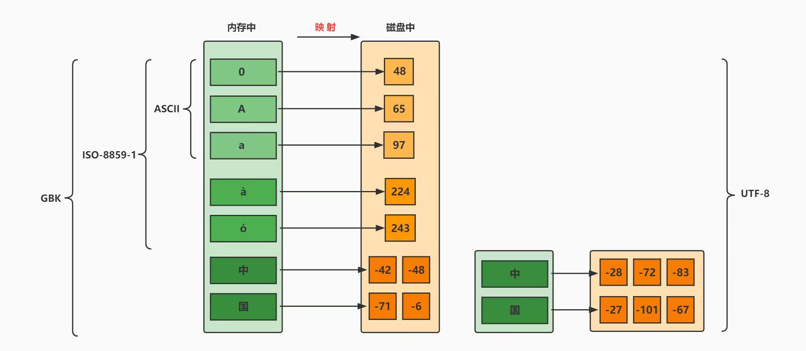

# 硅谷Java

## 1 基本语法

### 1.1 语言概述

#### 1.1.1 软件

软件：一系列按照特定顺序组织的计算机数据和指令的集合。

系统软件和应用软件

#### 1.1.2 人机交互方式

图形化界面 命令行方式

#### 1.1.3 常用的DSO（cmd）命令

|操作|说明|
|:---:|:---:|
|盘符名:|盘符切换|
|md 文件夹名|创建文件夹|
|rd 文件夹名|删除文件夹|
|del 文件名|删除文件|
|dir|查看当前路径下所有文件|
|cd 目录名|进入单级目录|
|cd 目录1\目录2\\...（\与/都可以）|进入多级目录|
|cd ..|回到上级文件夹|
|cd \\ （\与/都可以）|回退到盘符目录|
|cls|清屏|
|exit|退出|

#### 1.1.4 注释

单行注释
` // `

多行注释：不能嵌套

```java
/*
*/
```

文档注释：可以被jdk提供的工具javadoc解析，生成一套以网页文件形式体现的该程序的说明文档。

```java
/**

*/
```

#### 1.1.5 JavaAPI文档

API：Java提供的基本编程接口

#### 1.1.6 Java特点和jvm特性

优点：跨平台性，面向对象性，健壮性，安全性高，简单性，高性能。

缺点：语法过于复杂、严谨，架构重，并非适用于所有领域。

jvm：实习跨平台性，自动内存管理（GC自动回收）（还是可能出现内存溢出与内存泄漏）。

### 1.2 变量与运算符

#### 1.2.1 数据类型

数据类型：
基本数据类型：整型(byte\short\int默认\long(L\l后缀))，浮点型(float(F\f后缀)\double默认)，布尔值boolean(true/false)，字符型(char)
引用数据类型：类class，数组array，接口interface，枚举enum，注解annotaction，记录record

char 可以直接用unicode编码 \uxxx

#### 1.2.2 关键字

被Java定义有特殊意义的标识符

#### 1.2.3 标识符

26个字母10个数字下划线美元符，大小写严格，不能是关键字，长度不限，数字不开头

数字不开头原因：
`int 123L = 12; long i = 123L`
这个时候i的值是123(long)还是12。有歧义。

#### 1.2.4 变量

定义：数据类型 变量名 = 值;

this 该对象的地址

##### 1.2.4.1 自动类型提升

小的变成大的

byte、short、char 直接提升为 **int**

byte -> short -> int -> long -> float -> double

##### 1.2.4.2 强制类型转换

格式：`目标数据类型 变量名 = (目标数据类型) 被强转的数据`

#### 1.2.5 基本数据类型与String的运算

String 引用数据类型
可以使用一对`""`进行赋值

##### 1.2.5.1 字符串的“+”操作（字符串相加）

当“ + ”操作当中出现字符串，这个“ + ”就变成了**字符串连接符**，把前后进行拼接，形成一个新的字符串。

连“ + ”操作，从左到右。

```java
int age = 18;
System.out.println("我的年龄是" + "age" + "岁");// 我的年龄age岁
System.out.println("我的年龄是" + age + "岁");// 我的年龄是18岁
```

##### 1.2.5.2 字符的“+”操作（字符相加）

字符+字符 或 字符+数字，字符通过ASC2码表变为数字再计算。

#### 1.2.6 数据存储

进制转换

#### 1.2.7 运算符

尽量少依靠运算符自身优先级，而用括号控制执行顺序。

不要把一个表达式写的太复杂。

##### 1.2.7.1 算术运算符

- \+
- \-
- \*
- /
- %(取余)
- \+\+
- \-\-

##### 1.2.7.2 赋值运算符

=与其引申出来的

`x op= y 等价于 x = (T)(x op y)（T 是变量 x 的类型）`

##### 1.2.7.3 比较（关系）运算符

- ==
- !=
- \>=
- <=
- \>
- <
- instanceof 检查是否是类对象。`对象名 instanceof 类名`

其中\<、\>、\<=、\>=只能比较基本数据类型，而==、!=可以比较基本数据类型与引用数据类型。

##### 1.2.7.4 逻辑运算符

- & 与
- | 或
- ! 非
- && 短路与
- || 短路或
- ^ 异或

建议使用短路与、短路或。

##### 1.2.7.5 位运算符

- & 按位与
- | 按位或
- ~ 按位取反
- ^ 按位异或
- << 左移。补0
- \>\> 右移。补最高位。
- \>\>\> 右移。补0。

##### 1.2.7.6 三目运算符（条件运算符）

变量 = 条件表达式?语句1:语句2;

- 条件表达式的结果是boolean类型
- 如果条件表达式为true，执行1，否则执行2
- 表达式1表达式2必须是同类型的或能兼容的类型
- 条件运算符一定可以转换为if-else，建议用条件运算符，因为它效率高点

##### 1.2.7.7 Lambda运算符

#### 1.2.8 关于字符集

##### 1.2.8.1 字符集

规则f:信息->二进制。这个过程就叫做**编码**。

规则f:二进制->信息。这个过程就叫做**解码**。

**字符编码**f:自然语言字符->二进制数。

字符集：也叫做编码表。系统支持所有字符的集合。(文字、标点符号、图形符号、数字等)

##### 1.2.8.2 ASCII码

**ASCII码**f:英文字符->二进制。

用于显示现代英语，主要包括控制字符(回车键、退格键、换行键)和可显示字符(英文大小写字符，阿拉伯数字和西文符号)。

基本的ASCII码，使用7位表示一个字符(最前面统一为0)，共128个字符。

缺点：不能显示所有字符。

##### 1.2.8.3 ISO-8859-1字符集

拉丁码表，用于显示欧洲使用的语言(荷兰语、德语、意大利语、葡萄牙语等)。

ISO-8859-1使用单字节编码，兼容ASCII码。

##### 1.2.8.4 GBXXX字符集

GB就是国标的意思，为了显示中文而设计的。

**GB2312**：简体中文码表。向下兼容ASCII码。

- 半角字符：127号以下
- 全角字符：两个大于127的字符连在一起表示一个字符

**GBK**：最常用的中文码表。在GB2312的基础上的扩展规范。使用双字节码编码方案，完全兼容GB2312，同时支持繁体汉字以及日韩汉字。

**GB18030**：在GBK的基础上，还支持国内少数民族的文字。

##### 1.2.8.5 Unicode码

为表达任意语言的任意字符设计，也叫做统一码、标准万国码。

Unicode将世界上所有文字用两个字节统一编码，为每个字符设定唯一二进制编码，以满足跨语言、跨平台进行文本处理的要求。

问题：

1. 英文字母只需要一个直接表示，用更多字节存储是浪费。
1. 如何区分ASCII和Unicode？怎么知道两个字节表示一个符号还是两个？
1. 如果和GBK的编码方式一样，用最高位是1或0表示两个字节和一个字节，就少了很多值无法用于表示字符，不够表示所有字符

为解决Unicode的传输问题，面向传输的UTF(UCS Transfer Format)标准出现。具体来说有三种编码方案。UTF-8，UTF-16，UTF-32

##### 1.2.8.6 UTF-8

Unicode是字符集，而UTF-8，UTF-16，UTF-32是*将数字转换为程序数据的编码方案*。UTF-8就是每次8个位传输数据，UTF-16就是每次16个位传输数据。UTF-8在互联网上使用最广。

互联网工程工作小组(IETF)要求所有互联网协议都必须支持UTF-8编码。所以开发web应用，也要使用UTF-8编码。

UTF-8编码是一种变长编码方式，可以使用1~4个字节来表示一个字符。

编码规则：

1. 128个US-ASCII码只需1个字节编码。
1. 拉丁文等字符，需要2个字节编码。
1. 大部分常用字(含中文)，需要3个字节编码。
1. 其他极少使用的Unicode辅助字符，使用4字节编码

##### 1.2.8.7 小结



中文操作系统上ANSI编码即GBK

英文操作系统上ANSI编码即ISO-8859-1

### 1.3 流程控制语句

### 1.4 IDEA的安装与使用

### 1.5 数组

## 2 面向对象

### 2.1 基础

### 2.2 进阶

### 2.3 高级

## 3 高级应用

### 3.1 异常处理

### 3.2 多线程

### 3.3 常用类和基础API

### 3.4 集合框架

### 3.5 泛型

### 3.6 数据结构与集合源码

### 3.7 File类与IO流

### 3.8 网络编程

### 3.9 反射机制

### 3.10 JDK8-17新特性

## 常用类

### Scanner

1. 导包（找）
   `import java.util.Scanner;`在类定义前
1. 创建对象（准备）
    `Scanner sc = new Scannner(System.in);`sc可以改
1. 接收数据（开始）
    `int i = sc.nextInt();`i可以改

### Random

1. 导包
    `import java.util.Random;`
1. 创建对象
    `Random r = new Random ();`r可以改
1. 生成随机数
    `int number = r.nextInt(随机数范围);// 0到这个数-1。包头不包尾，包左不包右。`number可以改

## 琐碎

### 1 多样的System.out.输出

- System.out.println()。先输出后换行。
- System.out.print()。输出不换行。
- System.out.printf()。用格式化的形式输出。

### 2 求余与取模

q = [a/b]

r = a-b*q

求余是q向0靠拢。
取模是q向负无穷靠拢。

### 3 交换两个变量值的方法

#### 3.1 引入中间变量

- 优点：使用与所有数据类型的变量。
- 缺点：需要额外的空间。

#### 3.2 加减交换

```java
m = m + n;
n = m - n;
m = m - n;
```

- 优点：不需要额外空间
- 缺点：只适用数值

#### 3.3 异或交换

```java
m = m ^ n;
n = m ^ n;
m = m ^ n;
```

- 优点：不需要额外空间
- 缺点：只适用数值
