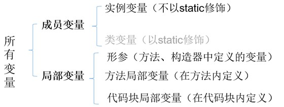
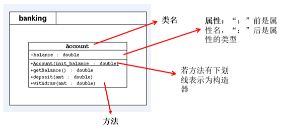
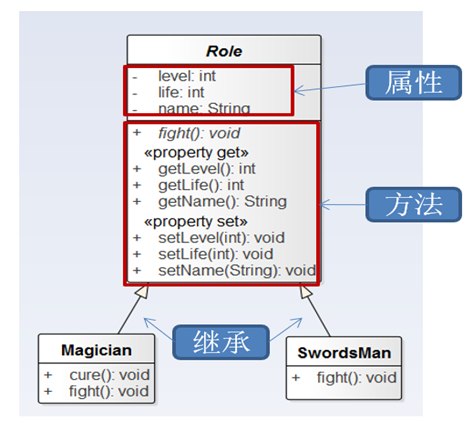
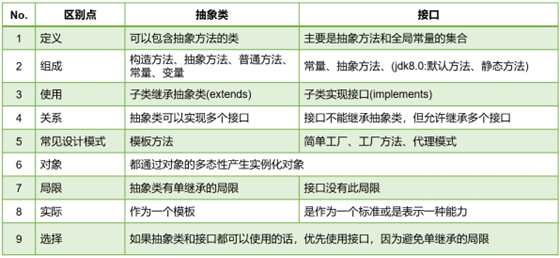
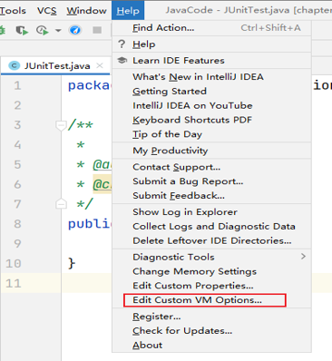
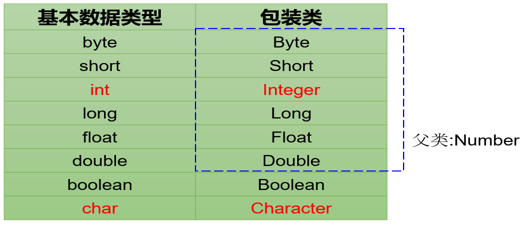

# 硅谷Java

## 1 基本语法

### 1.1 语言概述

#### 1.1.1 软件

软件：一系列按照特定顺序组织的计算机数据和指令的集合。

系统软件和应用软件

#### 1.1.2 人机交互方式

图形化界面 命令行方式

#### 1.1.3 常用的DSO（cmd）命令

|操作|说明|
|:---:|:---:|
|盘符名:|盘符切换|
|md 文件夹名|创建文件夹|
|rd 文件夹名|删除文件夹|
|del 文件名|删除文件|
|dir|查看当前路径下所有文件|
|cd 目录名|进入单级目录|
|cd 目录1\目录2\\...（\与/都可以）|进入多级目录|
|cd ..|回到上级文件夹|
|cd \\ （\与/都可以）|回退到盘符目录|
|cls|清屏|
|exit|退出|

#### 1.1.4 注释

单行注释
` // `

多行注释：不能嵌套

```java
/*
*/
```

文档注释：可以被jdk提供的工具javadoc解析，生成一套以网页文件形式体现的该程序的说明文档。

```java
/**

*/
```

#### 1.1.5 JavaAPI文档

API：Java提供的基本编程接口

#### 1.1.6 Java特点和jvm特性

优点：跨平台性，面向对象性，健壮性，安全性高，简单性，高性能。

缺点：语法过于复杂、严谨，架构重，并非适用于所有领域。

jvm：实习跨平台性，自动内存管理（GC自动回收）（还是可能出现内存溢出与内存泄漏）。

### 1.2 变量与运算符

#### 1.2.1 数据类型

数据类型：

- 基本数据类型：整型(byte\short\int默认\long(L\l后缀))，浮点型(float(F\f后缀)\double默认)，布尔值boolean(true/false)，字符型(char)

- 引用数据类型：类class，数组array，接口interface，枚举enum，注解annotaction，记录record。

区别：栈区中，基本数据类型变量存的是值，而引用数据类型的变量中存储的是对象的地址，或者说指向堆中对象的首地址。

char 可以直接用unicode编码 \uxxx

对象创建时，才会赋默认。
**数据类型默认值**：
基本数据类型默认值为0；引用数据类型默认值为null

#### 1.2.2 关键字

被Java定义有特殊意义的标识符

#### 1.2.3 标识符

26个字母10个数字下划线美元符，大小写严格，不能是关键字，长度不限，数字不开头

数字不开头原因：
`int 123L = 12; long i = 123L`
这个时候i的值是123(long)还是12。有歧义。

#### 1.2.4 变量

定义：数据类型 变量名 = 值;

##### 1.2.4.1 自动类型提升

小的变成大的

byte、short、char 直接提升为 **int**

byte -> short -> int -> long -> float -> double

##### 1.2.4.2 强制类型转换

格式：`目标数据类型 变量名 = (目标数据类型) 被强转的数据`

#### 1.2.5 基本数据类型与String的运算

String 引用数据类型
可以使用一对`""`进行赋值

##### 1.2.5.1 字符串的“+”操作（字符串相加）

当“ + ”操作当中出现字符串，这个“ + ”就变成了**字符串连接符**，把前后进行拼接，形成一个新的字符串。

连“ + ”操作，从左到右。

```java
int age = 18;
System.out.println("我的年龄是" + "age" + "岁");// 我的年龄age岁
System.out.println("我的年龄是" + age + "岁");// 我的年龄是18岁
```

##### 1.2.5.2 字符的“+”操作（字符相加）

字符+字符 或 字符+数字，字符通过ASC2码表变为数字再计算。

#### 1.2.6 数据存储

进制转换

#### 1.2.7 运算符

尽量少依靠运算符自身优先级，而用括号控制执行顺序。

不要把一个表达式写的太复杂。

##### 1.2.7.1 算术运算符

- \+
- \-
- \*
- /
- %(取余)
- \+\+
- \-\-

##### 1.2.7.2 赋值运算符

=与其引申出来的

`x op= y 等价于 x = (T)(x op y)（T 是变量 x 的类型）`

##### 1.2.7.3 比较（关系）运算符

- ==
- !=
- \>=
- <=
- \>
- <
- instanceof 检查是否是类对象。`对象名 instanceof 类名`

其中\<、\>、\<=、\>=只能比较基本数据类型，而==、!=可以比较基本数据类型与引用数据类型。

##### 1.2.7.4 逻辑运算符

- & 与
- | 或
- ! 非
- && 短路与
- || 短路或
- ^ 异或

建议使用短路与、短路或。

##### 1.2.7.5 位运算符

- & 按位与
- | 按位或
- ~ 按位取反
- ^ 按位异或
- << 左移。补0
- \>\> 右移。补最高位。
- \>\>\> 右移。补0。

##### 1.2.7.6 三目运算符（条件运算符）

变量 = 条件表达式?语句1:语句2;

- 条件表达式的结果是boolean类型
- 如果条件表达式为true，执行1，否则执行2
- 表达式1表达式2必须是同类型的或能兼容的类型
- 条件运算符一定可以转换为if-else，建议用条件运算符，因为它效率高点

##### 1.2.7.7 Lambda运算符

#### 1.2.8 关于字符集

##### 1.2.8.1 字符集

规则f:信息->二进制。这个过程就叫做**编码**。

规则f:二进制->信息。这个过程就叫做**解码**。

**字符编码**f:自然语言字符->二进制数。

字符集：也叫做编码表。系统支持所有字符的集合。(文字、标点符号、图形符号、数字等)

##### 1.2.8.2 ASCII码

**ASCII码**f:英文字符->二进制。

用于显示现代英语，主要包括控制字符(回车键、退格键、换行键)和可显示字符(英文大小写字符，阿拉伯数字和西文符号)。

基本的ASCII码，使用7位表示一个字符(最前面统一为0)，共128个字符。

缺点：不能显示所有字符。

##### 1.2.8.3 ISO-8859-1字符集

拉丁码表，用于显示欧洲使用的语言(荷兰语、德语、意大利语、葡萄牙语等)。

ISO-8859-1使用单字节编码，兼容ASCII码。

##### 1.2.8.4 GBXXX字符集

GB就是国标的意思，为了显示中文而设计的。

**GB2312**：简体中文码表。向下兼容ASCII码。

- 半角字符：127号以下
- 全角字符：两个大于127的字符连在一起表示一个字符

**GBK**：最常用的中文码表。在GB2312的基础上的扩展规范。使用双字节码编码方案，完全兼容GB2312，同时支持繁体汉字以及日韩汉字。

**GB18030**：在GBK的基础上，还支持国内少数民族的文字。

##### 1.2.8.5 Unicode码

为表达任意语言的任意字符设计，也叫做统一码、标准万国码。

Unicode将世界上所有文字用两个字节统一编码，为每个字符设定唯一二进制编码，以满足跨语言、跨平台进行文本处理的要求。

问题：

1. 英文字母只需要一个直接表示，用更多字节存储是浪费。
1. 如何区分ASCII和Unicode？怎么知道两个字节表示一个符号还是两个？
1. 如果和GBK的编码方式一样，用最高位是1或0表示两个字节和一个字节，就少了很多值无法用于表示字符，不够表示所有字符

为解决Unicode的传输问题，面向传输的UTF(UCS Transfer Format)标准出现。具体来说有三种编码方案。UTF-8，UTF-16，UTF-32

##### 1.2.8.6 UTF-8

Unicode是字符集，而UTF-8，UTF-16，UTF-32是*将数字转换为程序数据的编码方案*。UTF-8就是每次8个位传输数据，UTF-16就是每次16个位传输数据。UTF-8在互联网上使用最广。

互联网工程工作小组(IETF)要求所有互联网协议都必须支持UTF-8编码。所以开发web应用，也要使用UTF-8编码。

UTF-8编码是一种变长编码方式，可以使用1~4个字节来表示一个字符。

编码规则：

1. 128个US-ASCII码只需1个字节编码。
1. 拉丁文等字符，需要2个字节编码。
1. 大部分常用字(含中文)，需要3个字节编码。
1. 其他极少使用的Unicode辅助字符，使用4字节编码

##### 1.2.8.7 小结


中文操作系统上ANSI编码即GBK

英文操作系统上ANSI编码即ISO-8859-1

### 1.3 流程控制语句

#### 1.3.1 顺序结构

从上到下，定义变量时采用合法的前向引用。

#### 1.3.2 分支语句

##### 1.3.2.1 if-else语句

基本语法：

```java
if(条件表达式1){
    语句块1
}else if(条件表达式2){
    语句块2
}else if(条件表达式n){
    语句块n
}else{
    语句块n+1
}
```

如果语句块中只有一条语句，可以省略`{}`

if-else语句之间可以嵌套。

##### 1.3.2.2 switch-case语句

基本语法：

```java
switch(表达式){
    case 常量值:{
        语句块1
        break;
    }
    case 常量值:{
        语句块2
        break;
    }
    case 常量值:{
        语句块n
        break;
    }default:{
        语句块n+1
        break;
    }
}
```

注意事项：

1. 如果不break，会出现case穿透。
1. 表达式的值必须为byte、short、char、int、枚举(jdk 5.0)、String(jdk 7.0)。
1. case子句的值必须为常量，不能为变量名或不确定的表达式的值或范围。
1. default子句是可选的，位置也是灵活的。只有没有匹配的case时，才会执行default。

##### 1.3.2.3 if-else与switch-case的比较

switch-case一定能转换为if-else。反之不一定。

如果二者都可以使用，建议使用switch-case，效率稍高。

#### 1.3.3 循环语句

##### 1.3.3.1 for循环

基本语法：

```java
for(初始化部分;循环条件部分;迭代部分){
    循环体;
}
```

温馨提示：

1. for(;;)中两个;一个都不能省。
1. 初始化部分可以声明多个变量，但必须是同一类型，用逗号隔开。
1. 循环条件部分的值为boolean类型，为true时，循环才继续。
1. 迭代部分可以有多个变量更新，用逗号隔开。

##### 1.3.3.2 while循环

```java
初始化部分
while(循环条件部分){
    循环体
    迭代部分
}
```

温馨提示：

1. 循环条件部分必须为boolean类型。
1. 必须有迭代部分，不然就是死循环。

for与while可以互相转换，没有性能上的区别。

for与while的区别是**初始化语句的作用域**

##### 1.3.3.3 do-while循环

基本语法：

```java
初始化部分
do{
循环体
迭代部分
}while(循环条件部分);
```

温馨提示：

1. 循环条件部分必须为boolean类型。
1. `while(循环条件部分);`**是有分号**的。

do-while至少执行一次。

do-while、for、while可以互相转换

##### 1.3.3.4 三个循环的对比

三个循环都有的四个部分：

1. 循环变量的初始化条件
1. 循环条件
1. 循环体
1. 循环变量的修改迭代表达式

do-while至少执行一次，而for、while先判断循环语句是否成立，再决定是否执行循环体

##### 1.3.3.5 无限循环

`while(true)`
`for(;;)`

事先不清楚循环次数，根据内部某些条件来控制循环结束。

##### 1.3.3.6 嵌套(多重)循环

循环结构可以嵌套另一个循环结构。

在开发过程，尽量减少循环嵌套，一般不超过3层。如果出现，需要重新梳理业务逻辑、思考算法实现，否则可读性很差。

#### 1.3.4 关键字break与continue的使用

适用范围：在循环结构中使用

- break 直接跳出结构
- continue 结束本次循环

带标签的使用：可以通过标签指明跳出或结束的循环结构。

示例

```java
label while(true){
    label1 while(true){
        break label; // label、label1都是标签名。这里的break label;表示跳出标签为label的循环结构。
    }
}
```

标签一定要在**紧接**循环结构头部

### 1.4 IDEA的安装与使用

### 1.5 数组

数组有长度属性(length)，代表该维度的元素个数。

用法：`数组名.length`

#### 1.5.1 一维数组

定义(声明)格式： `数据类型[] 数组名;`(推荐)或`数据类型 数组名[];`

在定义(声明)阶段，不能定义数组长度。

##### 1.5.1.1 静态初始化

`数据类型[] 数组名 = new 数据类型[]{元素表};`

##### 1.5.1.2 动态初始化

`数据类型[] 数组名 = new 数据类型[数组长度];`

#### 1.5.2 数组元素的引用

用索引来引用。索引值从0开始。`数组名[索引]`。

#### 1.5.3 多维数组

定义(声明)格式： `数据类型[][] 数组名;`(推荐)或`数据类型 数组名[][];`

在定义(声明)阶段，不能定义数组长度。

注意特殊写法：`int[] x,y[];`x是一维数组，y是二维数组。

##### 1.5.3.1 静态初始化

`数据类型[][] 数组名 = new 数据类型[]{{元素表1},{元素表2}...};`

##### 1.5.3.2 动态初始化

`数据类型[][] 数组名 = new 数据类型[第一维数组长度][第二维数组长度];`

第二维数组长度若有，则为规则二维表。不存在，则为不规则二维表。即，第二维数组可以任意长度。

##### 1.5.3.3 特殊情况一

```java
public static void main(String[] args)
{
    int[][] arr = new int[2][];
    int[] arr1 = new int[]{9,5};
    int[] arr2 = new int[]{1,2,3};

    arr[0] = arr1;
    arr[1] = arr2;
    //这样arr中存的更灵活
}
```

##### 1.5.3.4 特殊情况二

```java
public static void main(String[] args)
{
    int[][] arr = new int[2][3];
    int[] arr1 = new int[]{9,5};
    int[] arr2 = new int[]{1,2,3};

    arr[0] = arr1;
    arr[1] = arr2;
    //这样arr中原先的arr[0]与arr[1]就被替代了，原来的会被JVM自动处理回收
}
```

#### 1.5.4 内存分析

#### 1.5.5 数组查找算法

#### 1.5.6 数组排序算法

#### 1.5.7 Arrays 工具类的使用

java.util.Arrays类，即操作数组的工具类。包括了用来操作数组的各种方法。

数组元素拼接：

- `static String toString(int[] a)`：字符串表示形式由数组的元素列表组成，括在方括号（"[]"）中。相邻元素用字符 ", "（逗号加空格）分隔。形式为：[元素1，元素2，元素3。。。]。
- `static String toString(Object[] a)`：字符串表示形式由数组的元素列表组成，括在方括号（"[]"）中。相邻元素用字符 ", "（逗号加空格）分隔。元素将自动调用自己从Object继承的toString方法将对象转为字符串进行拼接，如果没有重写，则返回类型@hash值，如果重写则按重写返回的字符串进行拼接。

数组排序：

- `static void sort(int[] a)`：将a数组按照从小到大进行排序
- `static void sort(int[] a, int fromIndex, int toIndex)`：将a数组的[fromIndex, toIndex)部分按照升序排列
- `static void sort(Object[] a)`：根据元素的自然顺序对指定对象数组按升序进行排序。
- `static  void sort(T[] a, Comparator<? super T> c)`：根据指定比较器产生的顺序对指定对象数组进行排序。

数组元素的二分查找：

- `static int binarySearch(int[] a, int key)`、`static int binarySearch(Object[] a, Object key)`：要求数组有序，在数组中查找key是否存在，如果存在返回第一次找到的下标，不存在返回负数。

数组的复制：

- `static int[] copyOf(int[] original, int newLength)`：根据original原数组复制一个长度为newLength的新数组，并返回新数组
- `static  T[] copyOf(T[] original,int newLength)`：根据original原数组复制一个长度为newLength的新数组，并返回新数组
- `static int[] copyOfRange(int[] original, int from, int to)`：复制original原数组的[from,to)构成新数组，并返回新数组
- `static  T[] copyOfRange(T[] original,int from,int to)`：复制original原数组的[from,to)构成新数组，并返回新数组

比较两个数组是否相等：

- `static boolean equals(int[] a, int[] a2)`：比较两个数组的长度、元素是否完全相同
- `static boolean equals(Object[] a,Object[] a2)`：比较两个数组的长度、元素是否完全相同

填充数组：

- `static void fill(int[] a, int val)`：用val值填充整个a数组
- `static void fill(Object[] a,Object val)`：用val对象填充整个a数组
- `static void fill(int[] a, int fromIndex, int toIndex, int val)`：将a数组[fromIndex,toIndex)部分填充为val值
- `static void fill(Object[] a, int fromIndex, int toIndex, Object val)`：将a数组[fromIndex,toIndex)部分填充为val对象

#### 1.5.8 数组常见异常

数组下标越界访问、数组空指针异常(访问的元素是数组而且为null)。

## 2 面向对象

### 2.1 基础

#### 2.1.1 类的成员概述

属性：该类事物的状态信息。对应类中的**成员变量field**。
行为：该类事物要做什么操作，或者基于事物的状态能做什么。对应类中的**成员方法method**

#### 2.1.2 类完成功能的三个步骤

1. 类的定义
1. 对象的创建
1. 对象调用属性和方法

示例：

```java
public class Dog{
    //声明属性
    String type; //种类
    String nickName; //昵称
    String hostName; //主人名称

    //声明方法
    public void eat(){ //吃东西
    System.out.println("狗狗进食");
    }
}

public class Person{
    String name;
    char gender;
    Dog dog;
    
    //喂宠物
    public void feed(){
        dog.eat();
    }
}

public class Game{
    public static void main(String[] args){
        Person p = new Person();
        //通过Person对象调用属性
        p.name = "康师傅";
        p.gender = '男';
        p.dog = new Dog(); //给Person对象的dog属性赋值
        
        //给Person对象的dog属性的type、nickname属性赋值
        p.dog.type = "柯基犬";
        p.dog.nickName = "小白";
        
        //通过Person对象调用方法
        p.feed();
    }
}

```

##### 2.1.2.1 类的定义

class 类名{
    成员变量声明;
    方法声明;
}

##### 2.1.2.2 对象的创建

1. `类名 对象名 = new 类名();`使用一个引用数据类型，保存对象信息，可以多次使用。
1. `new 类名()`匿名对象。

##### 2.1.2.3 对象创建时JVM内存分析

`Student s = new Student()`;

1. 加载class文件
1. 声明局部变量
1. 堆内存开辟变量
1. 默认初始化
1. 显示初始化
1. 构造方法初始化
1. 堆中地址值赋值给局部变量

##### 2.1.2.4 对象调用属性和方法

`对象名.方法名();`

#### 2.1.3 匿名对象

我们也可以不定义对象的句柄，而直接调用这个对象的方法。这样的对象叫做匿名对象。

如：new Person().shout();

使用情况：

- 如果一个对象只需要进行一次方法调用，那么就可以使用匿名对象。
- 我们经常将匿名对象作为实参传递给一个方法调用。

#### 2.1.4 内存分析

- 堆（Heap）：此内存区域的唯一目的就是存放对象实例，几乎所有的对象实例都在这里分配内存。这一点在Java虚拟机规范中的描述是：所有的对象实例以及数组都要在堆上分配。
- 栈（Stack）：是指虚拟机栈。虚拟机栈用于存储局部变量等。局部变量表存放了编译期可知长度的各种基本数据类型（boolean、byte、char、short、int、float、long、double）、对象引用（reference类型，它不等同于对象本身，是对象在堆内存的首地址）。 方法执行完，自动释放。
- 方法区（Method Area）：用于存储已被虚拟机加载的类信息、常量、静态变量、即时编译器编译后的代码等数据。

new出来的对象都在堆区。

当声明一个新的变量使用现有的对象进行赋值时（比如p3 = p1），此时并没有在堆空间中创建新的对象。而是两个变量共同指向了堆空间中同一个对象。当通过一个对象修改属性时，会影响另外一个对象对此属性的调用。

#### 2.1.5 类成员之一——成员变量field

语法格式：
[修饰符1] class 类名{
    [修饰符2] 数据类型 成员变量名 [= 初始化值];
}

说明：

- 位置要求：必须在类中，方法外
- 修饰符2(暂不考虑)

    常用的权限修饰符有：private、缺省、protected、public

    其他修饰符：static、final

- 数据类型：任何基本数据类型(如int、Boolean) 或 任何引用数据类型。

- 成员变量名：属于标识符，符合命名规则和规范即可。
- 初始化值：根据情况，可以显式赋值；也可以不赋值，使用默认值

##### 2.1.5.1 成员变量与局部变量的对比

1、变量的分类：成员变量与局部变量。

- 在方法体外，类体内声明的变量称为成员变量。
- 在方法体内部等位置声明的变量称为局部变量。



其中，static可以将成员变量分为两大类，静态变量和非静态变量。其中静态变量又称为类变量，非静态变量又称为实例变量或者属性。

2、对比

相同点：

- 变量声明的格式相同：`数据类型 变量名 = 初始化值`
- 变量必须先声明、后初始化、再使用。
- 变量都有其对应的作用域。只在其作用域内是有效的。

不同点：

1. 声明位置和方式

    （1）实例变量：在类中方法外。

    （2）局部变量：在方法体{}中或方法的形参列表、代码块中
1. 在内存中存储的位置不同

    （1）实例变量：堆

    （2）局部变量：栈
1. 生命周期

    （1）实例变量：和对象的生命周期一样，随着对象的创建而存在，随着对象被GC回收而消亡，  而且每一个对象的实例变量是独立的。

    （2）局部变量：和方法调用的生命周期一样，每一次方法被调用而在存在，随着方法执行的结束而消亡，  而且每一次方法调用都是独立。
1. 作用域

    （1）实例变量：通过对象就可以使用，本类中直接调用，其他类中“对象.实例变量”

    （2）局部变量：出了作用域就不能使用
1. 修饰符

    （1）实例变量：public,protected,private,final,volatile,transient等

    （2）局部变量：final
1. 默认值

    （1）实例变量：有默认值

    （2）局部变量：没有，必须手动初始化。其中的形参比较特殊，靠实参给它初始化。

#### 2.1.6 类成员之二——方法method

方法是类或对象行为特征的抽象，用来完成某个功能操作。在某些语言中也称为函数或过程。

将功能封装为方法的目的是，可以实现代码重用，减少冗余，简化代码。

Java里的方法不能独立存在，所有的方法必须定义在类里。

##### 2.1.6.1 声明方法

1、声明方法的语法格式

`[修饰符] 返回值类型 方法名([形参列表])[throws 异常列表]{
方法体的功能代码
}`

（1）一个完整的方法 = 方法头 + 方法体。

方法头就是`[修饰符] 返回值类型 方法名([形参列表])[throws 异常列表]`，也称为方法签名。

通常调用方法时只需要关注方法头就可以，从方法头可以看出这个方法的功能和调用格式。

方法体就是方法被调用后要执行的代码。对于调用者来说，不了解方法体如何实现的，并不影响方法的使用。

（2）方法头可能包含5个部分

- 修饰符：可选的。方法的修饰符也有很多，例如：public、protected、private、static、abstract、native、final、synchronized等。

    其中，权限修饰符有public、protected、private。在讲封装性之前，我们先默认使用pulbic修饰方法。

    其中，根据是否有static，可以将方法分为静态方法和非静态方法。其中静态方法又称为类方法，非静态方法又称为实例方法。咱们在讲static前先学习实例方法。

- 返回值类型： 表示方法运行的结果的数据类型，方法执行后将结果返回到调用者。

    无返回值，则声明：void

    有返回值，则声明出返回值类型（可以是任意类型）。与方法体中“return 返回值”搭配使用

- 方法名：属于标识符，命名时遵循标识符命名规则和规范，“见名知意”

- 形参列表：表示完成方法体功能时需要外部提供的数据列表。可以包含零个，一个或多个参数。

    无论是否有参数，()不能省略。

    如果有参数，每一个参数都要指定数据类型和参数名，多个参数之间使用逗号分隔，例如：
    `一个参数： (数据类型 参数名)`
    `二个参数： (数据类型1 参数1, 数据类型2 参数2)`

    参数的类型可以是基本数据类型、引用数据类型

    throws 异常列表：可选。

（3）方法体：方法体必须有{}括起来，在{}中编写完成方法功能的代码。

（4）关于方法体中return语句的说明：

return语句的作用是结束方法的执行，并将方法的结果返回去
如果返回值类型不是void，方法体中必须保证一定有 return 返回值; 语句，并且要求该返回值结果的类型与声明的返回值类型一致或兼容。

如果返回值类型为void时，方法体中可以没有return语句，如果要用return语句提前结束方法的执行，那么return后面不能跟返回值，直接写`return ;`就可以。

return语句后面就不能再写其他代码了，否则会报错：Unreachable code

##### 2.1.6.2 调用方法

`对象.方法名([实参列表])`

##### 2.1.6.3 注意事项

1. 必须先声明后使用，且方法必须定义在类的内部
1. 调用一次就执行一次，不调用不执行。
1. 方法中可以调用类中的方法或属性，不可以在方法内部定义方法。

##### 2.1.6.4 方法调用时内存分析

方法没有被调用的时候，都在方法区中的字节码文件(.class)中存储。

方法被调用的时候，需要进入到栈内存中运行。方法每调用一次就会在栈中有一个入栈动作，即给当前方法开辟一块独立的内存区域，用于存储当前方法的局部变量的值。

当方法执行结束后，会释放该内存，称为出栈，如果方法有返回值，就会把结果返回调用处，如果没有返回值，就直接结束，回到调用处继续执行下一条指令。

栈结构：先进后出，后进先出。

##### 2.1.6.5 方法重载

方法重载：在同一个类中，允许存在一个以上的同名方法，只要它们的**参数列表**不同即可。（与返回值无关）

参数列表不同，意味着参数个数或参数类型的不同

重载的特点：与修饰符、返回值类型无关，只看参数列表，且参数列表必须不同(参数个数或参数类型)。

调用时，根据方法参数列表的不同来区别。

重载方法调用：JVM通过方法的参数列表，调用匹配的方法。

- 先找个数、类型最匹配的
- 再找个数和类型可以兼容的，如果同时多个方法可以兼容将会报错

##### 2.1.6.6 可变个数的形参

在JDK 5.0 中提供了Varargs(variable number of arguments)机制。即当定义一个方法时，形参的类型可以确定，但是形参的个数不确定，那么可以考虑使用可变个数的形参。

`方法名(参数数据类型...参数名)`

特点：

1. 可变参数：方法参数部分指定类型的参数个数是可变多个：0个，1个或多个
1. 可变个数形参的方法与同名的方法之间，彼此构成重载
可变参数方法的使用与方法参数部分使用数组是一致的，二者不能同时声明，否则报错。
1. 方法的参数部分有可变形参，需要放在形参声明的最后
在一个方法的形参中，最多只能声明一个可变个数的形参

##### 2.1.6.7 方法的参数传递机制

参数分为形参与实参。形参是方法在定义时在参数表中的参数，实参是调用方法时传递的参数。

Java中，只有值传递，即创建副本接收栈区中传递过来的变量的值，变量本身不受影响。

- 形参是基本数据类型：将实参基本数据类型变量的“数据值”传递给形参。
- 形参是引用数据类型：将实参引用数据类型变量的“地址值”传递给形参。

##### 2.1.6.8 方法的递归调用

方法自己调用自己的现象就称为递归。

递归分为直接递归和简介递归。

- 直接递归；A调用A。
- 间接递归：A调用B，B调用C，C调用A。

说明：

- 递归方法包含了一种隐式的循环。
- 递归方法会重复执行某段代码，但这种重复执行无须循环控制。
- 递归一定要向已知方向递归，否则这种递归就变成了无穷递归，停不下来，类似于死循环。最终发生栈内存溢出。

递归调用会占用大量的系统堆栈，内存耗用多，在递归调用层次多时速度要比循环慢的多，所以在使用递归时要慎重。

在要求高性能的情况下尽量避免使用递归，递归调用既花时间又耗内存。考虑使用循环迭代

#### 2.1.7 对象数组

当数组元素为引用数据类型时，为对象数组。

定义时，先定义对象数组，在逐个创建数组元素。

很容易出现空指针问题。

#### 2.1.8 关键字package与import

##### 2.1.8.1 package

为这个类设定唯一位置。

package 顶层包名.子包名 ;

举例：pack1\pack2\PackageTest.java

```java
package pack1.pack2;    //指定类PackageTest属于包pack1.pack2

public class PackageTest{
    public void display(){
        System.out.println("in  method display()");
    }
}
```

说明：

- 一个源文件只能有一个声明包的package语句
- package语句作为Java源文件的第一条语句出现。若缺省该语句，则指定为无名包。
- 包名，属于标识符，满足标识符命名的规则和规范（全部小写）、见名知意
- 包通常使用所在公司域名的倒置：com.atguigu.xxx。
    大家取包名时不要使用"java.xx"包
- 包对应于文件系统的目录，package语句中用 “.” 来指明包(目录)的层次，每.一次就表示一层文件目录。
- 同一个包下可以声明多个结构（类、接口），但是不能定义同名的结构（类、接口）。不同的包下可以定义同名的结构（类、接口）

包的作用

- 包可以包含类和子包，划分项目层次，便于管理
- 帮助管理大型软件系统：将功能相近的类划分到同一个包中。比如：MVC的设计模式
- 解决类命名冲突的问题
- 控制访问权限

##### 2.1.8.2 import

告诉编译器，去哪里找用到的类。

import 包名.类名;

说明：

- import语句，声明在包的声明和类的声明之间。
- 如果需要导入多个类或接口，那么就并列显式多个import语句即可
- 如果使用a.*导入结构，表示可以导入a包下的所有的结构。举例：可以使用java.util.*的方式，一次性导入util包下所有的类或接口。
- 如果导入的类或接口是java.lang包下的，或者是当前包下的，则可以省略此import语句。
- 如果已经导入java.a包下的类，那么如果需要使用a包的子包下的类的话，仍然需要导入。
- 如果在代码中使用不同包下的同名的类，那么就需要使用类的全类名的方式指明调用的是哪个类。
- （了解）import static组合的使用：调用指定类或接口下的静态的属性或方法

#### 2.1.9 面向对象特征之一——封装性

- 开发中，一般成员实例变量都习惯使用private修饰，再提供相应的public权限的get/set方法访问。
- 对于final的实例变量，不提供set()方法。（后面final关键字的时候讲）
- 对于static final的成员变量，习惯上使用public修饰。

##### 2.1.9.1 为何需要封装

为何需要封装：遵循“高内聚、低耦合”。

高内聚、低耦合是软件工程中的概念。

- 内聚，指一个模块内各个元素彼此结合的紧密程度；耦合指一个软件结构内不同模块之间互连程度的度量。
- 内聚意味着重用和独立，耦合意味着多米诺效应牵一发动全身。

“高内聚，低耦合”的体现之一：

- 高内聚：类的内部数据操作细节自己完成，不允许外部干涉；
- 低耦合：仅暴露少量的方法给外部使用，尽量方便外部调用。

##### 2.1.9.2 何为封装性

把客观事物封装成抽象概念的类，并且类可以把自己的数据和方法只向可信的类或者对象开放，向没必要开放的类或者对象隐藏信息。(该隐藏的隐藏，该暴露的暴露。)

##### 2.1.9.3 Java实现封装性原理

实现封装就是**控制类或成员的可见性范围**。这就需要依赖访问控制修饰符，也称为权限修饰符来控制。

##### 2.1.9.4 封装性的体现

- 成员变量/属性私有化：私有化类的成员变量，提供公共的get和set方法，对外暴露获取和修改属性的功能。
- 私有化方法

###### 2.1.9.4.1 成员变量/属性私有化

1. 使用 private 修饰成员变量`private 数据类型 变量名;`
1. 提供 getXxx方法 / setXxx 方法，可以访问成员变量

成员变量封装的好处：

- 让使用者只能通过事先预定的方法来访问数据，从而可以在该方法里面加入控制逻辑，限制对成员变量的不合理访问。还可以进行数据检查，从而有利于保证对象信息的完整性。
- 便于修改，提高代码的可维护性。主要说的是隐藏的部分，在内部修改了，如果其对外可以的访问方式不变的话，外部根本感觉不到它的修改。例如：Java8->Java9，String从char[]转为byte[]内部实现，而对外的方法不变，我们使用者根本感觉不到它内部的修改。

#### 2.1.10 类成员之三——构造器(构造方法)

作用：在new创建对象时，为实例对象赋值。

语法：

```java
[修饰符] class 类名{
    [修饰符] 构造器名(){
        // 实例初始化代码
    }
    [修饰符] 构造器名(参数列表){
        // 实例初始化代码
    }
}
```

说明：

1. 构造器名必须与它所在的类名必须相同。
1. 它没有返回值，所以不需要返回值类型，也不需要void。
1. 构造器的修饰符只能是权限修饰符，不能被其他任何修饰。比如，不能被static、final、synchronized、abstract、native修饰，不能有return语句返回值。
1. 设计类时，必须提供空构造方法与满构造方法。

#### 2.1.11 阶段性知识总结与补充

##### 2.1.11.1 成员变量的赋值

1. 默认初始化
1. 显式初始化
1. 构造器赋值
1. setXX()赋值

顺序从上到下，其中1、2、3只执行一次，4可以多次调用执行。

##### 2.1.11.2 JavaBean方法

JavaBean是一种Java语言写成的可重用组件。

- 类是公开的(public)
- 必须提供空的构造器
- 有属性，且有对应的get、set方法

用户可以使用JavaBean将功能、处理、值、数据库访问和其他任何可以用Java代码创造的对象进行打包，并且其他的开发者可以通过内部的JSP页面、Servlet、其他JavaBean、applet程序或者应用来使用这些对象。用户可以认为JavaBean提供了一种随时随地的复制和粘贴的功能，而不用关心任何改变。

《Think in Java》中提到，JavaBean最初是为Java GUI的可视化编程实现的。你拖动IDE构建工具创建一个GUI 组件（如多选框），其实是工具给你创建Java类，并提供将类的属性暴露出来给你修改调整，将事件监听器暴露出来。

##### 2.1.11.3 UML类图

UML（Unified Modeling Language，统一建模语言），用来描述软件模型和架构的图形化语言。

常用的UML工具软件有PowerDesinger、Rose和Enterprise Architect。

- UML工具软件不仅可以绘制软件开发中所需的各种图表，还可以生成对应的源代码。
- 在软件开发中，使用UML类图可以更加直观地描述类内部结构（类的属性和操作）以及类之间的关系（如关联、依赖、聚合等）。

    +表示 public 类型， - 表示 private 类型，#表示protected类型

    方法的写法:  方法的类型(+、-) 方法名(参数名： 参数类型)：返回值类型

    斜体表示抽象方法或类。





### 2.2 进阶

#### 2.2.1 this 关键字

##### 2.2.1.1 使用场景

只能在本类使用

- 它在方法（准确的说是实例方法或非static的方法）内部使用，表示调用该方法的对象。
- 它在构造器内部使用，表示该构造器正在初始化的对象。
this可以调用的结构：成员变量、方法和构造器

##### 2.2.1.2 作用一：记录本对象地址，代表本对象

使用this访问属性和方法时，如果在本类中未找到，会从父类中查找。

当在实例方法或构造器中，要表示本对象的成员变量时，用this，以区分成员变量和局部变量。

this.方法跟不加this的作用没区别，jvm会帮你加上。

##### 2.2.1.3 作用二：构造器相互调用

this可以作为一个类中构造器相互调用的特殊格式。可以不用重复写相似的代码。

this()：调用本类的无参构造器

this(实参列表)：调用本类的有参构造器

#### 2.2.2 面向对象特征之二——继承

##### 2.2.2.1 何为继承

- 角度一：一类作为由另一类拓展而形成的新类。
- 角度二：某一些类有相同的部分，把相同的部分提取出来，形成父类，原先的类为子类。

##### 2.2.2.2 继承的好处

- 继承的出现减少了代码冗余，提高了代码的复用性。
- 继承的出现，更有利于功能的扩展。
- 继承的出现让类与类之间产生了is-a的关系，为多态的使用提供了前提。
- 继承描述事物之间的所属关系，这种关系是：
    is-a 的关系。可见，父类更通用、更一般，子类更具体。
- 注意：不要仅为了获取其他类中某个功能而去继承！

##### 2.2.2.3 继承的语法与基本概念

**语法**：

通过 extends 关键字，可以声明一个类B继承另外一个类A，定义格式如下：

```java
[修饰符] class 类A {
    ...
}

[修饰符] class 类B extends 类A {
    ...
}
```

**基本概念**：

类B，称为子类、派生类(derived class)、SubClass
类A，称为父类、超类、基类(base class)、SuperClass

##### 2.2.2.4 细节补充

###### 2.2.2.4.1 子类会继承父类所有的实例变量和实例方法

从类的定义来看，类是一类具有相同特性的事物的抽象描述。父类是所有子类共同特征的抽象描述。而实例变量和实例方法就是事物的特征，那么父类中声明的实例变量和实例方法代表子类事物也有这个特征。

- 当子类对象被创建时，在堆中给对象申请内存时，就要看子类和父类都声明了什么实例变量，这些实例变量都要分配内存。
- 当子类对象调用方法时，编译器会先在子类模板中看该类是否有这个方法，如果没找到，会看它的父类甚至父类的父类是否声明了这个方法，遵循从下往上找的顺序，找到了就停止，一直到根父类都没有找到，就会报编译错误。
所以继承意味着子类的对象除了看子类的类模板还要看父类的类模板。

###### 2.2.2.4.2 子类不能直接访问父类中私有的(private)的成员变量和方法

子类虽会继承父类私有(private)的成员变量，但子类不能对继承的私有成员变量直接进行访问，可通过继承的get/set方法进行访问。

###### 2.2.2.4.3 父类是子类的子集

在Java 中，继承的关键字用的是“extends”，即子类不是父类的子集，而是对父类的“扩展”

子类在继承父类以后，还可以定义自己特有的方法，这就可以看做是对父类功能上的扩展。

###### 2.2.2.4.4 Java支持多层继承

多层继承也就是，A类的子类BC，而C类也可以有子类D。

子类和父类是一种相对的概念。顶层父类是Object类。所有的类默认继承Object，作为父类。

###### 2.2.2.4.5 Java只支持单继承，不支持多重继承

即Java只支持一个直接父亲。

##### 2.2.3 方法的重写

###### 2.2.3.1 方法重写的引入与形式

父类的所有方法子类都会继承，但是当某个方法被继承到子类之后，子类觉得父类原来的实现不适合于自己当前的类，该怎么办呢？

子类可以对从父类中继承来的方法进行**改造**，我们称为方法的重写 (override、overwrite)。也称为方法的重置、覆盖。

在程序执行时，子类的方法将覆盖父类的方法。

在重写的方法前一行加上`@override`,作为注解，表示这个方法是重写父类的。这样编译器会帮你检查是否为重写，如果不是(方法名、参数列表、返回值、权限修饰符等写错)，就会报错。

`@override`只是注解，不写也没事。不写的话，编译器不会检查是否为重写，如果不是重写，就会按照新的方法来执行。

###### 2.2.3.2 方法重写的要求

- 子类重写的方法必须和父类被重写的方法具有相同的方法名称、参数列表。
- 子类重写的方法的返回值类型不能大于父类被重写的方法的返回值类型。（例如：Student < Person）。
注意：如果返回值类型是基本数据类型和void，那么必须是相同
- 子类重写的方法使用的访问权限不能小于父类被重写的方法的访问权限。（public > protected > 缺省 > private）
注意：① 父类私有方法不能重写 ② 跨包的父类缺省的方法也不能重写
- 子类方法抛出的异常不能大于父类被重写方法的异常

此外，子类与父类中同名同参数的方法必须同时声明为非static的(即为重写)，或者同时声明为static的（不是重写）。因为static方法是属于类的，子类无法覆盖父类的方法。

#### 2.2.3 super 关键字

##### 2.2.3.1 理解

在Java类中使用super来调用父类中的指定操作：

- super可用于访问父类中定义的属性
- super可用于调用父类中定义的成员方法
- super可用于在子类构造器中调用父类的构造器

注意：

- 尤其当子父类出现同名成员时，可以用super表明调用的是父类中的成员
- super的追溯不仅限于直接父类
- super和this的用法相像，this代表本类对象的引用，super代表父类的内存空间的标识

##### 2.2.3.2 使用场景

###### 2.2.3.2.1 子类中调用父类被重写的方法

1. 如果子类没有重写父类的方法，只要权限修饰符允许，在子类中完全可以直接调用父类的方法；
1. 如果子类重写了父类的方法，在子类中需要通过super.才能调用父类被重写的方法，否则默认调用的子类重写的方法

调用方法时，如果没有super，先在本类找，如果没找到，再往父类追溯。如果有super，则直接往父类追溯。

###### 2.2.3.2.2 子类中调用父类中同名的成员变量

如果实例变量与局部变量重名，可以在实例变量前面加this.进行区别

如果子类实例变量和父类实例变量重名，并且父类的该实例变量在子类仍然可见，在子类中要访问父类声明的实例变量需要在父类实例变量前加super.，否则默认访问的是子类自己声明的实例变量

如果父子类实例变量没有重名，只要权限修饰符允许，在子类中完全可以直接访问父类中声明的实例变量，也可以用this.实例访问，也可以用super.实例变量访问

- 变量，先从局部找，再从本类找，最后追溯父类找。
- 如果有this，先在本类找，再追溯父类找
- 如果有super，直接追溯父类找。

特别注意：**应该避免子类声明和父类重名的成员变量**

###### 2.2.3.2.3 子类构造器中调用父类构造器

1. 子类继承父类时，不会继承父类的构造器。只能通过“super(形参列表)”的方式调用父类指定的构造器。
1. 规定：“super(形参列表)”，必须声明在构造器的首行。
1. 我们前面讲过，在构造器的首行可以使用"this(形参列表)"，调用本类中重载的构造器，  结合②，结论：在构造器的首行，"this(形参列表)" 和 "super(形参列表)"只能二选一。
1. 如果在子类构造器的首行既没有显示调用"this(形参列表)"，也没有显式调用"super(形参列表)"，  则子类此构造器默认调用"super()"，即调用父类中空参的构造器。
1. 由③和④得到结论：子类的任何一个构造器中，要么会调用本类中重载的构造器，要么会调用父类的构造器。  只能是这两种情况之一。
1. 由⑤得到：一个类中声明有n个构造器，最多有n-1个构造器中使用了"this(形参列表)"，则剩下的那个一定使用"super(形参列表)"。

开发中常见错误：
如果子类构造器中既未显式调用父类或本类的构造器，且父类中又没有空参的构造器，则编译出错。

###### 2.2.3.4 小结this与super

1、this和super的意义

this：当前对象

- 在构造器和非静态代码块中，表示正在new的对象
- 在实例方法中，表示调用当前方法的对象

super：引用父类声明的成员

2、this和super的使用格式

this

- this.成员变量：表示当前对象的某个成员变量，而不是局部变量
- this.成员方法：表示当前对象的某个成员方法，完全可以省略this.
- this()或this(实参列表)：调用另一个构造器协助当前对象的实例化，只能在构造器首行，只会找本类的构造器，找不到就报错

super

- super.成员变量：表示当前对象的某个成员变量，该成员变量在父类中声明的
- super.成员方法：表示当前对象的某个成员方法，该成员方法在父类中声明的
- super()或super(实参列表)：调用父类的构造器协助当前对象的实例化，只能在构造器首行，只会找直接父类的对应构造器，找不到就报错

#### 2.2.4 面向对象特征之三——多态

##### 2.2.4.1 多态的形式与体现

###### 2.2.4.1.1  对象的多态性

多态性，是面向对象中最重要的概念，在Java中的体现：`对象的多态性：父类的引用指向子类的对象`

格式：（父类类型：指子类继承的父类类型，或者实现的接口类型）
`父类类型 变量名 = 子类对象；`

###### 2.2.4.1.2 多态的理解

Java引用变量有两个类型：编译时类型和运行时类型。编译时类型由声明该变量时使用的类型决定，运行时类型由实际赋给该变量的对象决定。简称：编译时，看左边；运行时，看右边。

- 若编译时类型和运行时类型不一致，就出现了对象的多态性(Polymorphism)
- 多态情况下，“看左边”：看的是父类的引用（父类中不具备子类特有的方法）  “看右边”：看的是子类的对象（实际运行的是子类重写父类的方法）

多态的使用前提：① 类的继承关系 ② 方法的重写

###### 2.2.4.1.3 体现

- 方法内局部变量的赋值体现多态
- 方法的形参声明体现多态
- 方法返回值类型体现多态

##### 2.2.4.2 多态的好处和弊端

- 好处：变量引用的子类对象不同，执行的方法就不同，实现动态绑定。代码编写更灵活、功能更强大，可维护性和扩展性更好了。
- 弊端：一个引用类型变量如果声明为父类的类型，但实际引用的是子类对象，那么该变量就不能再访问子类中添加的属性和方法

开发中：使用父类做方法的形参，是多态使用最多的场合。即使增加了新的子类，方法也无需改变，提高了扩展性，符合开闭原则。

##### 2.2.4.3 虚方法调用(Virtual Method Invocation)

在Java中虚方法是指在编译阶段不能确定方法的调用入口地址，在运行阶段才能确定的方法，即可能被重写的方法。

```java
Person e = new Student();
e.getInfo();//调用Student类的getInfo()方法
```

子类中定义了与父类同名同参数的方法，在多态情况下，将此时父类的方法称为虚方法，父类根据赋给它的不同子类对象，动态调用属于子类的该方法。这样的方法调用在编译期是无法确定的。

执行：多态的情况下，调用对象的方法，实际执行的是子类重写的方法。

##### 2.2.4.4 静态链接与动态链接

- 静态链接（或早起绑定）：当一个字节码文件被装载进JVM内部时，如果被调用的目标方法在编译期可知，且运行期保持不变时。这种情况下将调用方法的符号引用转换为直接引用的过程称之为静态链接。那么调用这样的方法，就称为非虚方法调用。比如调用静态方法、私有方法、final方法、父类构造器、本类重载构造器等。
- 动态链接（或晚期绑定）：如果被调用的方法在编译期无法被确定下来，也就是说，只能够在程序运行期将调用方法的符号引用转换为直接引用，由于这种引用转换过程具备动态性，因此也就被称之为动态链接。调用这样的方法，就称为虚方法调用。比如调用重写的方法（针对父类）、实现的方法（针对接口）。

##### 2.2.4.5 成员变量没有多态性

- 若子类重写了父类方法，就意味着子类里定义的方法彻底覆盖了父类里的同名方法，系统将不可能把父类里的方法转移到子类中。
- 对于实例变量则不存在这样的现象，即使子类里定义了与父类完全相同的实例变量，这个实例变量依然不可能覆盖父类中定义的实例变量

##### 2.2.4.6 向下转型与向上转型

因为多态，就一定会有把子类对象赋值给父类变量的时候，这个时候，在编译期间，就会出现类型转换的现象。

但是，使用父类变量接收了子类对象之后，我们就不能调用子类拥有，而父类没有的方法了。这也是多态给我们带来的一点"小麻烦"。所以，想要调用子类特有的方法，必须做类型转换，使得编译通过。

向上转型：变量类型为父类，对象为子类。

- 编译时，对象转变为父类类型，只能用父类有的方法。
- 执行时，仍是对象本身类型，按照父类的子类重写的方法。

向下转型：前提是已经完成向上转型的变量。

- 不是所有通过编译的向下转型都是正确的，可能会发生ClassCastException，为了安全，可以通过isInstanceof关键字进行判断。

格式：
`向上转型：自动完成`
`向下转型：（子类类型）父类变量`

##### 2.2.4.7 instanceof 关键字

检验对象a是否是数据类型A的对象，返回值为boolean型。
`对象a instanceof 数据类型A`

`C extends B;B extends A;a = new C();`
a无论与谁instanceof都是true。

#### 2.2.5 Object类的使用

##### 2.2.5.1 Object类的理解

类 java.lang.Object是类层次结构的根类，即所有其它类的父类。每个类都使用 Object 作为超类。

Object类型的变量与除Object以外的任意引用数据类型的对象都存在多态引用。

```java
method(Object obj){…} //可以接收任何类作为其参数
Person o = new Person();  
method(o);
```

##### 2.2.5.2 Object类的方法

根据JDK源代码及Object类的API文档，Object类当中包含的方法有11个。这里我们主要关注其中的6个：

由于每个类都直接间接继承了Object类，那只要是Object类支持重写的方法，在每个类中都可以重写。

1. `equal()`或者`==`

    ```java
    public boolean equals(Object obj) {
    return this == obj;
    }
    ```

    **基本数据类型比较数值。**

    **在没有重写的情况下，引用数据类型比较栈区的值，即是否指向同一个对象。**

    `==`不能重写，功能还是上面那样的。

    格式:`obj1.equals(obj2)`

    特例：当用equals()方法进行比较时，对类File、String、Date及包装类（Wrapper Class）来说，是比较类型及内容而不考虑引用的是否是同一个对象；

    原因：在这些类中重写了Object类的equals()方法。

    当自定义使用equals()时，可以重写。用于比较两个对象的“内容”是否都相等

    重写equals()方法的原则：

    - 对称性：如果x.equals(y)返回是“true”，那么y.equals(x)也应该返回是“true”。
    - 自反性：x.equals(x)必须返回是“true”。
    - 传递性：如果x.equals(y)返回是“true”，而且y.equals(z)返回是“true”，那么z.equals(x)也应该返回是“true”。
    - 一致性：如果x.equals(y)返回是“true”，只要x和y内容一直不变，不管你重复x.equals(y)多少次，返回都是“true”。
    - 任何情况下，x.equals(null)，永远返回是“false”；
    - x.equals(和x不同类型的对象)永远返回是“false”。

1. `toString()`

    方法签名：public String toString()

    所有对象都能调用。默认返回`执行时类型@hachcode`。

    ```java
    public String toString() {
    return getClass().getName() + "@" + Integer.toHexString(hashCode());
    }
    ```

    作用：
    把对象转成字符串，方便：打印对象信息、日志输出、看对象里面有什么属性。

    自动调用

    - System.out.println (对象)
    - 拼接字符串时自动调用

1. `clone()`

    `protected native Object clone() throws CloneNotSupportedException;`

    - 浅克隆（默认 super.clone () 就是浅克隆）基本数据类型：复制值引用类型（数组、自定义对象）：只复制引用地址，不复制里面内容。克隆后，引用类型还是共用同一个内部对象
    - 深克隆，把内部引用对象也重新克隆一份，完全独立，互不干扰。
    需要手动自己写逻辑，或用序列化实现。

    使用 clone () 必须满足两个条件
    - 实体类 实现 Cloneable 接口（标记接口，空的，没有方法）
    - 重写 Object 的 clone() 方法，改成 public

1. `finalize()`

    `protected void finalize() throws Throwable`

    当对象被回收时，系统自动调用该对象的 finalize() 方法。（不是垃圾回收器调用的，是本类对象调用的）

    永远不要主动调用某个对象的finalize方法，应该交给垃圾回收机制调用。

    什么时候被回收：当某个对象没有任何引用时，JVM就认为这个对象是垃圾对象，就会在之后不确定的时间使用垃圾回收机制来销毁该对象，在销毁该对象前，会先调用 finalize()方法。

    子类可以重写该方法，目的是在对象被清理之前执行必要的清理操作。比如，在方法内断开相关连接资源。

    如果重写该方法，让一个新的引用变量重新引用该对象，则会重新激活对象。

    1. 对象没有任何引用指向它（变成垃圾）
    1. GC 决定要回收它
    1. 回收前一瞬间 自动调用 finalize()
    1. 执行完，对象才被真正销毁、释放内存

1. `getClass()`

    所有对象都能调用，返回对象真正new出来的本体。

    ||||
    |:---:|:---:|:---:|
    |对象.getClass()|拿到类的本体对象|Class<Student\>|
    |getClass().getName()|全类名 (包名 + 类名)|com.test.Student|
    |getClass().getSimpleName()|只拿简单类名，不要包名|Student|

1. `hashcode()`

    `public native int hashCode();`

    默认作用（不重写时）
    默认规则：根据对象内存地址，算出一个int 数字。每个新对象，默认哈希码几乎都不一样。

    Java 硬性规定：

    - 如果两个对象 equals () 相等 → 它们的 hashCode 必须相等
    - 如果两个对象 hashCode 相等 → equals 不一定相等（哈希碰撞）

#### 2.2.6 native 关键字

使用native关键字说明这个方法是原生函数，也就是这个方法是用C/C++等非Java语言实现的，并且被编译成了DLL，由Java去调用。

- 本地方法是有方法体的，用c语言编写。由于本地方法的方法体源码没有对我们开源，所以我们看不到方法体
- 在Java中定义一个native方法时，并不提供实现体。

native 只能修饰方法，而且被修饰的方法只能有方法头。

### 2.3 高级

#### 2.3.1 static 关键字

**static与类绑定，不需要与对象绑定，不需要引用类**而**static与对象绑定，需要引用类**

某些特定的数据在内存空间里只有一份。
有些方法的调用者和当前类的对象无关，这样的方法通常被声明为类方法，由于不需要创建对象就可以调用类方法，从而简化了方法的调用。

如果想让一个成员变量被类的所有实例所共享，就用static修饰即可，称为类变量（或类属性）。

这里的类变量、类方法，只需要使用static修饰即可。所以也称为静态变量、静态方法。

使用范围：

- 在Java类中，可用static修饰属性、方法、代码块、内部类
- 被修饰后的成员具备以下特点：
- 随着类的加载而加载
- 优先于对象存在
- 修饰的成员，被所有对象所共享
- 访问权限允许时，可不创建对象，直接被类调用

##### 2.3.1.1 静态变量

语法格式：

使用static修饰的成员变量就是静态变量（或类变量、类属性）

```java
[修饰符] class 类{
    [其他修饰符] static 数据类型 变量名;
}
```

静态变量的特点

- 静态变量的默认值规则和实例变量一样。
- 静态变量值是所有对象共享。
- 静态变量在本类中，可以在任意方法、代码块、构造器中直接使用。
- 如果权限修饰符允许，在其他类中可以通过“**类名.静态变量**”直接访问，也可以通过“对象.静态变量”的方式访问（但是更推荐使用类名.静态变量的方式）。
- 静态变量的get/set方法也静态的，当局部变量与静态变量重名时，使用“类名.静态变量”进行区分。

##### 2.3.1.2 静态方法

语法格式：

用static修饰的成员方法就是静态方法。

```java
[修饰符] class 类{
    [其他修饰符] static 返回值类型 方法名(形参列表){
        方法体
    }
}
```

静态方法的特点

- 静态方法在本类的任意方法、代码块、构造器中都可以直接被调用。
- 只要权限修饰符允许，静态方法在其他类中可以通过“**类名.静态方法**“的方式调用。也可以通过”对象.静态方法“的方式调用（但是更推荐使用类名.静态方法的方式）。
- 在static方法内部只能访问类的static修饰的属性或方法，不能访问类的非static的结构。
- **静态方法可以被子类继承，但不能被子类重写。**
- **静态方法的调用都只看编译时类型。**
- 因为不需要实例就可以访问static方法，因此**static方法内部不能有this，也不能有super**。如果有重名问题，使用“类名.”进行区别。

#### 2.3.2 单例(Singleton)设计模式

##### 2.3.2.1 设计模式概况

设计模式是在大量的实践中总结和理论化之后优选的代码结构、编程风格、以及解决问题的思考方式。设计模式免去我们自己再思考和摸索。就像是经典的棋谱，不同的棋局，我们用不同的棋谱。

经典的设计模式共有23种。每个设计模式均是特定环境下特定问题的处理方法。


简单工厂模式并不是23中经典模式的一种，是其中工厂方法模式的简化版。

对软件设计模式的研究造就了一本可能是面向对象设计方面最有影响的书籍：《设计模式》：《Design Patterns: Elements of Reusable Object-Oriented Software》（即后述《设计模式》一书），由 Erich Gamma、Richard Helm、Ralph Johnson 和 John Vlissides 合著（Addison-Wesley，1995）。这几位作者常被称为"四人组（Gang of Four）"，而这本书也就被称为"四人组（或 GoF）"书。

##### 2.3.2.2 何为单例模式

所谓类的单例设计模式，就是**采取一定的方法**保证在整个的软件系统中，**对某个类只能存在一个对象实例，并且该类只提供一个取得其对象实例的方法**。

##### 2.3.2.3 实现思路

如果我们要让类在一个虚拟机中只能产生一个对象，我们首先必须将**类的构造器的访问权限设置为private**，这样，就不能用new操作符在类的外部产生类的对象了，但在**类内部仍可以产生该类的对象**。因为在类的外部开始还无法得到类的对象，只能调用该类的某个**静态方法以返回类内部创建的对象**，静态方法只能访问类中的静态成员变量，所以，指向类内部产生的该类对象的**变量也必须定义成静态的**。

##### 2.3.2.4 两种实现方式

```java
// 饿汉式
class Singleton {
    // 1.私有化构造器
    private Singleton() {
    }
    // 2.内部提供一个当前类的实例
    // 4.此实例也必须静态化
    private static Singleton single = new Singleton();

    // 3.提供公共的静态的方法，返回当前类的对象
    public static Singleton getInstance() {
        return single;
    }
}

// 懒汉式
class Singleton {
    // 1.私有化构造器
    private Singleton() {
    }
    // 2.内部提供一个当前类的实例
    // 4.此实例也必须静态化
    private static Singleton single;
    // 3.提供公共的静态的方法，返回当前类的对象
    public static Singleton getInstance() {
        if(single == null) {
            single = new Singleton();
        }
        return single;
    }
}
```

饿汉式：

- 特点：立即加载，即在使用类的时候已经将对象创建完毕。
- 优点：实现起来简单；没有多线程安全问题。
- 缺点：当类被加载的时候，会初始化static的实例，静态变量被创建并分配内存空间，从这以后，这个static的实例便一直占着这块内存，直到类被卸载时，静态变量被摧毁，并释放所占有的内存。因此在某些特定条件下会耗费内存。

懒汉式：

- 特点：延迟加载，即在调用静态方法时实例才被创建。
- 优点：实现起来比较简单；当类被加载的时候，static的实例未被创建并分配内存空间，当静态方法第一次被调用时，初始化实例变量，并分配内存，因此在某些特定条件下会节约内存。
- 缺点：在多线程环境中，这种实现方法是完全错误的，线程不安全，根本不能保证单例的唯一性。

    说明：在多线程章节，会将懒汉式改造成线程安全的模式。

##### 2.3.2.5 应用场景

由于单例模式只生成一个实例，减少了系统性能开销，当一个对象的产生需要比较多的资源时，如读取配置、产生其他依赖对象时，则可以通过在应用启动时直接产生一个单例对象，然后永久驻留内存的方式来解决。

- Windows的Task Manager (任务管理器)就是很典型的单例模式
- Windows的Recycle Bin (回收站)也是典型的单例应用。在整个系统运行过程中，回收站一直维护着仅有的一个实例。
- Application 也是单例的典型应用
- 应用程序的日志应用，一般都使用单例模式实现，这一般是由于共享的日志文件一直处于打开状态，因为只能有一个实例去操作，否则内容不好追加。
- 数据库连接池的设计一般也是采用单例模式，因为数据库连接是一种数据库资源。

#### 2.3.3 理解main方法

由于JVM需要调用类的main()方法，所以该方法的访问权限必须是public，又因为JVM在执行main()方法时不必创建对象，所以该方法必须是static的，该方法接收一个String类型的数组参数，该数组中保存执行Java命令时传递给所运行的类的参数。

又因为main() 方法是静态的，我们不能直接访问该类中的非静态成员，必须创建该类的一个实例对象后，才能通过这个对象去访问类中的非静态成员。

#### 2.3.4 类成员之四——代码块

如果成员变量想要初始化的值不是一个硬编码的常量值，而是**需要通过复杂的计算或读取文件、或读取运行环境信息等方式**才能获取的一些值。此时，可以考虑代码块（或初始化块）。

代码块(或初始化块)的作用：对Java类或对象进行初始化

##### 2.3.4.1 静态代码块

如果想要为静态变量初始化，可以直接在静态变量的声明后面直接赋值，也可以使用静态代码块。

语法格式：

在代码块的前面加static，就是静态代码块。

```java
【修饰符】 class 类{
    static{
        静态代码块
    }
}
```

静态代码块的特点

- 可以有输出语句。
- 可以对类的属性、类的声明进行初始化操作。
- 不可以对非静态的属性初始化。即：不可以调用非静态的属性和方法。
- 若有多个静态的代码块，那么按照从上到下的顺序依次执行。
- 静态代码块的执行要先于非静态代码块。
- 静态代码块随着类的加载而加载，且只执行一次。

##### 2.3.4.2 非静态代码块

语法格式：

```java
【修饰符】 class 类{
    {
        非静态代码块
    }
    【修饰符】 构造器名(){
        // 实例初始化代码
    }
    【修饰符】 构造器名(参数列表){
        // 实例初始化代码
    }
}
```

作用与构造器一样，都是实例变量的初始化等操作。

非静态代码块的意义：
如果多个重载的构造器有公共代码，并且这些代码都是先于构造器其他代码执行的，那么可以将这部分代码抽取到非静态代码块中，减少冗余代码。

非静态代码块的执行特点：

- 可以有输出语句。
- 可以对类的属性、类的声明进行初始化操作。
- 除了调用非静态的结构外，还可以调用静态的变量或方法。
- 若有多个非静态的代码块，那么按照从上到下的顺序依次执行。
- 每次创建对象的时候，都会执行一次。且先于构造器执行。

#### 2.3.5 final 关键字

- final修饰类：表示这个类不能被继承，没有子类。提高安全性，提高程序的可读性。
- final修饰方法：表示这个方法不能被子类重写。
- final修饰变量：final修饰某个变量（成员变量或局部变量），一旦赋值，它的值就不能被修改，即常量，常量名建议使用大写字母。

    如果某个成员变量用final修饰后，没有set方法，并且必须初始化(多选一)（可以显式赋值、或在初始化块赋值、实例变量还可以在构造器中赋值）

#### 2.3.6 抽象类与抽象方法(abstract 关键字)

##### 2.3.6.1 理论

- 抽象方法：只有方法签名，没有方法体。
- 抽象类：没有具体实例。

语法格式：

```java
// 抽象类
权限修饰符 abstract class 类名{}
权限修饰符 abstract class 类名 extends 类名{}
// 抽象方法
权限修饰符 abstract 返回值 方法名(参数列表);
```

实现方法：子类对父类抽象方法的重写操作

注意事项：
abstract只能修饰方法与类，不能修饰变量、代码块、构造器，也不能修饰私有方法、static方法、final方法、final类。

1. 抽象类不能创建对象，否则编译不通过而报错。
1. 子类必须重写全部抽象方法，否则子类仍为抽象类。
1. 抽象类也有构造器，用来初始化抽象类中的成员变量。
1. 有抽象方法一定是抽象类，抽象类可以没有抽象方法。

##### 2.3.6.2 模板方法设计模式

抽象类体现的就是一种模板模式的设计，抽象类作为多个子类的通用模板，子类在抽象类的基础上进行扩展、改造，但子类总体上会保留抽象类的行为方式。

解决的问题：

- 当功能内部一部分实现是确定的，另一部分实现是不确定的。这时可以把不确定的部分暴露出去，让子类去实现。
- 换句话说，在软件开发中实现一个算法时，整体步骤很固定、通用，这些步骤已经在父类中写好了。但是某些部分易变，易变部分可以抽象出来，供不同子类实现。这就是一种模板模式。

例子：

```java
package com.atguigu.java;
//抽象类的应用：模板方法的设计模式
public class TemplateMethodTest {

    public static void main(String[] args) {
        BankTemplateMethod btm = new DrawMoney();
        btm.process();

        BankTemplateMethod btm2 = new ManageMoney();
        btm2.process();
    }
}
abstract class BankTemplateMethod {
    // 具体方法
    public void takeNumber() {
        System.out.println("取号排队");
    }

    public abstract void transact(); // 办理具体的业务 //钩子方法

    public void evaluate() {
        System.out.println("反馈评分");
    }

    // 模板方法，把基本操作组合到一起，子类一般不能重写
    public final void process() {
        this.takeNumber();

        this.transact();// 像个钩子，具体执行时，挂哪个子类，就执行哪个子类的实现代码

        this.evaluate();
    }
}

class DrawMoney extends BankTemplateMethod {
    public void transact() {
        System.out.println("我要取款！！！");
    }
}

class ManageMoney extends BankTemplateMethod {
    public void transact() {
        System.out.println("我要理财！我这里有2000万美元!!");
    }
}
```

模板方法设计模式是编程中经常用得到的模式。各个框架、类库中都有他的影子，比如常见的有：

- 数据库访问的封装
- Junit单元测试
- JavaWeb的Servlet中关于doGet/doPost方法调用
- Hibernate中模板程序
- Spring中JDBCTemlate、HibernateTemplate等

#### 2.3.7 接口(interface 关键字)

##### 2.3.7.1 理解

接口，多个相似类抽象出来的规范，本质是契约、标准、规范，是一种引用数据类型。会被编译为`.class`

##### 2.3.7.2 语法格式

```java
[修饰符] interface 接口名{
    //接口的成员列表：
    // 公共的静态常量
    // 公共的抽象方法
    
    // 公共的默认方法（JDK1.8以上）
    // 公共的静态方法（JDK1.8以上）
    // 私有方法（JDK1.9以上）
}
```

接口定义位置：

1. 和类写在一个文件里（最简单）
1. 新建一个.java文件（标准规范写法）
1. 写在类内部（内部接口）

##### 2.3.7.3 成员说明

1. 公共的静态常量：
    `public static final 变量名 = 值`也按照static、final的规则，其中`public static final`可以省略。
1. 公共的抽象方法：
    `public abstract 方法名(参数表);`也按照abstract的规则，其中`public abstract`可以省略。
1. 公共的默认方法1.8+：
    `public default 方法名(参数表)`default表示这个方法是默认方法，其中public可省，但是不建议。
1. 公共的静态方法1.8+：
    `public static 方法名(参数表)`供接口直接调用，其中public可省，但是不建议。
1. 私有方法1.9+：
    `private 方法名(参数表)`由于默认方法与静态方法的抽象，可以抽象出相似的部分，作为私有方法。

除此之外，接口中没有构造器，没有初始化块，因为接口中没有成员变量需要动态初始化。

##### 2.3.7.4 接口使用规则

1. **类实现接口(implements)、接口实现多个类**

    接口不能创建对象，但是能被类实现。

    类与接口的关系为实现关系。

    `修饰符 class 实现类名 (extends 父类) implements 接口1、接口2...`

    默认方法的重写程度，决定了类是否为抽象类。如果全部重写，就是非抽象类，否则就是抽象类。非抽象类可以不写default，非抽象类一定要写default。
1. **接口的继承、接口的多继承**

    接口继承其他接口。

    `修饰符 接口名 extends 接口1、接口2...`
1. **接口与实现类构成多态引用**

    类似父子类的多态引用

    区别是：
    - 父子类的静态方法能继承，而接口不能。
    - 子类只要一个父类，而接口能有多个父接口。
1. **使用接口的静态方法**

    `接口名.静态方法`，而且接口的静态方法不能继承。
1. **使用接口的非静态方法**

    必须有实现类的对象才能使用。

#### 2.3.7.5 jdk8中相关冲突问题

##### 2.3.7.5.1 默认方法冲突

1. 父类成员方法与接口的默认方法或抽象方法重名，父类优先。
1. 多父接口默认方法冲突，解决方法：
    1. 接口中重写一个默认方法为本类默认方法。
    1. 指明某个父接口的默认方法为本类默认方法，`父接口名.super.方法名`。

##### 2.3.7.5.2 多父类的公共静态常量冲突

解决方法：

1. 接口中重写一个公共静态常量为本类公共静态常量。建议这个
1. 要用哪个就用哪个，`父接口名.公共静态常量`，仅限于方法中临时使用。

##### 2.3.7.6 面试题（八股）

1. 为什么接口中只能声明公共的静态的常量？

    因为接口是标准规范，那么在规范中需要声明一些底线边界值，当实现者在实现这些规范时，不能去随意修改和触碰这些底线，否则就有“危险”。
1. 为什么JDK8.0 之后允许接口定义静态方法和默认方法呢？

    因为它违反了接口作为一个抽象标准定义的概念。
    1. 静态方法：因为之前的标准类库设计中，有很多Collection/Colletions或者Path/Paths这样成对的接口和类，后面的类中都是静态方法，而这些静态方法都是为前面的接口服务的，那么这样设计一对API，不如把静态方法直接定义到接口中使用和维护更方便。
    1. 默认方法：
        1. 我们要在已有的老版接口中提供新方法时，如果添加抽象方法，就会涉及到原来使用这些接口的类就会有问题，那么为了保持与旧版本代码的兼容性，只能允许在接口中定义默认方法实现。比如：Java8中对Collection、List、Comparator等接口提供了丰富的默认方法。
        1. 当我们接口的某个抽象方法，在很多实现类中的实现代码是一样的，此时将这个抽象方法设计为默认方法更为合适，那么实现类就可以选择重写，也可以选择不重写。
1. 为什么JDK1.9要允许接口定义私有方法呢？

    因为我们说接口是规范，规范是需要公开让大家遵守的。
    私有方法：因为有了默认方法和静态方法这样具有具体实现的方法，那么就可能出现多个方法由共同的代码可以抽取，而这些共同的代码抽取出来的方法又只希望在接口内部使用，所以就增加了私有方法。

##### 2.3.7.7 接口与抽象类对比



在开发中，常看到一个类不是去继承一个已经实现好的类，而是要么继承抽象类，要么实现接口。

#### 2.3.8 内部类

##### 2.3.8.1 概述

1. **定义**：

    将一个类A定义在另一个类B里面，里面的那个类A就称为内部类（InnerClass），类B则称为外部类（OuterClass）。
1. **为什么需要内部类**：

    具体来说，当一个事物A的内部，还有一个部分需要一个完整的结构B进行描述，而这个内部的完整的结构B又只为外部事物A提供服务，不在其他地方单独使用，那么整个内部的完整结构B最好使用内部类。

    也就是，内部类B只有A需要使用。

    总的来说，遵循高内聚、低耦合的面向对象开发原则。
1. **分类**：

    

##### 2.3.8.2 成员内部类

1. 位置：类内部与方法等成员齐次，也作为类成员。
1. 外部类中使用内部类成员，静态内部类`内部类.成员`，非静态内部类`内部类对象.成员`。
1. 实例化**静态内部类**：`静态内部类 变量名 = new 外部类名.静态内部类名()`，静态内部类依附于类，不需要外部类的对象就可以new。

    静态内部类里面有静态方法与实例方法。
    调用方法：
    - 静态方法，一般`外部类.内部类.静态方法`、外部类内部可省略外部类、通过内部对象调用（不推荐）。
    - 实例方法，通过内部对象调用。
1. 实例化**非静态内部类**：`外部类 变量1 = new 外部类();静态内部类 变量名 = 外部类名.new 静态内部类名()`，非静态内部类依附于对象，需要外部类的对象才可以new。

    非静态内部类里只有实例方法。
    调用方法：通过内部对象调用。

##### 2.3.8.3 局部内部类

1. 位置：类的成员内部。而且多是继承类和实现接口。不能用权限修饰符。能否访问外部类的成员，取决于所在方法。
1. 根据有无名称分为**非匿名局部内部类**和**匿名局部内部类**。
1. **非匿名局部内部类**：与不同的类少了权限操作符。
    `[final/abstract] class 内部类名{}`用的时候，可以按照对象那样调用。
1. **匿名局部内部类**：只用一次。`new 接口\类{重写的方法}`。调用方法：
    1. new完直接.方法；
    1. 用父接口或父类的数据类型变量多态引用，即`数据类型 变量名 = new完`,随后可以按照对象那样使用，也多次调用。
    1. 匿名内部类对象作为实参，先有形式参数是父接口或父类的数据类型变量（多态引用）的方法，在另一个方法中调用该方法，在该方法的实参用上new完。

##### 2.3.8.4 编译成独立.class文件

- 静态成员内部类：外部类$类名.class，底层自带this$0。
- 非静态成员内部类：外部类$类名.class
- 非匿名内部类：外部类$数字编号$类名.class
- 匿名内部类：外部类$数字编号.class

数字编号是因为不同方法可以有相同名称的局部内部类。

#### 2.3.9 枚举类

java.lang.Enum

##### 2.3.9.1 概述

枚举类型本质上也是一种类，只不过是这个类的对象是有限的、固定的几个，不能让用户随意创建。

若枚举只有一个对象, 则可以作为一种单例模式的实现方式。

枚举类的实现：

- 在JDK5.0 之前，需要程序员自定义枚举类型。
- 在JDK5.0 之后，Java支持enum关键字来快速定义枚举类型。

##### 2.3.9.2 定义枚举类

1. jdk5.0之前：

    - 私有化类的构造器，保证不能在类的外部创建其对象。
    - 类的内部创建枚举类的实例。声明为：public static final ，对外暴露这些常量对象。
    - 对象如果有实例变量，应该声明为private final（建议，不是必须），并在构造器中初始化。

    ```java
    class Season{
    private final String SEASONNAME;//季节的名称
    private final String SEASONDESC;//季节的描述
    private Season(String seasonName,String seasonDesc){
        this.SEASONNAME = seasonName;
        this.SEASONDESC = seasonDesc;
    }
    public static final Season SPRING = new Season("春天", "春暖花开");
    public static final Season SUMMER = new Season("夏天", "夏日炎炎");
    public static final Season AUTUMN = new Season("秋天", "秋高气爽");
    public static final Season WINTER = new Season("冬天", "白雪皑皑");

    @Override
    public String toString() {
        return "Season{" +
                "SEASONNAME='" + SEASONNAME + '\'' +
                ", SEASONDESC='" + SEASONDESC + '\'' +
                '}';
        }
    }
    class SeasonTest{
        public static void main(String[] args) {
            System.out.println(Season.AUTUMN);
        }
    }
    ```

1. jdk5.0以后：

    ```java
    【修饰符】 enum 枚举类名{
        常量对象列表
    }

    【修饰符】 enum 枚举类名{
        常量对象列表;
    
        对象的实例变量列表;
    }
    ```

    enum方式定义的要求和特点：

    - 枚举类的常量对象列表必须在枚举类的首行，因为是常量，所以建议大写。
    - 列出的实例系统会自动添加 public static final 修饰。
    - 如果常量对象列表后面没有其他代码，那么“；”可以省略，否则不可以省略“；”。
    - 编译器给枚举类默认提供的是private的无参构造，如果枚举类需要的是无参构造，就不需要声明，写常量对象列表时也不用加参数
    - 如果枚举类需要的是有参构造，需要手动定义，有参构造的private可以省略，调用有参构造的方法就是在常量对象名后面加(实参列表)就可以。
    - 枚举类默认继承的是java.lang.Enum类，因此不能再继承其他的类型。
    - JDK5.0 之后switch，提供支持枚举类型，case后面可以写枚举常量名，无需添加枚举类作为限定。

    ```java
    public enum Week {
    MONDAY("星期一"),
    TUESDAY("星期二"),
    WEDNESDAY("星期三"),
    THURSDAY("星期四"),
    FRIDAY("星期五"),
    SATURDAY("星期六"),
    SUNDAY("星期日");

    private final String description;

    private Week(String description){
        this.description = description;
    }

    @Override
    public String toString() {
        return super.toString() +":"+ description;
        }
    }
    package com.atguigu.enumeration;

    public class TestWeek {
        public static void main(String[] args) {
            Week week = Week.MONDAY;
            System.out.println(week);

            switch (week){
                case MONDAY:
                    System.out.println("怀念周末，困意很浓");break;
                case TUESDAY:
                    System.out.println("进入学习状态");break;
                case WEDNESDAY:
                    System.out.println("死撑");break;
                case THURSDAY:
                    System.out.println("小放松");break;
                case FRIDAY:
                    System.out.println("又信心满满");break;
                case SATURDAY:
                    System.out.println("开始盼周末，无心学习");break;
                case SUNDAY:
                    System.out.println("一觉到下午");break;
            }
        }
    }
    ```

开发中，当需要定义一组常量时，强烈建议使用枚举类。

##### 2.3.9.3 enum中的常用方法

- String toString(): 默认返回的是常量名（对象名），可以继续手动重写该方法！
- static 枚举类型[] values():返回枚举类型的对象数组。该方法可以很方便地遍历所有的枚举值，是一个静态方法
- static 枚举类型 valueOf(String name)：可以把一个字符串转为对应的枚举类对象。要求字符串必须是枚举类对象的“名字”。如不是，会有运行时异常：IllegalArgumentException。
- String name():得到当前枚举常量的名称。建议优先使用toString()。
- int ordinal():返回当前枚举常量的次序号，默认从0开始

##### 2.3.9.4 实现接口的枚举类

- 和普通 Java 类一样，枚举类可以实现一个或多个接口
- 若每个枚举值在调用实现的接口方法呈现相同的行为方式，则只要统一实现该方法即可。
- 若需要每个枚举值在调用实现的接口方法呈现出不同的行为方式，则可以让每个枚举值分别来实现该方法

语法：

```java
//1、枚举类可以像普通的类一样，实现接口，并且可以多个，但要求必须实现里面所有的抽象方法！
enum A implements 接口1，接口2{
    //抽象方法的实现
}

//2、如果枚举类的常量可以继续重写抽象方法!
enum A implements 接口1，接口2{
    常量名1(参数){
        //抽象方法的实现或重写
    },
    常量名2(参数){
        //抽象方法的实现或重写
    },
    //...
}
```

#### 2.3.10 注解(Annotation)

java.lang.annotation

##### 2.3.10.1 概述

注解（Annotation）是从JDK5.0开始引入，以“@注解名”在代码中存在。

可以像修饰符一样被使用，可用于修饰包、类、构造器、方法、成员变量、参数、局部变量的声明。还可以添加一些参数值，这些信息被保存在 Annotation 的 “name=value” 对中。

注解可以在类编译、运行时进行加载，体现不同的功能。

注解是写给程序或编译器看的。程序还可以根据注解的不同，做出相应的处理。

**重要性**：

在JavaSE中，注解的使用目的比较简单，例如标记过时的功能，忽略警告等。

在JavaEE/Android中注解占据了更重要的角色，例如用来配置应用程序的任何切面，代替JavaEE旧版中所遗留的繁冗代码和XML配置等。

未来的开发模式都是基于注解的，JPA是基于注解的，Spring2.5以上都是基于注解的，Hibernate3.x以后也是基于注解的，Struts2有一部分也是基于注解的了。注解是一种趋势，一定程度上可以说：框架 = 注解 + 反射 + 设计模式。

##### 2.3.10.2 常见作用

1. 生成文档相关的注解

    @author 标明开发该类模块的作者，多个作者之间使用,分割
    @version 标明该类模块的版本
    @see 参考转向，也就是相关主题
    @since 从哪个版本开始增加的
    @param 对方法中某参数的说明，如果没有参数就不能写
    @return 对方法返回值的说明，如果方法的返回值类型是void就不能写
    @exception 对方法可能抛出的异常进行说明 ，如果方法没有用throws显式抛出的异常就不能写

    ```java
    package com.annotation.javadoc;
    public class JavadocTest {
        /**
        * 程序的主方法，程序的入口
        * @param args String[] 命令行参数
        */
        public static void main(String[] args) {
        }
        
        /**
        * 求圆面积的方法
        * @param radius double 半径值
        * @return double 圆的面积
        */
        public static double getArea(double radius){
            return Math.PI * radius * radius;
        }
    }
    ```

1. 在编译时进行格式检查(JDK内置的三个基本注解)

    @Override: 限定重写父类方法，该注解只能用于方法
    @Deprecated: 用于表示所修饰的元素(类，方法等)已过时。通常是因为所修饰的结构危险或存在更好的选择
    @SuppressWarnings: 抑制编译器警告

    ```java
    package com.annotation.javadoc;
    
    public class AnnotationTest{
    
        public static void main(String[] args) {
            @SuppressWarnings("unused")
            int a = 10;
        }
        @Deprecated
        public void print(){
            System.out.println("过时的方法");
        }
    
        @Override
        public String toString() {
            return "重写的toString方法()";
        }
    }
    ```

1. 跟踪代码依赖性，实现替代配置文件功能
    Servlet3.0提供了注解(annotation)，使得不再需要在web.xml文件中进行Servlet的部署。

    ```java
    @WebServlet("/login")
    public class LoginServlet extends HttpServlet {
        private static final long serialVersionUID = 1L;
        
        protected void doGet(HttpServletRequest request, HttpServletResponse response) { }
        
        protected void doPost(HttpServletRequest request, HttpServletResponse response) {
            doGet(request, response);
        }  
    }
    <servlet>
        <servlet-name>LoginServlet</servlet-name>
        <servlet-class>com.servlet.LoginServlet</servlet-class>
    </servlet>
    <servlet-mapping>
        <servlet-name>LoginServlet</servlet-name>
        <url-pattern>/login</url-pattern>
    </servlet-mapping>

    spring框架中关于“事务”的管理
    @Transactional(propagation=Propagation.REQUIRES_NEW,isolation=Isolation.READ_COMMITTED,readOnly=false,timeout=3)
    public void buyBook(String username, String isbn) {
        //1.查询书的单价
        int price = bookShopDao.findBookPriceByIsbn(isbn);
        //2. 更新库存
        bookShopDao.updateBookStock(isbn);
        //3. 更新用户的余额
        bookShopDao.updateUserAccount(username, price);
    }
    <!-- 配置事务属性 -->
    <tx:advice transaction-manager="dataSourceTransactionManager" id="txAdvice">
        <tx:attributes>
        <!-- 配置每个方法使用的事务属性 -->
        <tx:method name="buyBook" propagation="REQUIRES_NEW" 
        isolation="READ_COMMITTED"  read-only="false"  timeout="3" />
        </tx:attributes>
    </tx:advice>
    ```

##### 2.3.10.3 三个基本注解

1. @Override
    - 用于检测被标记的方法为有效的重写方法，如果不是，则报编译错误！
    - 只能标记在方法上。
    - 它会被编译器程序读取。
1. @Deprecated
    - 用于表示被标记的数据已经过时，不推荐使用。
    - 可以用于修饰 属性、方法、构造、类、包、局部变量、参数。
    - 它会被编译器程序读取。
1. @SuppressWarnings
    - 抑制编译警告。当我们不希望看到警告信息的时候，可以使用 SuppressWarnings 注解来抑制警告信息
    - 可以用于修饰类、属性、方法、构造、局部变量、参数
    - 它会被编译器程序读取。
    - 可以指定的警告类型有（了解）
        - all，抑制所有警告
        - unchecked，抑制与未检查的作业相关的警告
        - unused，抑制与未用的程式码及停用的程式码相关的警告
        - deprecation，抑制与淘汰的相关警告
        - nls，抑制与非 nls 字串文字相关的警告
        - null，抑制与空值分析相关的警告
        - rawtypes，抑制与使用 raw 类型相关的警告
        - static-access，抑制与静态存取不正确相关的警告
        - static-method，抑制与可能宣告为 static 的方法相关的警告
        - super，抑制与置换方法相关但不含 super 呼叫的警告

##### 2.3.10.4 元注解

JDK1.5在java.lang.annotation包定义了4个标准的meta-annotation类型，它们被用来提供**对其它 annotation类型作说明**。

1. @Target：用于描述注解的使用范围

    可以通过枚举类型ElementType的10个常量对象来指定TYPE，METHOD，CONSTRUCTOR，PACKAGE.....
1. @Retention：用于描述注解的生命周期
    - 可以通过枚举类型RetentionPolicy的3个常量对象来指定SOURCE（源代码）、CLASS（字节码）、RUNTIME（运行时）
    - 唯有RUNTIME阶段才能被反射读取到。
1. @Documented：表明这个注解应该被 javadoc工具记录。
1. @Inherited：允许子类继承父类中的注解

```java
package java.lang;

import java.lang.annotation.*;

@Target(ElementType.METHOD)
@Retention(RetentionPolicy.SOURCE)
public @interface Override {
}


package java.lang;

import java.lang.annotation.*;
import static java.lang.annotation.ElementType.*;

@Target({TYPE, FIELD, METHOD, PARAMETER, CONSTRUCTOR, LOCAL_VARIABLE})
@Retention(RetentionPolicy.SOURCE)
public @interface SuppressWarnings {
    String[] value();
}


package java.lang;

import java.lang.annotation.*;
import static java.lang.annotation.ElementType.*;

@Documented
@Retention(RetentionPolicy.RUNTIME)
@Target(value={CONSTRUCTOR, FIELD, LOCAL_VARIABLE, METHOD, PACKAGE, PARAMETER, TYPE})
public @interface Deprecated {
}
```

##### 2.3.10.5 自定义注解

一个完整的注解应该包含三个部分：声明、使用、读取。

1. 声明自定义注解

    ```java
    【元注解】
    【修饰符】 @interface 注解名{
        【成员列表】
    }
    ```

    - 自定义注解可以通过四个元注解@Retention,@Target，@Inherited,@Documented，分别说明它的声明周期，使用位置，是否被继承，是否被生成到API文档中。
    - Annotation 的成员在 Annotation 定义中以无参数有返回值的抽象方法的形式来声明，我们又称为配置参数。返回值类型只能是八种基本数据类型、String类型、Class类型、enum类型、Annotation类型、以上所有类型的数组
    - 可以使用 default 关键字为抽象方法指定默认返回值
    - 如果定义的注解含有抽象方法，那么使用时必须指定返回值，除非它有默认值。格式是“方法名 = 返回值”，如果只有一个抽象方法需要赋值，且方法名为value，可以省略“value=”，所以如果注解只有一个抽象方法成员，建议使用方法名value。

    ```java
    package com.atguigu.annotation;

    import java.lang.annotation.*;

    @Inherited
    @Target(ElementType.TYPE)
    @Retention(RetentionPolicy.RUNTIME)
    public @interface Table {
        String value();
    }
    package com.atguigu.annotation;

    import java.lang.annotation.*;

    @Inherited
    @Target(ElementType.FIELD)
    @Retention(RetentionPolicy.RUNTIME)
    public @interface Column {
        String columnName();
        String columnType();
    }
    ```

1. 使用自定义注解

    ```java
    package com.atguigu.annotation;

    @Table("t_stu")
    public class Student {
        @Column(columnName = "sid",columnType = "int")
        private int id;
        @Column(columnName = "sname",columnType = "varchar(20)")
        private String name;

        public int getId() {
            return id;
        }

        public void setId(int id) {
            this.id = id;
        }

        public String getName() {
            return name;
        }

        public void setName(String name) {
            this.name = name;
        }

        @Override
        public String toString() {
            return "Student{" +
                    "id=" + id +
                    ", name='" + name + '\'' +
                    '}';
        }
    }
    ```

1. 读取和处理自定义注解

    自定义注解必须配上注解的信息处理流程才有意义。

    我们自己定义的注解，只能使用反射的代码读取。所以自定义注解的声明周期必须是RetentionPolicy.RUNTIME。

##### 2.3.10.6 JUnit单元测试

###### 2.3.10.6.1 介绍

测试

- 黑盒测试：不需要写代码，给输入值，看程序是否能够输出期望的值。
- 白盒测试：需要写代码的。关注程序具体的执行流程。

JUnit 是由 Erich Gamma 和 Kent Beck 编写的一个测试框架（regression testing framework），供Java开发人员编写单元测试之用。

JUnit测试是程序员测试，即所谓白盒测试，因为程序员知道被测试的软件如何（How）完成功能和完成什么样（What）的功能。

要使用JUnit，必须在项目的编译路径中引入JUnit的库，即相关的.class文件组成的jar包。jar就是一个压缩包，压缩包都是开发好的第三方（Oracle公司第一方，我们自己第二方，其他都是第三方）工具类，都是以class文件形式存在的。

###### 2.3.10.6.2 JUnit.jar

引入本地JUnit.jar。在项目结构加入。

###### 2.3.10.6.3 编写和运行@Test单元测试方法

JUnit4版本，要求@Test标记的方法必须满足如下要求：

- 所在的类必须是public的，非抽象的，包含唯一的无参构造器。
- @Test标记的方法本身必须是public，非抽象的，非静态的，void无返回值，()无参数的。

```java
package com.atguigu.junit;
import org.junit.Test;
public class TestJUnit {
    @Test
    public void test01(){
        System.out.println("TestJUnit.test01");
    }
    @Test
    public void test02(){
        System.out.println("TestJUnit.test02");
    }
    @Test
    public void test03(){
        System.out.println("TestJUnit.test03");
    }
}
```

###### 2.3.10.6.4 设置执行JUnit用例时支持控制台输入

1. 设置数据：

    默认情况下，在单元测试方法中使用Scanner时，并不能实现控制台数据的输入。需要做如下设置：
    在idea64.exe.vmoptions配置文件中加入下面一行设置，重启idea后生效。`-Deditable.java.test.console=true`

2. idea64.exe.vmoptions位置

    

###### 2.3.10.6.5 定义测试方法模板

#### 2.3.11 包装类

##### 2.3.11.1 为什么需要

Java提供了两个类型系统，基本数据类型与引用数据类型。使用基本数据类型在于效率，然而当要使用只针对对象设计的API或新特性（例如泛型），怎么办呢？

为基本数据类型分别设立一类。

##### 2.3.11.2 有哪些包装类

Java针对八种基本数据类型定义了相应的引用类型：包装类（封装类）。有了类的特点，就可以调用类中的方法，Java才是真正的面向对象。



##### 2.3.11.3 自定义包装类

```java
public class MyInteger {
    int value;

    public MyInteger() {
    }

    public MyInteger(int value) {
        this.value = value;
    }

    @Override
    public String toString() {
        return String.valueOf(value);
    }
}
```

##### 2.3.11.4 包装类与基本数据类型间的转换

1. 装箱

    基本数据类型->包装类对象

    基本数值---->包装对象

    转为包装类的对象，是为了使用专门为对象设计的API和特性

    ```java
    Integer obj1 = new Integer(4);//使用构造函数函数
    Float f = new Float(“4.56”);
    Long l = new Long(“asdf”);  //NumberFormatException

    Integer obj2 = Integer.valueOf(4);//使用包装类中的valueOf方法
    ```

1. 拆箱

    包装类对象->基本数据类型

    包装对象---->基本数值

    转为基本数据类型，一般是因为需要运算，Java中的大多数运算符是为基本数据类型设计的。比较、算术等

    ```java
    Integer obj = new Integer(4);
    int num1 = obj.intValue();
    ```

1. 自动装箱与拆箱

    由于我们经常要做基本类型与包装类之间的转换，从JDK5.0开始，基本类型与包装类的装箱、拆箱动作可以自动完成。

    只能与自己对应的类型之间才能实现自动装箱与拆箱。

    ```java
    Integer i = 4;//自动装箱。相当于Integer i = Integer.valueOf(4);
    i = i + 5;//等号右边：将i对象转成基本数值(自动拆箱) i.intValue() + 5;
    //加法运算完成后，再次装箱，把基本数值转成对象。

    Integer i = 1;
    Double d = 1;//错误的，1是int类型
    ```

##### 2.3.11.5 基本数据类型、包装类与字符串间的转换

1. 基本数据类型转为字符串

    方式1：调用字符串重载的valueOf()方法

    ```java
    int a = 10;
    //String str = a;//错误的

    String str = String.valueOf(a);
    ```

    方式2：更直接的方式

    ```java
    int a = 10;

    String str = a + "";
    ```

1. 字符串转为基本数据类型

    方式1：除了Character类之外，其他所有包装类都具有parseXxx静态方法可以将字符串参数转换为对应的基本类型，例如：
    - public static int parseInt(String s)：将字符串参数转换为对应的int基本类型。
    - public static long parseLong(String s)：将字符串参数转换为对应的long基本类型。
    - public static double parseDouble(String s)：将字符串参数转换为对应的double基本类型。

    方式2：字符串转为包装类，然后可以自动拆箱为基本数据类型
    - public static Integer valueOf(String s)：将字符串参数转换为对应的Integer包装类，然后可以自动拆箱为int基本类型
    - public static Long valueOf(String s)：将字符串参数转换为对应的Long包装类，然后可以自动拆箱为long基本类型
    - public static Double valueOf(String s)：将字符串参数转换为对应的Double包装类，然后可以自动拆箱为double基本类型

    注意:如果字符串参数的内容无法正确转换为对应的基本类型，则会抛出java.lang.NumberFormatException异常。

    方式3：通过包装类的构造器实现

    - int a = Integer.parseInt("整数的字符串");
    - double d = Double.parseDouble("小数的字符串");
    - boolean b = Boolean.parseBoolean("true或false");

    - int a = Integer.valueOf("整数的字符串");
    - double d = Double.valueOf("小数的字符串");
    - boolean b = Boolean.valueOf("true或false");

    int i = new Integer(“12”);


##### 2.3.11.6 包装类的其它API

1. 数据类型的最大最小值

    Integer.MAX_VALUE和Integer.MIN_VALUE

    Long.MAX_VALUE和Long.MIN_VALUE

    Double.MAX_VALUE和Double.MIN_VALUE

1. 字符转大小写

    Character.toUpperCase('x');

    Character.toLowerCase('X');

1. 整数转进制

    Integer.toBinaryString(int i)

    Integer.toHexString(int i)

    Integer.toOctalString(int i)

1. 比较的方法

    Double.compare(double d1, double d2)

    Integer.compare(int x, int y)

##### 2.3.11.7 包装类对象的特点

1. 包装类缓存对象

    提前在推中创建一起固定对象(缓存池)。后面再创建相同数值的包装对象是，不再创建新的对象，而是让变量指向缓存池已有的对象。节省内存，减少重复new。

    |包装类|缓存对象|
    |:---:|:---:|
    |Byte|-128~127|
    |Short|-128~127|
    |Integer|-128~127|
    |Long|-128~127|
    |Float|没有|
    |Double|没有|
    |Character|0~127|
    |Boolean|true和false|

    小数没有是因为，小数有无穷个，存不完。
1. 类型转换问题

    Integer i = 1000;
    double j = 1000;
    System.out.println(i==j);//true  
    会先将i自动拆箱为int，然后根据基本数据类型“自动类型转换”规则，转为double比较

    Integer i = 1000;
    int j = 1000;
    System.out.println(i==j);//true
    会自动拆箱，按照基本数据类型进行比较

    Integer i = 1;
    Double d = 1.0
    System.out.println(i==d);//编译报错

1. 包装类对象不可变

    这类Integer等包装类对象是“不可变”对象，即一旦修改，就是新对象，和实参就无关了。

    方法里，如果包装类对象发生改变，jvm会自动return，改变变量指向。但是如果要改变实参，就需要return，再接收。

    ```java
    public class TestExam {
        public static void main(String[] args) {

            int i = 1;
            Integer j = new Integer(2);
            Circle c = new Circle();
            Change(i,j,c);
            System.out.println("i = " + i);//1
        System.out.println("j = " + j);//2
        System.out.println("c.radius = " + c.radius);//10.0
        }

        public static void change(int a ,Integer b,Circle c ){
            a += 10;
            b += 10;//等价于  b = new Integer(b+10);
            c.radius += 10;
            /*c = new Circle();
            c.radius+=10;*/
        }
    }
    class Circle{
        double radius;
    }
    ```

## 3 高级应用

### 3.1 异常处理

### 3.2 多线程

### 3.3 常用类和基础API

### 3.4 集合框架

### 3.5 泛型

### 3.6 数据结构与集合源码

### 3.7 File类与IO流

### 3.8 网络编程

### 3.9 反射机制

### 3.10 JDK8-17新特性

## 常用类

### java.util.Scanner 读取输入

1. 导包（找）
   `import java.util.Scanner;`在类定义前
1. 创建对象（准备）
    `Scanner sc = new Scannner(System.in);`sc可以改。System.in默认代表键盘输入。
1. 调用方法，接收数据（开始）
    `int i = sc.nextInt();`i可以改。nextXXX()接收某一基本数据类型，next()接收字符串。输入与对应类型不同时，会报异常，导致程序终止。
1. 释放资源
    sc.close();

### java.util.Random 获取随机数

1. 导包
    `import java.util.Random;`
1. 创建对象
    `Random r = new Random ();`r可以改。种子默认时间，可以更改。
1. 生成随机数
    `int number = r.nextInt(随机数范围);// 0到这个数-1。包头不包尾，包左不包右。`number可以改

获取随机数有另外一个方法。

用自带的Math.random(),Math.random()返回[0~1)double类型。种子默认时间，不能更改。

### java.util.Array 数组工具类

java.util.Arrays类，即操作数组的工具类。包括了用来操作数组的各种方法。

数组元素拼接：

- `static String toString(int[] a)`：字符串表示形式由数组的元素列表组成，括在方括号（"[]"）中。相邻元素用字符 ", "（逗号加空格）分隔。形式为：[元素1，元素2，元素3。。。]。
- `static String toString(Object[] a)`：字符串表示形式由数组的元素列表组成，括在方括号（"[]"）中。相邻元素用字符 ", "（逗号加空格）分隔。元素将自动调用自己从Object继承的toString方法将对象转为字符串进行拼接，如果没有重写，则返回类型@hash值，如果重写则按重写返回的字符串进行拼接。

数组排序：

- `static void sort(int[] a)`：将a数组按照从小到大进行排序
- `static void sort(int[] a, int fromIndex, int toIndex)`：将a数组的[fromIndex, toIndex)部分按照升序排列
- `static void sort(Object[] a)`：根据元素的自然顺序对指定对象数组按升序进行排序。
- `static  void sort(T[] a, Comparator<? super T> c)`：根据指定比较器产生的顺序对指定对象数组进行排序。

数组元素的二分查找：

- `static int binarySearch(int[] a, int key)`、`static int binarySearch(Object[] a, Object key)`：要求数组有序，在数组中查找key是否存在，如果存在返回第一次找到的下标，不存在返回负数。

数组的复制：

- `static int[] copyOf(int[] original, int newLength)`：根据original原数组复制一个长度为newLength的新数组，并返回新数组
- `static  T[] copyOf(T[] original,int newLength)`：根据original原数组复制一个长度为newLength的新数组，并返回新数组
- `static int[] copyOfRange(int[] original, int from, int to)`：复制original原数组的[from,to)构成新数组，并返回新数组
- `static  T[] copyOfRange(T[] original,int from,int to)`：复制original原数组的[from,to)构成新数组，并返回新数组

比较两个数组是否相等：

- `static boolean equals(int[] a, int[] a2)`：比较两个数组的长度、元素是否完全相同
- `static boolean equals(Object[] a,Object[] a2)`：比较两个数组的长度、元素是否完全相同

填充数组：

- `static void fill(int[] a, int val)`：用val值填充整个a数组
- `static void fill(Object[] a,Object val)`：用val对象填充整个a数组
- `static void fill(int[] a, int fromIndex, int toIndex, int val)`：将a数组[fromIndex,toIndex)部分填充为val值
- `static void fill(Object[] a, int fromIndex, int toIndex, Object val)`：将a数组[fromIndex,toIndex)部分填充为val对象

### Object类的getClass()与拓展

所有对象都能调用，返回对象真正new出来的本体。

||||
|:---:|:---:|:---:|
|对象.getClass()|拿到类的本体对象|Class<Student\>|
|getClass().getName()|全类名 (包名 + 类名)|com.test.Student|
|getClass().getSimpleName()|只拿简单类名，不要包名|Student|

## 琐碎

### 1 多样的System.out.输出

- System.out.println()。先输出后换行。
- System.out.print()。输出不换行。
- System.out.printf()。用格式化的形式输出。

### 2 求余与取模

q = [a/b]

r = a-b*q

求余是q向0靠拢。
取模是q向负无穷靠拢。

### 3 交换两个变量值的方法

#### 3.1 引入中间变量

- 优点：使用与所有数据类型的变量。
- 缺点：需要额外的空间。

#### 3.2 加减交换

```java
m = m + n;
n = m - n;
m = m - n;
```

- 优点：不需要额外空间
- 缺点：只适用数值

#### 3.3 异或交换

```java
m = m ^ n;
n = m ^ n;
m = m ^ n;
```

- 优点：不需要额外空间
- 缺点：只适用数值

### 4 MVC设计模式

MVC是一种软件构件模式，目的是为了降低程序开发中代码业务的耦合度。

MVC设计模式将整个程序分为三个层次：视图模型(Viewer)层，控制器(Controller)层，与数据模型(Model)层。这种将程序输入输出、数据处理，以及数据的展示分离开来的设计模式使程序结构变的灵活而且清晰，同时也描述了程序各个对象间的通信方式，降低了程序的耦合性。

视图层viewer：显示数据,为用户提供使用界面，与用户直接进行交互。

- 相关工具类   view.utils
- 自定义view  view.ui

控制层controller：解析用户请求，处理业务逻辑，给予用户响应

- 应用界面相关    controller.activity
- 存放fragment   controller.fragment
- 显示列表的适配器 controller.adapter
- 服务相关的        controller.service
- 抽取的基类        controller.base

模型层model：主要承载数据、处理数据

- 数据对象封装 model.bean/domain
- 数据库操作类 model.dao
- 数据库      model.db

### 5 jdk主要包介绍

- java.lang----包含一些Java语言的核心类，如String、Math、Integer、 System和Thread，提供常用功能
- java.net----包含执行与网络相关的操作的类和接口。
- java.io ----包含能提供多种输入/输出功能的类。
- java.util----包含一些实用工具类，如定义系统特性、接口的集合框架类、使用与日期日历相关的函数。
- java.text----包含了一些java格式化相关的类
- java.sql----包含了java进行JDBC数据库编程的相关类/接口
- java.awt----包含了构成抽象窗口工具集（abstract window toolkits）的多个类，这些类被用来构建和管理应用程序的图形用户界面(GUI)。

### 5 权限修饰符

权限修饰符：public、protected、缺省、private。

|权限修饰符|本类内部|本包内|其他包的子类|其他包的非子类|
|:---:|:---:|:---:|:---:|:---:|
|private|可|不|不|不|
|缺省|可|可|不|不|
|protected|可|可|可|不|
|public|可|可|可|可|

具体修饰结构：

- 类：public、缺省
- 成员变量、成员方法、构造器、成员内部类：public、protected、缺省、private

跨包使用时，如果类的权限修饰符缺省，成员权限修饰符>类的权限修饰符也没有意义。

### 6 Java内存分配

- 栈：方法运行时使用的内存
- 堆：存储对象或数组，new建立的
- 方法区：存储可以运行的class文件和静态方法静态变量
- 本地方法栈：JVM在使用操作系统功能时使用
- 寄存器：给CPU使用

（堆与方法区连一起）

**JDK8开始，取消方法区，新增元空间，把全赖的方法区的多种功能进行拆分，有的功能在堆区，有的功能在元空间。**

### 7 开闭原则OCP

对扩展开放，对修改关闭
通俗解释：软件系统中的各种组件，如模块（Modules）、类（Classes）以及功能（Functions）等，应该在不修改现有代码的基础上，引入新功能

### 8 一个.java文件要求

一个java文件只能有一个public引用数据类型
