# 硅谷Java

## 1 基本语法

### 1.1 语言概述

#### 1.1.1 软件

软件：一系列按照特定顺序组织的计算机数据和指令的集合。

系统软件和应用软件

#### 1.1.2 人机交互方式

图形化界面 命令行方式

#### 1.1.3 常用的DSO（cmd）命令

|操作|说明|
|:---:|:---:|
|盘符名:|盘符切换|
|md 文件夹名|创建文件夹|
|rd 文件夹名|删除文件夹|
|del 文件名|删除文件|
|dir|查看当前路径下所有文件|
|cd 目录名|进入单级目录|
|cd 目录1\目录2\\...（\与/都可以）|进入多级目录|
|cd ..|回到上级文件夹|
|cd \\ （\与/都可以）|回退到盘符目录|
|cls|清屏|
|exit|退出|

#### 1.1.4 注释

单行注释
` // `

多行注释：不能嵌套

```java
/*
*/
```

文档注释：可以被jdk提供的工具javadoc解析，生成一套以网页文件形式体现的该程序的说明文档。

```java
/**

*/
```

#### 1.1.5 JavaAPI文档

API：Java提供的基本编程接口

#### 1.1.6 Java特点和jvm特性

优点：跨平台性，面向对象性，健壮性，安全性高，简单性，高性能。

缺点：语法过于复杂、严谨，架构重，并非适用于所有领域。

jvm：实习跨平台性，自动内存管理（GC自动回收）（还是可能出现内存溢出与内存泄漏）。

### 1.2 变量与运算符

#### 1.2.1 数据类型

数据类型：

- 基本数据类型：整型(byte\short\int默认\long(L\l后缀))，浮点型(float(F\f后缀)\double默认)，布尔值boolean(true/false)，字符型(char)

- 引用数据类型：类class，数组array，接口interface，枚举enum，注解annotaction，记录record。

区别：栈区中，基本数据类型变量存的是值，而引用数据类型的变量中存储的是对象的地址，或者说指向堆中对象的首地址。

char 可以直接用unicode编码 \uxxx

对象创建时，才会赋默认。
**数据类型默认值**：
基本数据类型默认值为0；引用数据类型默认值为null

#### 1.2.2 关键字

被Java定义有特殊意义的标识符

#### 1.2.3 标识符

26个字母10个数字下划线美元符，大小写严格，不能是关键字，长度不限，数字不开头

数字不开头原因：
`int 123L = 12; long i = 123L`
这个时候i的值是123(long)还是12。有歧义。

#### 1.2.4 变量

定义：数据类型 变量名 = 值;

##### 1.2.4.1 自动类型提升

小的变成大的

byte、short、char 直接提升为 **int**

byte -> short -> int -> long -> float -> double

##### 1.2.4.2 强制类型转换

格式：`目标数据类型 变量名 = (目标数据类型) 被强转的数据`

#### 1.2.5 基本数据类型与String的运算

String 引用数据类型
可以使用一对`""`进行赋值

##### 1.2.5.1 字符串的“+”操作（字符串相加）

当“ + ”操作当中出现字符串，这个“ + ”就变成了**字符串连接符**，把前后进行拼接，形成一个新的字符串。

连“ + ”操作，从左到右。

```java
int age = 18;
System.out.println("我的年龄是" + "age" + "岁");// 我的年龄age岁
System.out.println("我的年龄是" + age + "岁");// 我的年龄是18岁
```

##### 1.2.5.2 字符的“+”操作（字符相加）

字符+字符 或 字符+数字，字符通过ASC2码表变为数字再计算。

#### 1.2.6 数据存储

进制转换

#### 1.2.7 运算符

尽量少依靠运算符自身优先级，而用括号控制执行顺序。

不要把一个表达式写的太复杂。

##### 1.2.7.1 算术运算符

- \+
- \-
- \*
- /
- %(取余)
- \+\+
- \-\-

##### 1.2.7.2 赋值运算符

=与其引申出来的

`x op= y 等价于 x = (T)(x op y)（T 是变量 x 的类型）`

##### 1.2.7.3 比较（关系）运算符

- ==
- !=
- \>=
- <=
- \>
- <
- instanceof 检查是否是类对象。`对象名 instanceof 类名`

其中\<、\>、\<=、\>=只能比较基本数据类型，而==、!=可以比较基本数据类型与引用数据类型。

##### 1.2.7.4 逻辑运算符

- & 与
- | 或
- ! 非
- && 短路与
- || 短路或
- ^ 异或

建议使用短路与、短路或。

##### 1.2.7.5 位运算符

- & 按位与
- | 按位或
- ~ 按位取反
- ^ 按位异或
- << 左移。补0
- \>\> 右移。补最高位。
- \>\>\> 右移。补0。

##### 1.2.7.6 三目运算符（条件运算符）

变量 = 条件表达式?语句1:语句2;

- 条件表达式的结果是boolean类型
- 如果条件表达式为true，执行1，否则执行2
- 表达式1表达式2必须是同类型的或能兼容的类型
- 条件运算符一定可以转换为if-else，建议用条件运算符，因为它效率高点

##### 1.2.7.7 Lambda运算符

#### 1.2.8 关于字符集

##### 1.2.8.1 字符集

规则f:信息->二进制。这个过程就叫做**编码**。

规则f:二进制->信息。这个过程就叫做**解码**。

**字符编码**f:自然语言字符->二进制数。

字符集：也叫做编码表。系统支持所有字符的集合。(文字、标点符号、图形符号、数字等)

##### 1.2.8.2 ASCII码

**ASCII码**f:英文字符->二进制。

用于显示现代英语，主要包括控制字符(回车键、退格键、换行键)和可显示字符(英文大小写字符，阿拉伯数字和西文符号)。

基本的ASCII码，使用7位表示一个字符(最前面统一为0)，共128个字符。

缺点：不能显示所有字符。

##### 1.2.8.3 ISO-8859-1字符集

拉丁码表，用于显示欧洲使用的语言(荷兰语、德语、意大利语、葡萄牙语等)。

ISO-8859-1使用单字节编码，兼容ASCII码。

##### 1.2.8.4 GBXXX字符集

GB就是国标的意思，为了显示中文而设计的。

**GB2312**：简体中文码表。向下兼容ASCII码。

- 半角字符：127号以下
- 全角字符：两个大于127的字符连在一起表示一个字符

**GBK**：最常用的中文码表。在GB2312的基础上的扩展规范。使用双字节码编码方案，完全兼容GB2312，同时支持繁体汉字以及日韩汉字。

**GB18030**：在GBK的基础上，还支持国内少数民族的文字。

##### 1.2.8.5 Unicode码

为表达任意语言的任意字符设计，也叫做统一码、标准万国码。

Unicode将世界上所有文字用两个字节统一编码，为每个字符设定唯一二进制编码，以满足跨语言、跨平台进行文本处理的要求。

问题：

1. 英文字母只需要一个直接表示，用更多字节存储是浪费。
1. 如何区分ASCII和Unicode？怎么知道两个字节表示一个符号还是两个？
1. 如果和GBK的编码方式一样，用最高位是1或0表示两个字节和一个字节，就少了很多值无法用于表示字符，不够表示所有字符

为解决Unicode的传输问题，面向传输的UTF(UCS Transfer Format)标准出现。具体来说有三种编码方案。UTF-8，UTF-16，UTF-32

##### 1.2.8.6 UTF-8

Unicode是字符集，而UTF-8，UTF-16，UTF-32是*将数字转换为程序数据的编码方案*。UTF-8就是每次8个位传输数据，UTF-16就是每次16个位传输数据。UTF-8在互联网上使用最广。

互联网工程工作小组(IETF)要求所有互联网协议都必须支持UTF-8编码。所以开发web应用，也要使用UTF-8编码。

UTF-8编码是一种变长编码方式，可以使用1~4个字节来表示一个字符。

编码规则：

1. 128个US-ASCII码只需1个字节编码。
1. 拉丁文等字符，需要2个字节编码。
1. 大部分常用字(含中文)，需要3个字节编码。
1. 其他极少使用的Unicode辅助字符，使用4字节编码

##### 1.2.8.7 小结


中文操作系统上ANSI编码即GBK

英文操作系统上ANSI编码即ISO-8859-1

### 1.3 流程控制语句

#### 1.3.1 顺序结构

从上到下，定义变量时采用合法的前向引用。

#### 1.3.2 分支语句

##### 1.3.2.1 if-else语句

基本语法：

```java
if(条件表达式1){
    语句块1
}else if(条件表达式2){
    语句块2
}else if(条件表达式n){
    语句块n
}else{
    语句块n+1
}
```

如果语句块中只有一条语句，可以省略`{}`

if-else语句之间可以嵌套。

##### 1.3.2.2 switch-case语句

基本语法：

```java
switch(表达式){
    case 常量值:{
        语句块1
        break;
    }
    case 常量值:{
        语句块2
        break;
    }
    case 常量值:{
        语句块n
        break;
    }default:{
        语句块n+1
        break;
    }
}
```

注意事项：

1. 如果不break，会出现case穿透。
1. 表达式的值必须为byte、short、char、int、枚举(jdk 5.0)、String(jdk 7.0)。
1. case子句的值必须为常量，不能为变量名或不确定的表达式的值或范围。
1. default子句是可选的，位置也是灵活的。只有没有匹配的case时，才会执行default。

##### 1.3.2.3 if-else与switch-case的比较

switch-case一定能转换为if-else。反之不一定。

如果二者都可以使用，建议使用switch-case，效率稍高。

#### 1.3.3 循环语句

##### 1.3.3.1 for循环

基本语法：

```java
for(初始化部分;循环条件部分;迭代部分){
    循环体;
}
```

温馨提示：

1. for(;;)中两个;一个都不能省。
1. 初始化部分可以声明多个变量，但必须是同一类型，用逗号隔开。
1. 循环条件部分的值为boolean类型，为true时，循环才继续。
1. 迭代部分可以有多个变量更新，用逗号隔开。

##### 1.3.3.2 while循环

```java
初始化部分
while(循环条件部分){
    循环体
    迭代部分
}
```

温馨提示：

1. 循环条件部分必须为boolean类型。
1. 必须有迭代部分，不然就是死循环。

for与while可以互相转换，没有性能上的区别。

for与while的区别是**初始化语句的作用域**

##### 1.3.3.3 do-while循环

基本语法：

```java
初始化部分
do{
循环体
迭代部分
}while(循环条件部分);
```

温馨提示：

1. 循环条件部分必须为boolean类型。
1. `while(循环条件部分);`**是有分号**的。

do-while至少执行一次。

do-while、for、while可以互相转换

##### 1.3.3.4 三个循环的对比

三个循环都有的四个部分：

1. 循环变量的初始化条件
1. 循环条件
1. 循环体
1. 循环变量的修改迭代表达式

do-while至少执行一次，而for、while先判断循环语句是否成立，再决定是否执行循环体

##### 1.3.3.5 无限循环

`while(true)`
`for(;;)`

事先不清楚循环次数，根据内部某些条件来控制循环结束。

##### 1.3.3.6 嵌套(多重)循环

循环结构可以嵌套另一个循环结构。

在开发过程，尽量减少循环嵌套，一般不超过3层。如果出现，需要重新梳理业务逻辑、思考算法实现，否则可读性很差。

#### 1.3.4 关键字break与continue的使用

适用范围：在循环结构中使用

- break 直接跳出结构
- continue 结束本次循环

带标签的使用：可以通过标签指明跳出或结束的循环结构。

示例

```java
label while(true){
    label1 while(true){
        break label; // label、label1都是标签名。这里的break label;表示跳出标签为label的循环结构。
    }
}
```

标签一定要在**紧接**循环结构头部

### 1.4 IDEA的安装与使用

### 1.5 数组

数组有长度属性(length)，代表该维度的元素个数。

用法：`数组名.length`

#### 1.5.1 一维数组

定义(声明)格式： `数据类型[] 数组名;`(推荐)或`数据类型 数组名[];`

在定义(声明)阶段，不能定义数组长度。

##### 1.5.1.1 静态初始化

`数据类型[] 数组名 = new 数据类型[]{元素表};`

##### 1.5.1.2 动态初始化

`数据类型[] 数组名 = new 数据类型[数组长度];`

#### 1.5.2 数组元素的引用

用索引来引用。索引值从0开始。`数组名[索引]`。

#### 1.5.3 多维数组

定义(声明)格式： `数据类型[][] 数组名;`(推荐)或`数据类型 数组名[][];`

在定义(声明)阶段，不能定义数组长度。

注意特殊写法：`int[] x,y[];`x是一维数组，y是二维数组。

##### 1.5.3.1 静态初始化

`数据类型[][] 数组名 = new 数据类型[]{{元素表1},{元素表2}...};`

##### 1.5.3.2 动态初始化

`数据类型[][] 数组名 = new 数据类型[第一维数组长度][第二维数组长度];`

第二维数组长度若有，则为规则二维表。不存在，则为不规则二维表。即，第二维数组可以任意长度。

##### 1.5.3.3 特殊情况一

```java
public static void main(String[] args)
{
    int[][] arr = new int[2][];
    int[] arr1 = new int[]{9,5};
    int[] arr2 = new int[]{1,2,3};

    arr[0] = arr1;
    arr[1] = arr2;
    //这样arr中存的更灵活
}
```

##### 1.5.3.4 特殊情况二

```java
public static void main(String[] args)
{
    int[][] arr = new int[2][3];
    int[] arr1 = new int[]{9,5};
    int[] arr2 = new int[]{1,2,3};

    arr[0] = arr1;
    arr[1] = arr2;
    //这样arr中原先的arr[0]与arr[1]就被替代了，原来的会被JVM自动处理回收
}
```

#### 1.5.4 内存分析

#### 1.5.5 数组查找算法

#### 1.5.6 数组排序算法

#### 1.5.7 Arrays 工具类的使用

java.util.Arrays类，即操作数组的工具类。包括了用来操作数组的各种方法。

数组元素拼接：

- `static String toString(int[] a)`：字符串表示形式由数组的元素列表组成，括在方括号（"[]"）中。相邻元素用字符 ", "（逗号加空格）分隔。形式为：[元素1，元素2，元素3。。。]。
- `static String toString(Object[] a)`：字符串表示形式由数组的元素列表组成，括在方括号（"[]"）中。相邻元素用字符 ", "（逗号加空格）分隔。元素将自动调用自己从Object继承的toString方法将对象转为字符串进行拼接，如果没有重写，则返回类型@hash值，如果重写则按重写返回的字符串进行拼接。

数组排序：

- `static void sort(int[] a)`：将a数组按照从小到大进行排序
- `static void sort(int[] a, int fromIndex, int toIndex)`：将a数组的[fromIndex, toIndex)部分按照升序排列
- `static void sort(Object[] a)`：根据元素的自然顺序对指定对象数组按升序进行排序。
- `static  void sort(T[] a, Comparator<? super T> c)`：根据指定比较器产生的顺序对指定对象数组进行排序。

数组元素的二分查找：

- `static int binarySearch(int[] a, int key)`、`static int binarySearch(Object[] a, Object key)`：要求数组有序，在数组中查找key是否存在，如果存在返回第一次找到的下标，不存在返回负数。

数组的复制：

- `static int[] copyOf(int[] original, int newLength)`：根据original原数组复制一个长度为newLength的新数组，并返回新数组
- `static  T[] copyOf(T[] original,int newLength)`：根据original原数组复制一个长度为newLength的新数组，并返回新数组
- `static int[] copyOfRange(int[] original, int from, int to)`：复制original原数组的[from,to)构成新数组，并返回新数组
- `static  T[] copyOfRange(T[] original,int from,int to)`：复制original原数组的[from,to)构成新数组，并返回新数组

比较两个数组是否相等：

- `static boolean equals(int[] a, int[] a2)`：比较两个数组的长度、元素是否完全相同
- `static boolean equals(Object[] a,Object[] a2)`：比较两个数组的长度、元素是否完全相同

填充数组：

- `static void fill(int[] a, int val)`：用val值填充整个a数组
- `static void fill(Object[] a,Object val)`：用val对象填充整个a数组
- `static void fill(int[] a, int fromIndex, int toIndex, int val)`：将a数组[fromIndex,toIndex)部分填充为val值
- `static void fill(Object[] a, int fromIndex, int toIndex, Object val)`：将a数组[fromIndex,toIndex)部分填充为val对象

#### 1.5.8 数组常见异常

数组下标越界访问、数组空指针异常(访问的元素是数组而且为null)。

## 2 面向对象

### 2.1 基础

#### 2.1.1 类的成员概述

属性：该类事物的状态信息。对应类中的**成员变量field**。
行为：该类事物要做什么操作，或者基于事物的状态能做什么。对应类中的**成员方法method**

#### 2.1.2 类完成功能的三个步骤

1. 类的定义
1. 对象的创建
1. 对象调用属性和方法

示例：

```java
public class Dog{
    //声明属性
    String type; //种类
    String nickName; //昵称
    String hostName; //主人名称

    //声明方法
    public void eat(){ //吃东西
    System.out.println("狗狗进食");
    }
}

public class Person{
    String name;
    char gender;
    Dog dog;
    
    //喂宠物
    public void feed(){
        dog.eat();
    }
}

public class Game{
    public static void main(String[] args){
        Person p = new Person();
        //通过Person对象调用属性
        p.name = "康师傅";
        p.gender = '男';
        p.dog = new Dog(); //给Person对象的dog属性赋值
        
        //给Person对象的dog属性的type、nickname属性赋值
        p.dog.type = "柯基犬";
        p.dog.nickName = "小白";
        
        //通过Person对象调用方法
        p.feed();
    }
}

```

##### 2.1.2.1 类的定义

class 类名{
    成员变量声明;
    方法声明;
}

##### 2.1.2.2 对象的创建

1. `类名 对象名 = new 类名();`使用一个引用数据类型，保存对象信息，可以多次使用。
1. `new 类名()`匿名对象。

##### 2.1.2.3 对象创建时JVM内存分析

`Student s = new Student()`;

1. 加载class文件
1. 声明局部变量
1. 堆内存开辟变量
1. 默认初始化
1. 显示初始化
1. 构造方法初始化
1. 堆中地址值赋值给局部变量

##### 2.1.2.4 对象调用属性和方法

`对象名.方法名();`

#### 2.1.3 匿名对象

我们也可以不定义对象的句柄，而直接调用这个对象的方法。这样的对象叫做匿名对象。

如：new Person().shout();

使用情况：

- 如果一个对象只需要进行一次方法调用，那么就可以使用匿名对象。
- 我们经常将匿名对象作为实参传递给一个方法调用。

#### 2.1.4 内存分析

- 堆（Heap）：此内存区域的唯一目的就是存放对象实例，几乎所有的对象实例都在这里分配内存。这一点在Java虚拟机规范中的描述是：所有的对象实例以及数组都要在堆上分配。
- 栈（Stack）：是指虚拟机栈。虚拟机栈用于存储局部变量等。局部变量表存放了编译期可知长度的各种基本数据类型（boolean、byte、char、short、int、float、long、double）、对象引用（reference类型，它不等同于对象本身，是对象在堆内存的首地址）。 方法执行完，自动释放。
- 方法区（Method Area）：用于存储已被虚拟机加载的类信息、常量、静态变量、即时编译器编译后的代码等数据。

new出来的对象都在堆区。

当声明一个新的变量使用现有的对象进行赋值时（比如p3 = p1），此时并没有在堆空间中创建新的对象。而是两个变量共同指向了堆空间中同一个对象。当通过一个对象修改属性时，会影响另外一个对象对此属性的调用。

#### 2.1.5 类成员之一——成员变量field

语法格式：
[修饰符1] class 类名{
    [修饰符2] 数据类型 成员变量名 [= 初始化值];
}

说明：

- 位置要求：必须在类中，方法外
- 修饰符2(暂不考虑)

    常用的权限修饰符有：private、缺省、protected、public

    其他修饰符：static、final

- 数据类型：任何基本数据类型(如int、Boolean) 或 任何引用数据类型。

- 成员变量名：属于标识符，符合命名规则和规范即可。
- 初始化值：根据情况，可以显式赋值；也可以不赋值，使用默认值

##### 2.1.5.1 成员变量与局部变量的对比

1、变量的分类：成员变量与局部变量。

- 在方法体外，类体内声明的变量称为成员变量。
- 在方法体内部等位置声明的变量称为局部变量。


其中，static可以将成员变量分为两大类，静态变量和非静态变量。其中静态变量又称为类变量，非静态变量又称为实例变量或者属性。

2、对比

相同点：

- 变量声明的格式相同：`数据类型 变量名 = 初始化值`
- 变量必须先声明、后初始化、再使用。
- 变量都有其对应的作用域。只在其作用域内是有效的。

不同点：

1. 声明位置和方式

    （1）实例变量：在类中方法外。

    （2）局部变量：在方法体{}中或方法的形参列表、代码块中
1. 在内存中存储的位置不同

    （1）实例变量：堆

    （2）局部变量：栈
1. 生命周期

    （1）实例变量：和对象的生命周期一样，随着对象的创建而存在，随着对象被GC回收而消亡，  而且每一个对象的实例变量是独立的。

    （2）局部变量：和方法调用的生命周期一样，每一次方法被调用而在存在，随着方法执行的结束而消亡，  而且每一次方法调用都是独立。
1. 作用域

    （1）实例变量：通过对象就可以使用，本类中直接调用，其他类中“对象.实例变量”

    （2）局部变量：出了作用域就不能使用
1. 修饰符

    （1）实例变量：public,protected,private,final,volatile,transient等

    （2）局部变量：final
1. 默认值

    （1）实例变量：有默认值

    （2）局部变量：没有，必须手动初始化。其中的形参比较特殊，靠实参给它初始化。

#### 2.1.6 类成员之二——方法method

方法是类或对象行为特征的抽象，用来完成某个功能操作。在某些语言中也称为函数或过程。

将功能封装为方法的目的是，可以实现代码重用，减少冗余，简化代码。

Java里的方法不能独立存在，所有的方法必须定义在类里。

##### 2.1.6.1 声明方法

1、声明方法的语法格式

`[修饰符] 返回值类型 方法名([形参列表])[throws 异常列表]{
方法体的功能代码
}`

（1）一个完整的方法 = 方法头 + 方法体。

方法头就是`[修饰符] 返回值类型 方法名([形参列表])[throws 异常列表]`，也称为方法签名。

通常调用方法时只需要关注方法头就可以，从方法头可以看出这个方法的功能和调用格式。

方法体就是方法被调用后要执行的代码。对于调用者来说，不了解方法体如何实现的，并不影响方法的使用。

（2）方法头可能包含5个部分

- 修饰符：可选的。方法的修饰符也有很多，例如：public、protected、private、static、abstract、native、final、synchronized等。

    其中，权限修饰符有public、protected、private。在讲封装性之前，我们先默认使用pulbic修饰方法。

    其中，根据是否有static，可以将方法分为静态方法和非静态方法。其中静态方法又称为类方法，非静态方法又称为实例方法。咱们在讲static前先学习实例方法。

- 返回值类型： 表示方法运行的结果的数据类型，方法执行后将结果返回到调用者。

    无返回值，则声明：void

    有返回值，则声明出返回值类型（可以是任意类型）。与方法体中“return 返回值”搭配使用

- 方法名：属于标识符，命名时遵循标识符命名规则和规范，“见名知意”

- 形参列表：表示完成方法体功能时需要外部提供的数据列表。可以包含零个，一个或多个参数。

    无论是否有参数，()不能省略。

    如果有参数，每一个参数都要指定数据类型和参数名，多个参数之间使用逗号分隔，例如：
    `一个参数： (数据类型 参数名)`
    `二个参数： (数据类型1 参数1, 数据类型2 参数2)`

    参数的类型可以是基本数据类型、引用数据类型

    throws 异常列表：可选。

（3）方法体：方法体必须有{}括起来，在{}中编写完成方法功能的代码。

（4）关于方法体中return语句的说明：

return语句的作用是结束方法的执行，并将方法的结果返回去
如果返回值类型不是void，方法体中必须保证一定有 return 返回值; 语句，并且要求该返回值结果的类型与声明的返回值类型一致或兼容。

如果返回值类型为void时，方法体中可以没有return语句，如果要用return语句提前结束方法的执行，那么return后面不能跟返回值，直接写`return ;`就可以。

return语句后面就不能再写其他代码了，否则会报错：Unreachable code

##### 2.1.6.2 调用方法

`对象.方法名([实参列表])`

##### 2.1.6.3 注意事项

1. 必须先声明后使用，且方法必须定义在类的内部
1. 调用一次就执行一次，不调用不执行。
1. 方法中可以调用类中的方法或属性，不可以在方法内部定义方法。

##### 2.1.6.4 方法调用时内存分析

方法没有被调用的时候，都在方法区中的字节码文件(.class)中存储。

方法被调用的时候，需要进入到栈内存中运行。方法每调用一次就会在栈中有一个入栈动作，即给当前方法开辟一块独立的内存区域，用于存储当前方法的局部变量的值。

当方法执行结束后，会释放该内存，称为出栈，如果方法有返回值，就会把结果返回调用处，如果没有返回值，就直接结束，回到调用处继续执行下一条指令。

栈结构：先进后出，后进先出。

##### 2.1.6.5 方法重载

方法重载：在同一个类中，允许存在一个以上的同名方法，只要它们的**参数列表**不同即可。（与返回值无关）

参数列表不同，意味着参数个数或参数类型的不同

重载的特点：与修饰符、返回值类型无关，只看参数列表，且参数列表必须不同(参数个数或参数类型)。

调用时，根据方法参数列表的不同来区别。

重载方法调用：JVM通过方法的参数列表，调用匹配的方法。

- 先找个数、类型最匹配的
- 再找个数和类型可以兼容的，如果同时多个方法可以兼容将会报错

##### 2.1.6.6 可变个数的形参

在JDK 5.0 中提供了Varargs(variable number of arguments)机制。即当定义一个方法时，形参的类型可以确定，但是形参的个数不确定，那么可以考虑使用可变个数的形参。

`方法名(参数数据类型...参数名)`

特点：

1. 可变参数：方法参数部分指定类型的参数个数是可变多个：0个，1个或多个
1. 可变个数形参的方法与同名的方法之间，彼此构成重载
可变参数方法的使用与方法参数部分使用数组是一致的，二者不能同时声明，否则报错。
1. 方法的参数部分有可变形参，需要放在形参声明的最后
在一个方法的形参中，最多只能声明一个可变个数的形参

##### 2.1.6.7 方法的参数传递机制

参数分为形参与实参。形参是方法在定义时在参数表中的参数，实参是调用方法时传递的参数。

Java中，只有值传递，即创建副本接收栈区中传递过来的变量的值，变量本身不受影响。

- 形参是基本数据类型：将实参基本数据类型变量的“数据值”传递给形参。
- 形参是引用数据类型：将实参引用数据类型变量的“地址值”传递给形参。

##### 2.1.6.8 方法的递归调用

方法自己调用自己的现象就称为递归。

递归分为直接递归和简介递归。

- 直接递归；A调用A。
- 间接递归：A调用B，B调用C，C调用A。

说明：

- 递归方法包含了一种隐式的循环。
- 递归方法会重复执行某段代码，但这种重复执行无须循环控制。
- 递归一定要向已知方向递归，否则这种递归就变成了无穷递归，停不下来，类似于死循环。最终发生栈内存溢出。

递归调用会占用大量的系统堆栈，内存耗用多，在递归调用层次多时速度要比循环慢的多，所以在使用递归时要慎重。

在要求高性能的情况下尽量避免使用递归，递归调用既花时间又耗内存。考虑使用循环迭代

#### 2.1.7 对象数组

当数组元素为引用数据类型时，为对象数组。

定义时，先定义对象数组，在逐个创建数组元素。

很容易出现空指针问题。

#### 2.1.8 关键字package与import

##### 2.1.8.1 package

为这个类设定唯一位置。

package 顶层包名.子包名 ;

举例：pack1\pack2\PackageTest.java

```java
package pack1.pack2;    //指定类PackageTest属于包pack1.pack2

public class PackageTest{
    public void display(){
        System.out.println("in  method display()");
    }
}
```

说明：

- 一个源文件只能有一个声明包的package语句
- package语句作为Java源文件的第一条语句出现。若缺省该语句，则指定为无名包。
- 包名，属于标识符，满足标识符命名的规则和规范（全部小写）、见名知意
- 包通常使用所在公司域名的倒置：com.atguigu.xxx。
    大家取包名时不要使用"java.xx"包
- 包对应于文件系统的目录，package语句中用 “.” 来指明包(目录)的层次，每.一次就表示一层文件目录。
- 同一个包下可以声明多个结构（类、接口），但是不能定义同名的结构（类、接口）。不同的包下可以定义同名的结构（类、接口）

包的作用

- 包可以包含类和子包，划分项目层次，便于管理
- 帮助管理大型软件系统：将功能相近的类划分到同一个包中。比如：MVC的设计模式
- 解决类命名冲突的问题
- 控制访问权限

##### 2.1.8.2 import

告诉编译器，去哪里找用到的类。

import 包名.类名;

说明：

- import语句，声明在包的声明和类的声明之间。
- 如果需要导入多个类或接口，那么就并列显式多个import语句即可
- 如果使用a.*导入结构，表示可以导入a包下的所有的结构。举例：可以使用java.util.*的方式，一次性导入util包下所有的类或接口。
- 如果导入的类或接口是java.lang包下的，或者是当前包下的，则可以省略此import语句。
- 如果已经导入java.a包下的类，那么如果需要使用a包的子包下的类的话，仍然需要导入。
- 如果在代码中使用不同包下的同名的类，那么就需要使用类的全类名的方式指明调用的是哪个类。
- （了解）import static组合的使用：调用指定类或接口下的静态的属性或方法

#### 2.1.9 面向对象特征之一——封装性

- 开发中，一般成员实例变量都习惯使用private修饰，再提供相应的public权限的get/set方法访问。
- 对于final的实例变量，不提供set()方法。（后面final关键字的时候讲）
- 对于static final的成员变量，习惯上使用public修饰。

##### 2.1.9.1 为何需要封装

为何需要封装：遵循“高内聚、低耦合”。

高内聚、低耦合是软件工程中的概念。

- 内聚，指一个模块内各个元素彼此结合的紧密程度；耦合指一个软件结构内不同模块之间互连程度的度量。
- 内聚意味着重用和独立，耦合意味着多米诺效应牵一发动全身。

“高内聚，低耦合”的体现之一：

- 高内聚：类的内部数据操作细节自己完成，不允许外部干涉；
- 低耦合：仅暴露少量的方法给外部使用，尽量方便外部调用。

##### 2.1.9.2 何为封装性

把客观事物封装成抽象概念的类，并且类可以把自己的数据和方法只向可信的类或者对象开放，向没必要开放的类或者对象隐藏信息。(该隐藏的隐藏，该暴露的暴露。)

##### 2.1.9.3 Java实现封装性原理

实现封装就是**控制类或成员的可见性范围**。这就需要依赖访问控制修饰符，也称为权限修饰符来控制。

##### 2.1.9.4 封装性的体现

- 成员变量/属性私有化：私有化类的成员变量，提供公共的get和set方法，对外暴露获取和修改属性的功能。
- 私有化方法

###### 2.1.9.4.1 成员变量/属性私有化

1. 使用 private 修饰成员变量`private 数据类型 变量名;`
1. 提供 getXxx方法 / setXxx 方法，可以访问成员变量

成员变量封装的好处：

- 让使用者只能通过事先预定的方法来访问数据，从而可以在该方法里面加入控制逻辑，限制对成员变量的不合理访问。还可以进行数据检查，从而有利于保证对象信息的完整性。
- 便于修改，提高代码的可维护性。主要说的是隐藏的部分，在内部修改了，如果其对外可以的访问方式不变的话，外部根本感觉不到它的修改。例如：Java8->Java9，String从char[]转为byte[]内部实现，而对外的方法不变，我们使用者根本感觉不到它内部的修改。

#### 2.1.10 类成员之三——构造器(构造方法)

作用：在new创建对象时，为实例对象赋值。

语法：

```java
[修饰符] class 类名{
    [修饰符] 构造器名(){
        // 实例初始化代码
    }
    [修饰符] 构造器名(参数列表){
        // 实例初始化代码
    }
}
```

说明：

1. 构造器名必须与它所在的类名必须相同。
1. 它没有返回值，所以不需要返回值类型，也不需要void。
1. 构造器的修饰符只能是权限修饰符，不能被其他任何修饰。比如，不能被static、final、synchronized、abstract、native修饰，不能有return语句返回值。
1. 设计类时，必须提供空构造方法与满构造方法。

#### 2.1.11 阶段性知识总结与补充

##### 2.1.11.1 成员变量的赋值

1. 默认初始化
1. 显式初始化
1. 构造器赋值
1. setXX()赋值

顺序从上到下，其中1、2、3只执行一次，4可以多次调用执行。

##### 2.1.11.2 JavaBean方法

JavaBean是一种Java语言写成的可重用组件。

- 类是公开的(public)
- 必须提供空的构造器
- 有属性，且有对应的get、set方法

用户可以使用JavaBean将功能、处理、值、数据库访问和其他任何可以用Java代码创造的对象进行打包，并且其他的开发者可以通过内部的JSP页面、Servlet、其他JavaBean、applet程序或者应用来使用这些对象。用户可以认为JavaBean提供了一种随时随地的复制和粘贴的功能，而不用关心任何改变。

《Think in Java》中提到，JavaBean最初是为Java GUI的可视化编程实现的。你拖动IDE构建工具创建一个GUI 组件（如多选框），其实是工具给你创建Java类，并提供将类的属性暴露出来给你修改调整，将事件监听器暴露出来。

##### 2.1.11.3 UML类图

UML（Unified Modeling Language，统一建模语言），用来描述软件模型和架构的图形化语言。

常用的UML工具软件有PowerDesinger、Rose和Enterprise Architect。

- UML工具软件不仅可以绘制软件开发中所需的各种图表，还可以生成对应的源代码。
- 在软件开发中，使用UML类图可以更加直观地描述类内部结构（类的属性和操作）以及类之间的关系（如关联、依赖、聚合等）。

    +表示 public 类型， - 表示 private 类型，#表示protected类型

    方法的写法:  方法的类型(+、-) 方法名(参数名： 参数类型)：返回值类型

    斜体表示抽象方法或类。


### 2.2 进阶

#### 2.2.1 this 关键字

##### 2.2.1.1 使用场景

只能在本类使用

- 它在方法（准确的说是实例方法或非static的方法）内部使用，表示调用该方法的对象。
- 它在构造器内部使用，表示该构造器正在初始化的对象。
this可以调用的结构：成员变量、方法和构造器

##### 2.2.1.2 作用一：记录本对象地址，代表本对象

使用this访问属性和方法时，如果在本类中未找到，会从父类中查找。

当在实例方法或构造器中，要表示本对象的成员变量时，用this，以区分成员变量和局部变量。

this.方法跟不加this的作用没区别，jvm会帮你加上。

##### 2.2.1.3 作用二：构造器相互调用

this可以作为一个类中构造器相互调用的特殊格式。可以不用重复写相似的代码。

this()：调用本类的无参构造器

this(实参列表)：调用本类的有参构造器

#### 2.2.2 面向对象特征之二——继承

##### 2.2.2.1 何为继承

- 角度一：一类作为由另一类拓展而形成的新类。
- 角度二：某一些类有相同的部分，把相同的部分提取出来，形成父类，原先的类为子类。

##### 2.2.2.2 继承的好处

- 继承的出现减少了代码冗余，提高了代码的复用性。
- 继承的出现，更有利于功能的扩展。
- 继承的出现让类与类之间产生了is-a的关系，为多态的使用提供了前提。
- 继承描述事物之间的所属关系，这种关系是：
    is-a 的关系。可见，父类更通用、更一般，子类更具体。
- 注意：不要仅为了获取其他类中某个功能而去继承！

##### 2.2.2.3 继承的语法与基本概念

**语法**：

通过 extends 关键字，可以声明一个类B继承另外一个类A，定义格式如下：

```java
[修饰符] class 类A {
    ...
}

[修饰符] class 类B extends 类A {
    ...
}
```

**基本概念**：

类B，称为子类、派生类(derived class)、SubClass
类A，称为父类、超类、基类(base class)、SuperClass

##### 2.2.2.4 细节补充

###### 2.2.2.4.1 子类会继承父类所有的实例变量和实例方法

从类的定义来看，类是一类具有相同特性的事物的抽象描述。父类是所有子类共同特征的抽象描述。而实例变量和实例方法就是事物的特征，那么父类中声明的实例变量和实例方法代表子类事物也有这个特征。

- 当子类对象被创建时，在堆中给对象申请内存时，就要看子类和父类都声明了什么实例变量，这些实例变量都要分配内存。
- 当子类对象调用方法时，编译器会先在子类模板中看该类是否有这个方法，如果没找到，会看它的父类甚至父类的父类是否声明了这个方法，遵循从下往上找的顺序，找到了就停止，一直到根父类都没有找到，就会报编译错误。
所以继承意味着子类的对象除了看子类的类模板还要看父类的类模板。

###### 2.2.2.4.2 子类不能直接访问父类中私有的(private)的成员变量和方法

子类虽会继承父类私有(private)的成员变量，但子类不能对继承的私有成员变量直接进行访问，可通过继承的get/set方法进行访问。

###### 2.2.2.4.3 父类是子类的子集

在Java 中，继承的关键字用的是“extends”，即子类不是父类的子集，而是对父类的“扩展”

子类在继承父类以后，还可以定义自己特有的方法，这就可以看做是对父类功能上的扩展。

###### 2.2.2.4.4 Java支持多层继承

多层继承也就是，A类的子类BC，而C类也可以有子类D。

子类和父类是一种相对的概念。顶层父类是Object类。所有的类默认继承Object，作为父类。

###### 2.2.2.4.5 Java只支持单继承，不支持多重继承

即Java只支持一个直接父亲。

##### 2.2.3 方法的重写

###### 2.2.3.1 方法重写的引入与形式

父类的所有方法子类都会继承，但是当某个方法被继承到子类之后，子类觉得父类原来的实现不适合于自己当前的类，该怎么办呢？

子类可以对从父类中继承来的方法进行**改造**，我们称为方法的重写 (override、overwrite)。也称为方法的重置、覆盖。

在程序执行时，子类的方法将覆盖父类的方法。

在重写的方法前一行加上`@override`,作为注解，表示这个方法是重写父类的。这样编译器会帮你检查是否为重写，如果不是(方法名、参数列表、返回值、权限修饰符等写错)，就会报错。

`@override`只是注解，不写也没事。不写的话，编译器不会检查是否为重写，如果不是重写，就会按照新的方法来执行。

###### 2.2.3.2 方法重写的要求

- 子类重写的方法必须和父类被重写的方法具有相同的方法名称、参数列表。
- 子类重写的方法的返回值类型不能大于父类被重写的方法的返回值类型。（例如：Student < Person）。
注意：如果返回值类型是基本数据类型和void，那么必须是相同
- 子类重写的方法使用的访问权限不能小于父类被重写的方法的访问权限。（public > protected > 缺省 > private）
注意：① 父类私有方法不能重写 ② 跨包的父类缺省的方法也不能重写
- 子类方法抛出的异常不能大于父类被重写方法的异常

此外，子类与父类中同名同参数的方法必须同时声明为非static的(即为重写)，或者同时声明为static的（不是重写）。因为static方法是属于类的，子类无法覆盖父类的方法。

#### 2.2.3 super 关键字

##### 2.2.3.1 理解

在Java类中使用super来调用父类中的指定操作：

- super可用于访问父类中定义的属性
- super可用于调用父类中定义的成员方法
- super可用于在子类构造器中调用父类的构造器

注意：

- 尤其当子父类出现同名成员时，可以用super表明调用的是父类中的成员
- super的追溯不仅限于直接父类
- super和this的用法相像，this代表本类对象的引用，super代表父类的内存空间的标识

##### 2.2.3.2 使用场景

###### 2.2.3.2.1 子类中调用父类被重写的方法

1. 如果子类没有重写父类的方法，只要权限修饰符允许，在子类中完全可以直接调用父类的方法；
1. 如果子类重写了父类的方法，在子类中需要通过super.才能调用父类被重写的方法，否则默认调用的子类重写的方法

调用方法时，如果没有super，先在本类找，如果没找到，再往父类追溯。如果有super，则直接往父类追溯。

###### 2.2.3.2.2 子类中调用父类中同名的成员变量

如果实例变量与局部变量重名，可以在实例变量前面加this.进行区别

如果子类实例变量和父类实例变量重名，并且父类的该实例变量在子类仍然可见，在子类中要访问父类声明的实例变量需要在父类实例变量前加super.，否则默认访问的是子类自己声明的实例变量

如果父子类实例变量没有重名，只要权限修饰符允许，在子类中完全可以直接访问父类中声明的实例变量，也可以用this.实例访问，也可以用super.实例变量访问

- 变量，先从局部找，再从本类找，最后追溯父类找。
- 如果有this，先在本类找，再追溯父类找
- 如果有super，直接追溯父类找。

特别注意：**应该避免子类声明和父类重名的成员变量**

###### 2.2.3.2.3 子类构造器中调用父类构造器

1. 子类继承父类时，不会继承父类的构造器。只能通过“super(形参列表)”的方式调用父类指定的构造器。
1. 规定：“super(形参列表)”，必须声明在构造器的首行。
1. 我们前面讲过，在构造器的首行可以使用"this(形参列表)"，调用本类中重载的构造器，  结合②，结论：在构造器的首行，"this(形参列表)" 和 "super(形参列表)"只能二选一。
1. 如果在子类构造器的首行既没有显示调用"this(形参列表)"，也没有显式调用"super(形参列表)"，  则子类此构造器默认调用"super()"，即调用父类中空参的构造器。
1. 由③和④得到结论：子类的任何一个构造器中，要么会调用本类中重载的构造器，要么会调用父类的构造器。  只能是这两种情况之一。
1. 由⑤得到：一个类中声明有n个构造器，最多有n-1个构造器中使用了"this(形参列表)"，则剩下的那个一定使用"super(形参列表)"。

开发中常见错误：
如果子类构造器中既未显式调用父类或本类的构造器，且父类中又没有空参的构造器，则编译出错。

###### 2.2.3.4 小结this与super

1、this和super的意义

this：当前对象

- 在构造器和非静态代码块中，表示正在new的对象
- 在实例方法中，表示调用当前方法的对象

super：引用父类声明的成员

2、this和super的使用格式

this

- this.成员变量：表示当前对象的某个成员变量，而不是局部变量
- this.成员方法：表示当前对象的某个成员方法，完全可以省略this.
- this()或this(实参列表)：调用另一个构造器协助当前对象的实例化，只能在构造器首行，只会找本类的构造器，找不到就报错

super

- super.成员变量：表示当前对象的某个成员变量，该成员变量在父类中声明的
- super.成员方法：表示当前对象的某个成员方法，该成员方法在父类中声明的
- super()或super(实参列表)：调用父类的构造器协助当前对象的实例化，只能在构造器首行，只会找直接父类的对应构造器，找不到就报错

#### 2.2.4 面向对象特征之三——多态

##### 2.2.4.1 多态的形式与体现

###### 2.2.4.1.1  对象的多态性

多态性，是面向对象中最重要的概念，在Java中的体现：`对象的多态性：父类的引用指向子类的对象`

格式：（父类类型：指子类继承的父类类型，或者实现的接口类型）
`父类类型 变量名 = 子类对象；`

###### 2.2.4.1.2 多态的理解

Java引用变量有两个类型：编译时类型和运行时类型。编译时类型由声明该变量时使用的类型决定，运行时类型由实际赋给该变量的对象决定。简称：编译时，看左边；运行时，看右边。

- 若编译时类型和运行时类型不一致，就出现了对象的多态性(Polymorphism)
- 多态情况下，“看左边”：看的是父类的引用（父类中不具备子类特有的方法）  “看右边”：看的是子类的对象（实际运行的是子类重写父类的方法）

多态的使用前提：① 类的继承关系 ② 方法的重写

###### 2.2.4.1.3 体现

- 方法内局部变量的赋值体现多态
- 方法的形参声明体现多态
- 方法返回值类型体现多态

##### 2.2.4.2 多态的好处和弊端

- 好处：变量引用的子类对象不同，执行的方法就不同，实现动态绑定。代码编写更灵活、功能更强大，可维护性和扩展性更好了。
- 弊端：一个引用类型变量如果声明为父类的类型，但实际引用的是子类对象，那么该变量就不能再访问子类中添加的属性和方法

开发中：使用父类做方法的形参，是多态使用最多的场合。即使增加了新的子类，方法也无需改变，提高了扩展性，符合开闭原则。

##### 2.2.4.3 虚方法调用(Virtual Method Invocation)

在Java中虚方法是指在编译阶段不能确定方法的调用入口地址，在运行阶段才能确定的方法，即可能被重写的方法。

```java
Person e = new Student();
e.getInfo();//调用Student类的getInfo()方法
```

子类中定义了与父类同名同参数的方法，在多态情况下，将此时父类的方法称为虚方法，父类根据赋给它的不同子类对象，动态调用属于子类的该方法。这样的方法调用在编译期是无法确定的。

执行：多态的情况下，调用对象的方法，实际执行的是子类重写的方法。

##### 2.2.4.4 静态链接与动态链接

- 静态链接（或早起绑定）：当一个字节码文件被装载进JVM内部时，如果被调用的目标方法在编译期可知，且运行期保持不变时。这种情况下将调用方法的符号引用转换为直接引用的过程称之为静态链接。那么调用这样的方法，就称为非虚方法调用。比如调用静态方法、私有方法、final方法、父类构造器、本类重载构造器等。
- 动态链接（或晚期绑定）：如果被调用的方法在编译期无法被确定下来，也就是说，只能够在程序运行期将调用方法的符号引用转换为直接引用，由于这种引用转换过程具备动态性，因此也就被称之为动态链接。调用这样的方法，就称为虚方法调用。比如调用重写的方法（针对父类）、实现的方法（针对接口）。

##### 2.2.4.5 成员变量没有多态性

- 若子类重写了父类方法，就意味着子类里定义的方法彻底覆盖了父类里的同名方法，系统将不可能把父类里的方法转移到子类中。
- 对于实例变量则不存在这样的现象，即使子类里定义了与父类完全相同的实例变量，这个实例变量依然不可能覆盖父类中定义的实例变量

##### 2.2.4.6 向下转型与向上转型

因为多态，就一定会有把子类对象赋值给父类变量的时候，这个时候，在编译期间，就会出现类型转换的现象。

但是，使用父类变量接收了子类对象之后，我们就不能调用子类拥有，而父类没有的方法了。这也是多态给我们带来的一点"小麻烦"。所以，想要调用子类特有的方法，必须做类型转换，使得编译通过。

向上转型：变量类型为父类，对象为子类。

- 编译时，对象转变为父类类型，只能用父类有的方法。
- 执行时，仍是对象本身类型，按照父类的子类重写的方法。

向下转型：前提是已经完成向上转型的变量。

- 不是所有通过编译的向下转型都是正确的，可能会发生ClassCastException，为了安全，可以通过isInstanceof关键字进行判断。

格式：
`向上转型：自动完成`
`向下转型：（子类类型）父类变量`

##### 2.2.4.7 instanceof 关键字

检验对象a是否是数据类型A的对象，返回值为boolean型。
`对象a instanceof 数据类型A`

`C extends B;B extends A;a = new C();`
a无论与谁instanceof都是true。

#### 2.2.5 Object类的使用

##### 2.2.5.1 Object类的理解

类 java.lang.Object是类层次结构的根类，即所有其它类的父类。每个类都使用 Object 作为超类。

Object类型的变量与除Object以外的任意引用数据类型的对象都存在多态引用。

```java
method(Object obj){…} //可以接收任何类作为其参数
Person o = new Person();  
method(o);
```

##### 2.2.5.2 Object类的方法

根据JDK源代码及Object类的API文档，Object类当中包含的方法有11个。这里我们主要关注其中的6个：

由于每个类都直接间接继承了Object类，那只要是Object类支持重写的方法，在每个类中都可以重写。

1. `equal()`或者`==`

    ```java
    public boolean equals(Object obj) {
    return this == obj;
    }
    ```

    **基本数据类型比较数值。**

    **在没有重写的情况下，引用数据类型比较栈区的值，即是否指向同一个对象。**

    `==`不能重写，功能还是上面那样的。

    格式:`obj1.equals(obj2)`

    特例：当用equals()方法进行比较时，对类File、String、Date及包装类（Wrapper Class）来说，是比较类型及内容而不考虑引用的是否是同一个对象；

    原因：在这些类中重写了Object类的equals()方法。

    当自定义使用equals()时，可以重写。用于比较两个对象的“内容”是否都相等

    重写equals()方法的原则：

    - 对称性：如果x.equals(y)返回是“true”，那么y.equals(x)也应该返回是“true”。
    - 自反性：x.equals(x)必须返回是“true”。
    - 传递性：如果x.equals(y)返回是“true”，而且y.equals(z)返回是“true”，那么z.equals(x)也应该返回是“true”。
    - 一致性：如果x.equals(y)返回是“true”，只要x和y内容一直不变，不管你重复x.equals(y)多少次，返回都是“true”。
    - 任何情况下，x.equals(null)，永远返回是“false”；
    - x.equals(和x不同类型的对象)永远返回是“false”。

1. `toString()`

    方法签名：public String toString()

    所有对象都能调用。默认返回`执行时类型@hachcode`。

    ```java
    public String toString() {
    return getClass().getName() + "@" + Integer.toHexString(hashCode());
    }
    ```

    作用：
    把对象转成字符串，方便：打印对象信息、日志输出、看对象里面有什么属性。

    自动调用

    - System.out.println (对象)
    - 拼接字符串时自动调用

1. `clone()`

    `protected native Object clone() throws CloneNotSupportedException;`

    - 浅克隆（默认 super.clone () 就是浅克隆）基本数据类型：复制值引用类型（数组、自定义对象）：只复制引用地址，不复制里面内容。克隆后，引用类型还是共用同一个内部对象
    - 深克隆，把内部引用对象也重新克隆一份，完全独立，互不干扰。
    需要手动自己写逻辑，或用序列化实现。

    使用 clone () 必须满足两个条件
    - 实体类 实现 Cloneable 接口（标记接口，空的，没有方法）
    - 重写 Object 的 clone() 方法，改成 public

1. `finalize()`

    `protected void finalize() throws Throwable`

    当对象被回收时，系统自动调用该对象的 finalize() 方法。（不是垃圾回收器调用的，是本类对象调用的）

    永远不要主动调用某个对象的finalize方法，应该交给垃圾回收机制调用。

    什么时候被回收：当某个对象没有任何引用时，JVM就认为这个对象是垃圾对象，就会在之后不确定的时间使用垃圾回收机制来销毁该对象，在销毁该对象前，会先调用 finalize()方法。

    子类可以重写该方法，目的是在对象被清理之前执行必要的清理操作。比如，在方法内断开相关连接资源。

    如果重写该方法，让一个新的引用变量重新引用该对象，则会重新激活对象。

    1. 对象没有任何引用指向它（变成垃圾）
    1. GC 决定要回收它
    1. 回收前一瞬间 自动调用 finalize()
    1. 执行完，对象才被真正销毁、释放内存

1. `getClass()`

    所有对象都能调用，返回对象真正new出来的本体。

    ||||
    |:---:|:---:|:---:|
    |对象.getClass()|拿到类的本体对象|Class<Student\>|
    |getClass().getName()|全类名 (包名 + 类名)|com.test.Student|
    |getClass().getSimpleName()|只拿简单类名，不要包名|Student|

1. `hashcode()`

    `public native int hashCode();`

    默认作用（不重写时）
    默认规则：根据对象内存地址，算出一个int 数字。每个新对象，默认哈希码几乎都不一样。

    Java 硬性规定：

    - 如果两个对象 equals () 相等 → 它们的 hashCode 必须相等
    - 如果两个对象 hashCode 相等 → equals 不一定相等（哈希碰撞）

#### 2.2.6 native 关键字

使用native关键字说明这个方法是原生函数，也就是这个方法是用C/C++等非Java语言实现的，并且被编译成了DLL，由Java去调用。

- 本地方法是有方法体的，用c语言编写。由于本地方法的方法体源码没有对我们开源，所以我们看不到方法体
- 在Java中定义一个native方法时，并不提供实现体。

native 只能修饰方法，而且被修饰的方法只能有方法头。

### 2.3 高级

#### 2.3.1 static 关键字

**static与类绑定，不需要与对象绑定，不需要引用类**而**static与对象绑定，需要引用类**

某些特定的数据在内存空间里只有一份。
有些方法的调用者和当前类的对象无关，这样的方法通常被声明为类方法，由于不需要创建对象就可以调用类方法，从而简化了方法的调用。

如果想让一个成员变量被类的所有实例所共享，就用static修饰即可，称为类变量（或类属性）。

这里的类变量、类方法，只需要使用static修饰即可。所以也称为静态变量、静态方法。

使用范围：

- 在Java类中，可用static修饰属性、方法、代码块、内部类
- 被修饰后的成员具备以下特点：
- 随着类的加载而加载
- 优先于对象存在
- 修饰的成员，被所有对象所共享
- 访问权限允许时，可不创建对象，直接被类调用

##### 2.3.1.1 静态变量

语法格式：

使用static修饰的成员变量就是静态变量（或类变量、类属性）

```java
[修饰符] class 类{
    [其他修饰符] static 数据类型 变量名;
}
```

静态变量的特点

- 静态变量的默认值规则和实例变量一样。
- 静态变量值是所有对象共享。
- 静态变量在本类中，可以在任意方法、代码块、构造器中直接使用。
- 如果权限修饰符允许，在其他类中可以通过“**类名.静态变量**”直接访问，也可以通过“对象.静态变量”的方式访问（但是更推荐使用类名.静态变量的方式）。
- 静态变量的get/set方法也静态的，当局部变量与静态变量重名时，使用“类名.静态变量”进行区分。

##### 2.3.1.2 静态方法

语法格式：

用static修饰的成员方法就是静态方法。

```java
[修饰符] class 类{
    [其他修饰符] static 返回值类型 方法名(形参列表){
        方法体
    }
}
```

静态方法的特点

- 静态方法在本类的任意方法、代码块、构造器中都可以直接被调用。
- 只要权限修饰符允许，静态方法在其他类中可以通过“**类名.静态方法**“的方式调用。也可以通过”对象.静态方法“的方式调用（但是更推荐使用类名.静态方法的方式）。
- 在static方法内部只能访问类的static修饰的属性或方法，不能访问类的非static的结构。
- **静态方法可以被子类继承，但不能被子类重写。**
- **静态方法的调用都只看编译时类型。**
- 因为不需要实例就可以访问static方法，因此**static方法内部不能有this，也不能有super**。如果有重名问题，使用“类名.”进行区别。

#### 2.3.2 单例(Singleton)设计模式

##### 2.3.2.1 设计模式概况

设计模式是在大量的实践中总结和理论化之后优选的代码结构、编程风格、以及解决问题的思考方式。设计模式免去我们自己再思考和摸索。就像是经典的棋谱，不同的棋局，我们用不同的棋谱。

经典的设计模式共有23种。每个设计模式均是特定环境下特定问题的处理方法。


简单工厂模式并不是23中经典模式的一种，是其中工厂方法模式的简化版。

对软件设计模式的研究造就了一本可能是面向对象设计方面最有影响的书籍：《设计模式》：《Design Patterns: Elements of Reusable Object-Oriented Software》（即后述《设计模式》一书），由 Erich Gamma、Richard Helm、Ralph Johnson 和 John Vlissides 合著（Addison-Wesley，1995）。这几位作者常被称为"四人组（Gang of Four）"，而这本书也就被称为"四人组（或 GoF）"书。

##### 2.3.2.2 何为单例模式

所谓类的单例设计模式，就是**采取一定的方法**保证在整个的软件系统中，**对某个类只能存在一个对象实例，并且该类只提供一个取得其对象实例的方法**。

##### 2.3.2.3 实现思路

如果我们要让类在一个虚拟机中只能产生一个对象，我们首先必须将**类的构造器的访问权限设置为private**，这样，就不能用new操作符在类的外部产生类的对象了，但在**类内部仍可以产生该类的对象**。因为在类的外部开始还无法得到类的对象，只能调用该类的某个**静态方法以返回类内部创建的对象**，静态方法只能访问类中的静态成员变量，所以，指向类内部产生的该类对象的**变量也必须定义成静态的**。

##### 2.3.2.4 两种实现方式

```java
// 饿汉式
class Singleton {
    // 1.私有化构造器
    private Singleton() {
    }
    // 2.内部提供一个当前类的实例
    // 4.此实例也必须静态化
    private static Singleton single = new Singleton();

    // 3.提供公共的静态的方法，返回当前类的对象
    public static Singleton getInstance() {
        return single;
    }
}

// 懒汉式
class Singleton {
    // 1.私有化构造器
    private Singleton() {
    }
    // 2.内部提供一个当前类的实例
    // 4.此实例也必须静态化
    private static Singleton single;
    // 3.提供公共的静态的方法，返回当前类的对象
    public static Singleton getInstance() {
        if(single == null) {
            single = new Singleton();
        }
        return single;
    }
}
```

饿汉式：

- 特点：立即加载，即在使用类的时候已经将对象创建完毕。
- 优点：实现起来简单；没有多线程安全问题。
- 缺点：当类被加载的时候，会初始化static的实例，静态变量被创建并分配内存空间，从这以后，这个static的实例便一直占着这块内存，直到类被卸载时，静态变量被摧毁，并释放所占有的内存。因此在某些特定条件下会耗费内存。

懒汉式：

- 特点：延迟加载，即在调用静态方法时实例才被创建。
- 优点：实现起来比较简单；当类被加载的时候，static的实例未被创建并分配内存空间，当静态方法第一次被调用时，初始化实例变量，并分配内存，因此在某些特定条件下会节约内存。
- 缺点：在多线程环境中，这种实现方法是完全错误的，线程不安全，根本不能保证单例的唯一性。

    说明：在多线程章节，会将懒汉式改造成线程安全的模式。

##### 2.3.2.5 应用场景

由于单例模式只生成一个实例，减少了系统性能开销，当一个对象的产生需要比较多的资源时，如读取配置、产生其他依赖对象时，则可以通过在应用启动时直接产生一个单例对象，然后永久驻留内存的方式来解决。

- Windows的Task Manager (任务管理器)就是很典型的单例模式
- Windows的Recycle Bin (回收站)也是典型的单例应用。在整个系统运行过程中，回收站一直维护着仅有的一个实例。
- Application 也是单例的典型应用
- 应用程序的日志应用，一般都使用单例模式实现，这一般是由于共享的日志文件一直处于打开状态，因为只能有一个实例去操作，否则内容不好追加。
- 数据库连接池的设计一般也是采用单例模式，因为数据库连接是一种数据库资源。

#### 2.3.3 理解main方法

由于JVM需要调用类的main()方法，所以该方法的访问权限必须是public，又因为JVM在执行main()方法时不必创建对象，所以该方法必须是static的，该方法接收一个String类型的数组参数，该数组中保存执行Java命令时传递给所运行的类的参数。

又因为main() 方法是静态的，我们不能直接访问该类中的非静态成员，必须创建该类的一个实例对象后，才能通过这个对象去访问类中的非静态成员。

#### 2.3.4 类成员之四——代码块

如果成员变量想要初始化的值不是一个硬编码的常量值，而是**需要通过复杂的计算或读取文件、或读取运行环境信息等方式**才能获取的一些值。此时，可以考虑代码块（或初始化块）。

代码块(或初始化块)的作用：对Java类或对象进行初始化

##### 2.3.4.1 静态代码块

如果想要为静态变量初始化，可以直接在静态变量的声明后面直接赋值，也可以使用静态代码块。

语法格式：

在代码块的前面加static，就是静态代码块。

```java
【修饰符】 class 类{
    static{
        静态代码块
    }
}
```

静态代码块的特点

- 可以有输出语句。
- 可以对类的属性、类的声明进行初始化操作。
- 不可以对非静态的属性初始化。即：不可以调用非静态的属性和方法。
- 若有多个静态的代码块，那么按照从上到下的顺序依次执行。
- 静态代码块的执行要先于非静态代码块。
- 静态代码块随着类的加载而加载，且只执行一次。

##### 2.3.4.2 非静态代码块

语法格式：

```java
【修饰符】 class 类{
    {
        非静态代码块
    }
    【修饰符】 构造器名(){
        // 实例初始化代码
    }
    【修饰符】 构造器名(参数列表){
        // 实例初始化代码
    }
}
```

作用与构造器一样，都是实例变量的初始化等操作。

非静态代码块的意义：
如果多个重载的构造器有公共代码，并且这些代码都是先于构造器其他代码执行的，那么可以将这部分代码抽取到非静态代码块中，减少冗余代码。

非静态代码块的执行特点：

- 可以有输出语句。
- 可以对类的属性、类的声明进行初始化操作。
- 除了调用非静态的结构外，还可以调用静态的变量或方法。
- 若有多个非静态的代码块，那么按照从上到下的顺序依次执行。
- 每次创建对象的时候，都会执行一次。且先于构造器执行。

#### 2.3.5 final 关键字

- final修饰类：表示这个类不能被继承，没有子类。提高安全性，提高程序的可读性。
- final修饰方法：表示这个方法不能被子类重写。
- final修饰变量：final修饰某个变量（成员变量或局部变量），一旦赋值，它的值就不能被修改，即常量，常量名建议使用大写字母。

    如果某个成员变量用final修饰后，没有set方法，并且必须初始化(多选一)（可以显式赋值、或在初始化块赋值、实例变量还可以在构造器中赋值）

#### 2.3.6 抽象类与抽象方法(abstract 关键字)

##### 2.3.6.1 理论

- 抽象方法：只有方法签名，没有方法体。
- 抽象类：没有具体实例。

语法格式：

```java
// 抽象类
权限修饰符 abstract class 类名{}
权限修饰符 abstract class 类名 extends 类名{}
// 抽象方法
权限修饰符 abstract 返回值 方法名(参数列表);
```

实现方法：子类对父类抽象方法的重写操作

注意事项：
abstract只能修饰方法与类，不能修饰变量、代码块、构造器，也不能修饰私有方法、static方法、final方法、final类。

1. 抽象类不能创建对象，否则编译不通过而报错。
1. 子类必须重写全部抽象方法，否则子类仍为抽象类。
1. 抽象类也有构造器，用来初始化抽象类中的成员变量。
1. 有抽象方法一定是抽象类，抽象类可以没有抽象方法。

##### 2.3.6.2 模板方法设计模式

抽象类体现的就是一种模板模式的设计，抽象类作为多个子类的通用模板，子类在抽象类的基础上进行扩展、改造，但子类总体上会保留抽象类的行为方式。

解决的问题：

- 当功能内部一部分实现是确定的，另一部分实现是不确定的。这时可以把不确定的部分暴露出去，让子类去实现。
- 换句话说，在软件开发中实现一个算法时，整体步骤很固定、通用，这些步骤已经在父类中写好了。但是某些部分易变，易变部分可以抽象出来，供不同子类实现。这就是一种模板模式。

例子：

```java
package com.atguigu.java;
//抽象类的应用：模板方法的设计模式
public class TemplateMethodTest {

    public static void main(String[] args) {
        BankTemplateMethod btm = new DrawMoney();
        btm.process();

        BankTemplateMethod btm2 = new ManageMoney();
        btm2.process();
    }
}
abstract class BankTemplateMethod {
    // 具体方法
    public void takeNumber() {
        System.out.println("取号排队");
    }

    public abstract void transact(); // 办理具体的业务 //钩子方法

    public void evaluate() {
        System.out.println("反馈评分");
    }

    // 模板方法，把基本操作组合到一起，子类一般不能重写
    public final void process() {
        this.takeNumber();

        this.transact();// 像个钩子，具体执行时，挂哪个子类，就执行哪个子类的实现代码

        this.evaluate();
    }
}

class DrawMoney extends BankTemplateMethod {
    public void transact() {
        System.out.println("我要取款！！！");
    }
}

class ManageMoney extends BankTemplateMethod {
    public void transact() {
        System.out.println("我要理财！我这里有2000万美元!!");
    }
}
```

模板方法设计模式是编程中经常用得到的模式。各个框架、类库中都有他的影子，比如常见的有：

- 数据库访问的封装
- Junit单元测试
- JavaWeb的Servlet中关于doGet/doPost方法调用
- Hibernate中模板程序
- Spring中JDBCTemlate、HibernateTemplate等

#### 2.3.7 接口(interface 关键字)

##### 2.3.7.1 理解

接口，多个相似类抽象出来的规范，本质是契约、标准、规范，是一种引用数据类型。会被编译为`.class`

##### 2.3.7.2 语法格式

```java
[修饰符] interface 接口名{
    //接口的成员列表：
    // 公共的静态常量
    // 公共的抽象方法
    
    // 公共的默认方法（JDK1.8以上）
    // 公共的静态方法（JDK1.8以上）
    // 私有方法（JDK1.9以上）
}
```

接口定义位置：

1. 和类写在一个文件里（最简单）
1. 新建一个.java文件（标准规范写法）
1. 写在类内部（内部接口）

##### 2.3.7.3 成员说明

1. 公共的静态常量：
    `public static final 变量名 = 值`也按照static、final的规则，其中`public static final`可以省略。
1. 公共的抽象方法：
    `public abstract 方法名(参数表);`也按照abstract的规则，其中`public abstract`可以省略。
1. 公共的默认方法1.8+：
    `public default 方法名(参数表)`default表示这个方法是默认方法，其中public可省，但是不建议。
1. 公共的静态方法1.8+：
    `public static 方法名(参数表)`供接口直接调用，其中public可省，但是不建议。
1. 私有方法1.9+：
    `private 方法名(参数表)`由于默认方法与静态方法的抽象，可以抽象出相似的部分，作为私有方法。

除此之外，接口中没有构造器，没有初始化块，因为接口中没有成员变量需要动态初始化。

##### 2.3.7.4 接口使用规则

1. **类实现接口(implements)、接口实现多个类**

    接口不能创建对象，但是能被类实现。

    类与接口的关系为实现关系。

    `修饰符 class 实现类名 (extends 父类) implements 接口1、接口2...`

    默认方法的重写程度，决定了类是否为抽象类。如果全部重写，就是非抽象类，否则就是抽象类。非抽象类可以不写default，非抽象类一定要写default。
1. **接口的继承、接口的多继承**

    接口继承其他接口。

    `修饰符 接口名 extends 接口1、接口2...`
1. **接口与实现类构成多态引用**

    类似父子类的多态引用

    区别是：
    - 父子类的静态方法能继承，而接口不能。
    - 子类只要一个父类，而接口能有多个父接口。
1. **使用接口的静态方法**

    `接口名.静态方法`，而且接口的静态方法不能继承。
1. **使用接口的非静态方法**

    必须有实现类的对象才能使用。

#### 2.3.7.5 jdk8中相关冲突问题

##### 2.3.7.5.1 默认方法冲突

1. 父类成员方法与接口的默认方法或抽象方法重名，父类优先。
1. 多父接口默认方法冲突，解决方法：
    1. 接口中重写一个默认方法为本类默认方法。
    1. 指明某个父接口的默认方法为本类默认方法，`父接口名.super.方法名`。

##### 2.3.7.5.2 多父类的公共静态常量冲突

解决方法：

1. 接口中重写一个公共静态常量为本类公共静态常量。建议这个
1. 要用哪个就用哪个，`父接口名.公共静态常量`，仅限于方法中临时使用。

##### 2.3.7.6 面试题（八股）

1. 为什么接口中只能声明公共的静态的常量？

    因为接口是标准规范，那么在规范中需要声明一些底线边界值，当实现者在实现这些规范时，不能去随意修改和触碰这些底线，否则就有“危险”。
1. 为什么JDK8.0 之后允许接口定义静态方法和默认方法呢？

    因为它违反了接口作为一个抽象标准定义的概念。
    1. 静态方法：因为之前的标准类库设计中，有很多Collection/Colletions或者Path/Paths这样成对的接口和类，后面的类中都是静态方法，而这些静态方法都是为前面的接口服务的，那么这样设计一对API，不如把静态方法直接定义到接口中使用和维护更方便。
    1. 默认方法：
        1. 我们要在已有的老版接口中提供新方法时，如果添加抽象方法，就会涉及到原来使用这些接口的类就会有问题，那么为了保持与旧版本代码的兼容性，只能允许在接口中定义默认方法实现。比如：Java8中对Collection、List、Comparator等接口提供了丰富的默认方法。
        1. 当我们接口的某个抽象方法，在很多实现类中的实现代码是一样的，此时将这个抽象方法设计为默认方法更为合适，那么实现类就可以选择重写，也可以选择不重写。
1. 为什么JDK1.9要允许接口定义私有方法呢？

    因为我们说接口是规范，规范是需要公开让大家遵守的。
    私有方法：因为有了默认方法和静态方法这样具有具体实现的方法，那么就可能出现多个方法由共同的代码可以抽取，而这些共同的代码抽取出来的方法又只希望在接口内部使用，所以就增加了私有方法。

##### 2.3.7.7 接口与抽象类对比


在开发中，常看到一个类不是去继承一个已经实现好的类，而是要么继承抽象类，要么实现接口。

#### 2.3.8 内部类

##### 2.3.8.1 概述

1. **定义**：

    将一个类A定义在另一个类B里面，里面的那个类A就称为内部类（InnerClass），类B则称为外部类（OuterClass）。
1. **为什么需要内部类**：

    具体来说，当一个事物A的内部，还有一个部分需要一个完整的结构B进行描述，而这个内部的完整的结构B又只为外部事物A提供服务，不在其他地方单独使用，那么整个内部的完整结构B最好使用内部类。

    也就是，内部类B只有A需要使用。

    总的来说，遵循高内聚、低耦合的面向对象开发原则。
1. **分类**：

    

##### 2.3.8.2 成员内部类

1. 位置：类内部与方法等成员齐次，也作为类成员。
1. 外部类中使用内部类成员，静态内部类`内部类.成员`，非静态内部类`内部类对象.成员`。
1. 实例化**静态内部类**：`静态内部类 变量名 = new 外部类名.静态内部类名()`，静态内部类依附于类，不需要外部类的对象就可以new。

    静态内部类里面有静态方法与实例方法。
    调用方法：
    - 静态方法，一般`外部类.内部类.静态方法`、外部类内部可省略外部类、通过内部对象调用（不推荐）。
    - 实例方法，通过内部对象调用。
1. 实例化**非静态内部类**：`外部类 变量1 = new 外部类();静态内部类 变量名 = 外部类名.new 静态内部类名()`，非静态内部类依附于对象，需要外部类的对象才可以new。

    非静态内部类里只有实例方法。
    调用方法：通过内部对象调用。

##### 2.3.8.3 局部内部类

1. 位置：类的成员内部。而且多是继承类和实现接口。不能用权限修饰符。能否访问外部类的成员，取决于所在方法。
1. 根据有无名称分为**非匿名局部内部类**和**匿名局部内部类**。
1. **非匿名局部内部类**：与不同的类少了权限操作符。
    `[final/abstract] class 内部类名{}`用的时候，可以按照对象那样调用。
1. **匿名局部内部类**：只用一次。`new 接口\类{重写的方法}`。调用方法：
    1. new完直接.方法；
    1. 用父接口或父类的数据类型变量多态引用，即`数据类型 变量名 = new完`,随后可以按照对象那样使用，也多次调用。
    1. 匿名内部类对象作为实参，先有形式参数是父接口或父类的数据类型变量（多态引用）的方法，在另一个方法中调用该方法，在该方法的实参用上new完。

##### 2.3.8.4 编译成独立.class文件

- 静态成员内部类：外部类$类名.class，底层自带this$0。
- 非静态成员内部类：外部类$类名.class
- 非匿名内部类：外部类$数字编号$类名.class
- 匿名内部类：外部类$数字编号.class

数字编号是因为不同方法可以有相同名称的局部内部类。

#### 2.3.9 枚举类

java.lang.Enum

##### 2.3.9.1 概述

枚举类型本质上也是一种类，只不过是这个类的对象是有限的、固定的几个，不能让用户随意创建。

若枚举只有一个对象, 则可以作为一种单例模式的实现方式。

枚举类的实现：

- 在JDK5.0 之前，需要程序员自定义枚举类型。
- 在JDK5.0 之后，Java支持enum关键字来快速定义枚举类型。

##### 2.3.9.2 定义枚举类

1. jdk5.0之前：

    - 私有化类的构造器，保证不能在类的外部创建其对象。
    - 类的内部创建枚举类的实例。声明为：public static final ，对外暴露这些常量对象。
    - 对象如果有实例变量，应该声明为private final（建议，不是必须），并在构造器中初始化。

    ```java
    class Season{
    private final String SEASONNAME;//季节的名称
    private final String SEASONDESC;//季节的描述
    private Season(String seasonName,String seasonDesc){
        this.SEASONNAME = seasonName;
        this.SEASONDESC = seasonDesc;
    }
    public static final Season SPRING = new Season("春天", "春暖花开");
    public static final Season SUMMER = new Season("夏天", "夏日炎炎");
    public static final Season AUTUMN = new Season("秋天", "秋高气爽");
    public static final Season WINTER = new Season("冬天", "白雪皑皑");

    @Override
    public String toString() {
        return "Season{" +
                "SEASONNAME='" + SEASONNAME + '\'' +
                ", SEASONDESC='" + SEASONDESC + '\'' +
                '}';
        }
    }
    class SeasonTest{
        public static void main(String[] args) {
            System.out.println(Season.AUTUMN);
        }
    }
    ```

1. jdk5.0以后：

    ```java
    【修饰符】 enum 枚举类名{
        常量对象列表
    }

    【修饰符】 enum 枚举类名{
        常量对象列表;
    
        对象的实例变量列表;
    }
    ```

    enum方式定义的要求和特点：

    - 枚举类的常量对象列表必须在枚举类的首行，因为是常量，所以建议大写。
    - 列出的实例系统会自动添加 public static final 修饰。
    - 如果常量对象列表后面没有其他代码，那么“；”可以省略，否则不可以省略“；”。
    - 编译器给枚举类默认提供的是private的无参构造，如果枚举类需要的是无参构造，就不需要声明，写常量对象列表时也不用加参数
    - 如果枚举类需要的是有参构造，需要手动定义，有参构造的private可以省略，调用有参构造的方法就是在常量对象名后面加(实参列表)就可以。
    - 枚举类默认继承的是java.lang.Enum类，因此不能再继承其他的类型。
    - JDK5.0 之后switch，提供支持枚举类型，case后面可以写枚举常量名，无需添加枚举类作为限定。

    ```java
    public enum Week {
    MONDAY("星期一"),
    TUESDAY("星期二"),
    WEDNESDAY("星期三"),
    THURSDAY("星期四"),
    FRIDAY("星期五"),
    SATURDAY("星期六"),
    SUNDAY("星期日");

    private final String description;

    private Week(String description){
        this.description = description;
    }

    @Override
    public String toString() {
        return super.toString() +":"+ description;
        }
    }
    package com.atguigu.enumeration;

    public class TestWeek {
        public static void main(String[] args) {
            Week week = Week.MONDAY;
            System.out.println(week);

            switch (week){
                case MONDAY:
                    System.out.println("怀念周末，困意很浓");break;
                case TUESDAY:
                    System.out.println("进入学习状态");break;
                case WEDNESDAY:
                    System.out.println("死撑");break;
                case THURSDAY:
                    System.out.println("小放松");break;
                case FRIDAY:
                    System.out.println("又信心满满");break;
                case SATURDAY:
                    System.out.println("开始盼周末，无心学习");break;
                case SUNDAY:
                    System.out.println("一觉到下午");break;
            }
        }
    }
    ```

开发中，当需要定义一组常量时，强烈建议使用枚举类。

##### 2.3.9.3 enum中的常用方法

- String toString(): 默认返回的是常量名（对象名），可以继续手动重写该方法！
- static 枚举类型[] values():返回枚举类型的对象数组。该方法可以很方便地遍历所有的枚举值，是一个静态方法
- static 枚举类型 valueOf(String name)：可以把一个字符串转为对应的枚举类对象。要求字符串必须是枚举类对象的“名字”。如不是，会有运行时异常：IllegalArgumentException。
- String name():得到当前枚举常量的名称。建议优先使用toString()。
- int ordinal():返回当前枚举常量的次序号，默认从0开始

##### 2.3.9.4 实现接口的枚举类

- 和普通 Java 类一样，枚举类可以实现一个或多个接口
- 若每个枚举值在调用实现的接口方法呈现相同的行为方式，则只要统一实现该方法即可。
- 若需要每个枚举值在调用实现的接口方法呈现出不同的行为方式，则可以让每个枚举值分别来实现该方法

语法：

```java
//1、枚举类可以像普通的类一样，实现接口，并且可以多个，但要求必须实现里面所有的抽象方法！
enum A implements 接口1，接口2{
    //抽象方法的实现
}

//2、如果枚举类的常量可以继续重写抽象方法!
enum A implements 接口1，接口2{
    常量名1(参数){
        //抽象方法的实现或重写
    },
    常量名2(参数){
        //抽象方法的实现或重写
    },
    //...
}
```

#### 2.3.10 注解(Annotation)

java.lang.annotation

##### 2.3.10.1 概述

注解（Annotation）是从JDK5.0开始引入，以“@注解名”在代码中存在。

可以像修饰符一样被使用，可用于修饰包、类、构造器、方法、成员变量、参数、局部变量的声明。还可以添加一些参数值，这些信息被保存在 Annotation 的 “name=value” 对中。

注解可以在类编译、运行时进行加载，体现不同的功能。

注解是写给程序或编译器看的。程序还可以根据注解的不同，做出相应的处理。

**重要性**：

在JavaSE中，注解的使用目的比较简单，例如标记过时的功能，忽略警告等。

在JavaEE/Android中注解占据了更重要的角色，例如用来配置应用程序的任何切面，代替JavaEE旧版中所遗留的繁冗代码和XML配置等。

未来的开发模式都是基于注解的，JPA是基于注解的，Spring2.5以上都是基于注解的，Hibernate3.x以后也是基于注解的，Struts2有一部分也是基于注解的了。注解是一种趋势，一定程度上可以说：框架 = 注解 + 反射 + 设计模式。

##### 2.3.10.2 常见作用

1. 生成文档相关的注解

    @author 标明开发该类模块的作者，多个作者之间使用,分割
    @version 标明该类模块的版本
    @see 参考转向，也就是相关主题
    @since 从哪个版本开始增加的
    @param 对方法中某参数的说明，如果没有参数就不能写
    @return 对方法返回值的说明，如果方法的返回值类型是void就不能写
    @exception 对方法可能抛出的异常进行说明 ，如果方法没有用throws显式抛出的异常就不能写

    ```java
    package com.annotation.javadoc;
    public class JavadocTest {
        /**
        * 程序的主方法，程序的入口
        * @param args String[] 命令行参数
        */
        public static void main(String[] args) {
        }
        
        /**
        * 求圆面积的方法
        * @param radius double 半径值
        * @return double 圆的面积
        */
        public static double getArea(double radius){
            return Math.PI * radius * radius;
        }
    }
    ```

1. 在编译时进行格式检查(JDK内置的三个基本注解)

    @Override: 限定重写父类方法，该注解只能用于方法
    @Deprecated: 用于表示所修饰的元素(类，方法等)已过时。通常是因为所修饰的结构危险或存在更好的选择
    @SuppressWarnings: 抑制编译器警告

    ```java
    package com.annotation.javadoc;
    
    public class AnnotationTest{
    
        public static void main(String[] args) {
            @SuppressWarnings("unused")
            int a = 10;
        }
        @Deprecated
        public void print(){
            System.out.println("过时的方法");
        }
    
        @Override
        public String toString() {
            return "重写的toString方法()";
        }
    }
    ```

1. 跟踪代码依赖性，实现替代配置文件功能
    Servlet3.0提供了注解(annotation)，使得不再需要在web.xml文件中进行Servlet的部署。

    ```java
    @WebServlet("/login")
    public class LoginServlet extends HttpServlet {
        private static final long serialVersionUID = 1L;
        
        protected void doGet(HttpServletRequest request, HttpServletResponse response) { }
        
        protected void doPost(HttpServletRequest request, HttpServletResponse response) {
            doGet(request, response);
        }  
    }
    <servlet>
        <servlet-name>LoginServlet</servlet-name>
        <servlet-class>com.servlet.LoginServlet</servlet-class>
    </servlet>
    <servlet-mapping>
        <servlet-name>LoginServlet</servlet-name>
        <url-pattern>/login</url-pattern>
    </servlet-mapping>

    spring框架中关于“事务”的管理
    @Transactional(propagation=Propagation.REQUIRES_NEW,isolation=Isolation.READ_COMMITTED,readOnly=false,timeout=3)
    public void buyBook(String username, String isbn) {
        //1.查询书的单价
        int price = bookShopDao.findBookPriceByIsbn(isbn);
        //2. 更新库存
        bookShopDao.updateBookStock(isbn);
        //3. 更新用户的余额
        bookShopDao.updateUserAccount(username, price);
    }
    <!-- 配置事务属性 -->
    <tx:advice transaction-manager="dataSourceTransactionManager" id="txAdvice">
        <tx:attributes>
        <!-- 配置每个方法使用的事务属性 -->
        <tx:method name="buyBook" propagation="REQUIRES_NEW" 
        isolation="READ_COMMITTED"  read-only="false"  timeout="3" />
        </tx:attributes>
    </tx:advice>
    ```

##### 2.3.10.3 三个基本注解

1. @Override
    - 用于检测被标记的方法为有效的重写方法，如果不是，则报编译错误！
    - 只能标记在方法上。
    - 它会被编译器程序读取。
1. @Deprecated
    - 用于表示被标记的数据已经过时，不推荐使用。
    - 可以用于修饰 属性、方法、构造、类、包、局部变量、参数。
    - 它会被编译器程序读取。
1. @SuppressWarnings
    - 抑制编译警告。当我们不希望看到警告信息的时候，可以使用 SuppressWarnings 注解来抑制警告信息
    - 可以用于修饰类、属性、方法、构造、局部变量、参数
    - 它会被编译器程序读取。
    - 可以指定的警告类型有（了解）
        - all，抑制所有警告
        - unchecked，抑制与未检查的作业相关的警告
        - unused，抑制与未用的程式码及停用的程式码相关的警告
        - deprecation，抑制与淘汰的相关警告
        - nls，抑制与非 nls 字串文字相关的警告
        - null，抑制与空值分析相关的警告
        - rawtypes，抑制与使用 raw 类型相关的警告
        - static-access，抑制与静态存取不正确相关的警告
        - static-method，抑制与可能宣告为 static 的方法相关的警告
        - super，抑制与置换方法相关但不含 super 呼叫的警告

##### 2.3.10.4 元注解

JDK1.5在java.lang.annotation包定义了4个标准的meta-annotation类型，它们被用来提供**对其它 annotation类型作说明**。

1. @Target：用于描述注解的使用范围

    可以通过枚举类型ElementType的10个常量对象来指定TYPE，METHOD，CONSTRUCTOR，PACKAGE.....
1. @Retention：用于描述注解的生命周期
    - 可以通过枚举类型RetentionPolicy的3个常量对象来指定SOURCE（源代码）、CLASS（字节码）、RUNTIME（运行时）
    - 唯有RUNTIME阶段才能被反射读取到。
1. @Documented：表明这个注解应该被 javadoc工具记录。
1. @Inherited：允许子类继承父类中的注解

```java
package java.lang;

import java.lang.annotation.*;

@Target(ElementType.METHOD)
@Retention(RetentionPolicy.SOURCE)
public @interface Override {
}


package java.lang;

import java.lang.annotation.*;
import static java.lang.annotation.ElementType.*;

@Target({TYPE, FIELD, METHOD, PARAMETER, CONSTRUCTOR, LOCAL_VARIABLE})
@Retention(RetentionPolicy.SOURCE)
public @interface SuppressWarnings {
    String[] value();
}


package java.lang;

import java.lang.annotation.*;
import static java.lang.annotation.ElementType.*;

@Documented
@Retention(RetentionPolicy.RUNTIME)
@Target(value={CONSTRUCTOR, FIELD, LOCAL_VARIABLE, METHOD, PACKAGE, PARAMETER, TYPE})
public @interface Deprecated {
}
```

##### 2.3.10.5 自定义注解

一个完整的注解应该包含三个部分：声明、使用、读取。

1. 声明自定义注解

    ```java
    【元注解】
    【修饰符】 @interface 注解名{
        【成员列表】
    }
    ```

    - 自定义注解可以通过四个元注解@Retention,@Target，@Inherited,@Documented，分别说明它的声明周期，使用位置，是否被继承，是否被生成到API文档中。
    - Annotation 的成员在 Annotation 定义中以无参数有返回值的抽象方法的形式来声明，我们又称为配置参数。返回值类型只能是八种基本数据类型、String类型、Class类型、enum类型、Annotation类型、以上所有类型的数组
    - 可以使用 default 关键字为抽象方法指定默认返回值
    - 如果定义的注解含有抽象方法，那么使用时必须指定返回值，除非它有默认值。格式是“方法名 = 返回值”，如果只有一个抽象方法需要赋值，且方法名为value，可以省略“value=”，所以如果注解只有一个抽象方法成员，建议使用方法名value。

    ```java
    package com.atguigu.annotation;

    import java.lang.annotation.*;

    @Inherited
    @Target(ElementType.TYPE)
    @Retention(RetentionPolicy.RUNTIME)
    public @interface Table {
        String value();
    }
    package com.atguigu.annotation;

    import java.lang.annotation.*;

    @Inherited
    @Target(ElementType.FIELD)
    @Retention(RetentionPolicy.RUNTIME)
    public @interface Column {
        String columnName();
        String columnType();
    }
    ```

1. 使用自定义注解

    ```java
    package com.atguigu.annotation;

    @Table("t_stu")
    public class Student {
        @Column(columnName = "sid",columnType = "int")
        private int id;
        @Column(columnName = "sname",columnType = "varchar(20)")
        private String name;

        public int getId() {
            return id;
        }

        public void setId(int id) {
            this.id = id;
        }

        public String getName() {
            return name;
        }

        public void setName(String name) {
            this.name = name;
        }

        @Override
        public String toString() {
            return "Student{" +
                    "id=" + id +
                    ", name='" + name + '\'' +
                    '}';
        }
    }
    ```

1. 读取和处理自定义注解

    自定义注解必须配上注解的信息处理流程才有意义。

    我们自己定义的注解，只能使用反射的代码读取。所以自定义注解的声明周期必须是RetentionPolicy.RUNTIME。

##### 2.3.10.6 JUnit单元测试

###### 2.3.10.6.1 介绍

测试

- 黑盒测试：不需要写代码，给输入值，看程序是否能够输出期望的值。
- 白盒测试：需要写代码的。关注程序具体的执行流程。

JUnit 是由 Erich Gamma 和 Kent Beck 编写的一个测试框架（regression testing framework），供Java开发人员编写单元测试之用。

JUnit测试是程序员测试，即所谓白盒测试，因为程序员知道被测试的软件如何（How）完成功能和完成什么样（What）的功能。

要使用JUnit，必须在项目的编译路径中引入JUnit的库，即相关的.class文件组成的jar包。jar就是一个压缩包，压缩包都是开发好的第三方（Oracle公司第一方，我们自己第二方，其他都是第三方）工具类，都是以class文件形式存在的。

###### 2.3.10.6.2 JUnit.jar

引入本地JUnit.jar。在项目结构加入。

###### 2.3.10.6.3 编写和运行@Test单元测试方法

JUnit4版本，要求@Test标记的方法必须满足如下要求：

- 所在的类必须是public的，非抽象的，包含唯一的无参构造器。
- @Test标记的方法本身必须是public，非抽象的，非静态的，void无返回值，()无参数的。

```java
package com.atguigu.junit;
import org.junit.Test;
public class TestJUnit {
    @Test
    public void test01(){
        System.out.println("TestJUnit.test01");
    }
    @Test
    public void test02(){
        System.out.println("TestJUnit.test02");
    }
    @Test
    public void test03(){
        System.out.println("TestJUnit.test03");
    }
}
```

###### 2.3.10.6.4 设置执行JUnit用例时支持控制台输入

1. 设置数据：

    默认情况下，在单元测试方法中使用Scanner时，并不能实现控制台数据的输入。需要做如下设置：
    在idea64.exe.vmoptions配置文件中加入下面一行设置，重启idea后生效。`-Deditable.java.test.console=true`

2. idea64.exe.vmoptions位置

    

###### 2.3.10.6.5 定义测试方法模板

#### 2.3.11 包装类

##### 2.3.11.1 为什么需要

Java提供了两个类型系统，基本数据类型与引用数据类型。使用基本数据类型在于效率，然而当要使用只针对对象设计的API或新特性（例如泛型），怎么办呢？

为基本数据类型分别设立一类。

##### 2.3.11.2 有哪些包装类

Java针对八种基本数据类型定义了相应的引用类型：包装类（封装类）。有了类的特点，就可以调用类中的方法，Java才是真正的面向对象。


##### 2.3.11.3 自定义包装类

```java
public class MyInteger {
    int value;

    public MyInteger() {
    }

    public MyInteger(int value) {
        this.value = value;
    }

    @Override
    public String toString() {
        return String.valueOf(value);
    }
}
```

##### 2.3.11.4 包装类与基本数据类型间的转换

1. 装箱

    基本数据类型->包装类对象

    基本数值---->包装对象

    转为包装类的对象，是为了使用专门为对象设计的API和特性

    ```java
    Integer obj1 = new Integer(4);//使用构造函数函数
    Float f = new Float(“4.56”);
    Long l = new Long(“asdf”);  //NumberFormatException

    Integer obj2 = Integer.valueOf(4);//使用包装类中的valueOf方法
    ```

1. 拆箱

    包装类对象->基本数据类型

    包装对象---->基本数值

    转为基本数据类型，一般是因为需要运算，Java中的大多数运算符是为基本数据类型设计的。比较、算术等

    ```java
    Integer obj = new Integer(4);
    int num1 = obj.intValue();
    ```

1. 自动装箱与拆箱

    由于我们经常要做基本类型与包装类之间的转换，从JDK5.0开始，基本类型与包装类的装箱、拆箱动作可以自动完成。

    只能与自己对应的类型之间才能实现自动装箱与拆箱。

    ```java
    Integer i = 4;//自动装箱。相当于Integer i = Integer.valueOf(4);
    i = i + 5;//等号右边：将i对象转成基本数值(自动拆箱) i.intValue() + 5;
    //加法运算完成后，再次装箱，把基本数值转成对象。

    Integer i = 1;
    Double d = 1;//错误的，1是int类型
    ```

##### 2.3.11.5 基本数据类型、包装类与字符串间的转换

1. 基本数据类型转为字符串

    方式1：调用字符串重载的valueOf()方法

    ```java
    int a = 10;
    //String str = a;//错误的

    String str = String.valueOf(a);
    ```

    方式2：更直接的方式

    ```java
    int a = 10;

    String str = a + "";
    ```

1. 字符串转为基本数据类型

    方式1：除了Character类之外，其他所有包装类都具有parseXxx静态方法可以将字符串参数转换为对应的基本类型，例如：
    - public static int parseInt(String s)：将字符串参数转换为对应的int基本类型。
    - public static long parseLong(String s)：将字符串参数转换为对应的long基本类型。
    - public static double parseDouble(String s)：将字符串参数转换为对应的double基本类型。

    方式2：字符串转为包装类，然后可以自动拆箱为基本数据类型
    - public static Integer valueOf(String s)：将字符串参数转换为对应的Integer包装类，然后可以自动拆箱为int基本类型
    - public static Long valueOf(String s)：将字符串参数转换为对应的Long包装类，然后可以自动拆箱为long基本类型
    - public static Double valueOf(String s)：将字符串参数转换为对应的Double包装类，然后可以自动拆箱为double基本类型

    注意:如果字符串参数的内容无法正确转换为对应的基本类型，则会抛出java.lang.NumberFormatException异常。

    方式3：通过包装类的构造器实现

    - int a = Integer.parseInt("整数的字符串");
    - double d = Double.parseDouble("小数的字符串");
    - boolean b = Boolean.parseBoolean("true或false");

    - int a = Integer.valueOf("整数的字符串");
    - double d = Double.valueOf("小数的字符串");
    - boolean b = Boolean.valueOf("true或false");

    int i = new Integer(“12”);


##### 2.3.11.6 包装类的其它API

1. 数据类型的最大最小值

    Integer.MAX_VALUE和Integer.MIN_VALUE

    Long.MAX_VALUE和Long.MIN_VALUE

    Double.MAX_VALUE和Double.MIN_VALUE

1. 字符转大小写

    Character.toUpperCase('x');

    Character.toLowerCase('X');

1. 整数转进制

    Integer.toBinaryString(int i)

    Integer.toHexString(int i)

    Integer.toOctalString(int i)

1. 比较的方法

    Double.compare(double d1, double d2)

    Integer.compare(int x, int y)

##### 2.3.11.7 包装类对象的特点

1. 包装类缓存对象

    提前在推中创建一起固定对象(缓存池)。后面再创建相同数值的包装对象是，不再创建新的对象，而是让变量指向缓存池已有的对象。节省内存，减少重复new。

    |包装类|缓存对象|
    |:---:|:---:|
    |Byte|-128~127|
    |Short|-128~127|
    |Integer|-128~127|
    |Long|-128~127|
    |Float|没有|
    |Double|没有|
    |Character|0~127|
    |Boolean|true和false|

    小数没有是因为，小数有无穷个，存不完。
1. 类型转换问题

    Integer i = 1000;
    double j = 1000;
    System.out.println(i==j);//true  
    会先将i自动拆箱为int，然后根据基本数据类型“自动类型转换”规则，转为double比较

    Integer i = 1000;
    int j = 1000;
    System.out.println(i==j);//true
    会自动拆箱，按照基本数据类型进行比较

    Integer i = 1;
    Double d = 1.0
    System.out.println(i==d);//编译报错

1. 包装类对象不可变

    这类Integer等包装类对象是“不可变”对象，即一旦修改，就是新对象，和实参就无关了。

    方法里，如果包装类对象发生改变，jvm会自动return，改变变量指向。但是如果要改变实参，就需要return，再接收。

    ```java
    public class TestExam {
        public static void main(String[] args) {

            int i = 1;
            Integer j = new Integer(2);
            Circle c = new Circle();
            Change(i,j,c);
            System.out.println("i = " + i);//1
        System.out.println("j = " + j);//2
        System.out.println("c.radius = " + c.radius);//10.0
        }

        public static void change(int a ,Integer b,Circle c ){
            a += 10;
            b += 10;//等价于  b = new Integer(b+10);
            c.radius += 10;
            /*c = new Circle();
            c.radius+=10;*/
        }
    }
    class Circle{
        double radius;
    }
    ```

## 3 高级应用

### 3.1 异常处理

#### 3.1.1 异常

异常：指的是程序在执行过程中，出现的非正常情况，如果不处理最终会导致JVM的非正常停止。

异常指的并不是语法错误和逻辑错误。语法错了，编译不通过，不会产生字节码文件，根本不能运行。

#### 3.1.2 异常体系

**异常Throwable，分类为Error和Exception。**

1. Throwable异常

    - public void printStackTrace()：打印异常的详细信息。包含了异常的类型、异常的原因、异常出现的位置、在开发和调试阶段都得使用printStackTrace。
    - public String getMessage()：获取发生异常的原因。

1. Error是java.lang.Error类

    Error：虚拟机无法解决的严重问题。如：JVM系统内部错误、资源耗尽等严重情况。一般不编写针对性的代码进行处理。

    Error最常见的就是VirtualMachineError，它有两个经典的子类：StackOverflowError（栈内存溢出）、OutOfMemoryError（堆内存溢出，简称OOM）。

1. Exception是java.lang.Exception类

    Exception：其它因编程错误或偶然的外在因素导致的一般性问题，需要使用针对性的代码进行处理，使程序继续运行。否则一旦发生异常，程序也会挂掉。例如：
    - 空指针访问
    - 试图读取不存在的文件
    - 网络连接中断
    - 数组角标越界

说明：
    无论是Error还是Exception，还有很多子类，异常的类型非常丰富。当代码运行出现异常时，特别是我们不熟悉的异常时，不要紧张，把异常的简单类名，拷贝到API中去查去认识它即可。

#### 3.1.3 编译时异常和运行时异常

Java程序的执行过程分为编译时过程和运行时过程。

编译时，**Java代码源程序(.java)**通过`javac.exe`这个工具，变为**字节码文件(.class)**。

运行时，**字节码文件(.class)**通过`java.exe`这个工具，在内存中加载运行类。

- 编译时期异常（即checked异常、受检异常）：在代码编译阶段，编译器就能明确警示当前代码可能发生（不是一定发生）xx异常，并明确督促程序员提前编写处理它的代码。如果程序员没有编写对应的异常处理代码，则编译器就会直接判定编译失败，从而不能生成字节码文件。通常，这类异常的发生不是由程序员的代码引起的，或者不是靠加简单判断就可以避免的，例如：FileNotFoundException（文件找不到异常）。
- 运行时期异常（即runtime异常、unchecked异常、非受检异常）：在代码编译阶段，编译器完全不做任何检查，无论该异常是否会发生，编译器都不给出任何提示。只有等代码运行起来并确实发生了xx异常，它才能被发现。通常，这类异常是由程序员的代码编写不当引起的，只要稍加判断，或者细心检查就可以避免。

    java.lang.RuntimeException:类及它的子类都是运行时异常。比如：ArrayIndexOutOfBoundsException:数组下标越界异常，ClassCastException类型转换异常。

#### 3.1.4 异常处理

在编写程序时，经常要在可能出现错误的地方加上检测的代码，如进行x/y运算时，要检测分母为0，数据为空，输入的不是数据而是字符等。过多的if-else分支会导致程序的代码加长、臃肿，可读性差，程序员需要花很大的精力“堵漏洞”。因此采用异常处理机制。

Java异常处理:

Java采用的异常处理机制，是将异常处理的程序代码集中在一起，与正常的程序代码分开，使得程序简洁、优雅，并易于维护。

Java提供了异常处理的抓抛模型。

- 前面提到，Java程序的执行过程中如出现异常，会生成一个异常类对象，该异常对象将被提交给Java运行时系统，这个过程称为抛出(throw)异常。
- 如果一个方法内抛出异常，该异常对象会被抛给调用者方法中处理。如果异常没有在调用者方法中处理，它继续被抛给这个调用方法的上层方法。这个过程将一直继续下去，直到异常被处理。这一过程称为捕获(catch)异常。
- 如果一个异常回到main()方法，并且main()也不处理，则程序运行终止。

Java异常处理的方式：

- 方式一：try-catch-finally
- 方式二：throws + 异常类型

##### 3.1.4.1 try-catch-finally

语法

```java
try{
    ......//可能产生异常的代码
}
catch( 异常类型1 e ){
    ......//当产生异常类型1型异常时的处置措施
}
catch( 异常类型2 e ){
    ......//当产生异常类型2型异常时的处置措施
}  
finally{
    ...... //无论是否发生异常，都无条件执行的语句
} 
```

1. 整体执行过程
    - 如果在程序运行时，try块中的代码没有发生异常，那么catch所有的分支都不执行。
    - 如果在程序运行时，try块中的代码发生了异常，根据异常对象的类型，将从上到下选择第一个匹配的catch分支执行。此时try中发生异常的语句下面的代码将不执行，而整个try...catch之后的代码可以继续运行。
    - 如果在程序运行时，try块中的代码发生了异常，但是所有catch分支都无法匹配（捕获）这个异常，那么JVM将会终止当前方法的执行，并把异常对象“抛”给调用者。如果调用者不处理，程序就挂了。

1. try
    捕获异常的第一步是用try{…}语句块选定捕获异常的范围，将可能出现异常的业务逻辑代码放在try语句块中。

1. catch

    - catch分支，分为两个部分，catch()中编写异常类型和异常参数名，{}中编写如果发生了这个异常，要做什么处理的代码。

        如果明确知道产生的是何种异常，可以用该异常类作为catch的参数；也可以用其父类作为catch的参数。

        比如：可以用ArithmeticException类作为参数的地方，就可以用RuntimeException类作为参数，或者用所有异常的父类Exception类作为参数。但不能是与ArithmeticException类无关的异常，如NullPointerException（catch中的语句将不会执行）。

    - 每个try语句块可以伴随一个或多个catch语句，用于处理可能产生的不同类型的异常对象。

        如果有多个catch分支，并且多个异常类型有父子类关系，必须保证小的子异常类型在上，大的父异常类型在下。否则，报错。

    - catch中常用异常处理的方式

        - public String getMessage()：获取异常的描述信息，返回字符串

        - public void printStackTrace()：打印异常的跟踪栈信息并输出到控制台。包含了异常的类型、异常的原因、还包括异常出现的位置，在开发和调试阶段，都得使用printStackTrace()。

1. finally

    - 因为异常会引发程序跳转，从而会导致有些语句执行不到。而程序中有一些特定的代码无论异常是否发生，都需要执行。例如，数据库连接、输入流输出流、Socket连接、Lock锁的关闭等，这样的代码通常就会放到finally块中。所以，我们通常将一定要被执行的代码声明在finally中。
    - 唯一的例外，使用 **System.exit(0)** 来终止当前正在运行的 Java 虚拟机。
    - 不论在try代码块中是否发生了异常事件，catch语句是否执行，catch语句是否有异常，catch语句中是否有return，finally块中的语句都会被执行。
    - finally语句和catch语句是可选的，但finally不能单独使用。

##### 3.1.4.2 throws + 异常类型

在方法头中，加入`throws 异常类型1,异常类型2,...`，表明这个方法可能会抛出的异常类型。

重写的时候，如果没有异常处理，就一定不能有。如果有异常处理，就一定要不少于原先的异常类型。

抛出异常

1. JVM自动抛出。
1. 在方法内throw new 异常类型(message)。这个异常类型Throwable及其子类。

#### 3.1.5 自定义异常

1. 要继承一个异常类型
    自定义一个编译时异常类型：自定义类继承java.lang.Exception。
    自定义一个运行时异常类型：自定义类继承java.lang.RuntimeException。
1. 提供至少两个构造器，一个是无参构造，一个是(String message)构造器。
1. 自定义异常需要提供serialVersionUID

注意：

1. 自定义的异常只能通过throw抛出。
1. 自定义异常最重要的是异常类的名字和message属性。当异常出现时，可以根据名字判断异常类型。比如：TeamException("成员已满，无法添加");TeamException("该员工已是某团队成员");
1. 自定义异常对象只能手动抛出。抛出后由try..catch处理，也可以甩锅throws给调用者处理。

### 3.2 多线程

#### 3.2.1 相关概念

程序(program)，进程(process)，线程(thread)。

注意：不同的进程之间是共享堆、不共享内存的。进程之间的数据交换和通信的成本很高。

单核与多核CPU、并行(parallel)、并发(concurrency)。

线程调度

- 分时调度：所有线程轮流使用 CPU 的使用权，并且平均分配每个线程占用 CPU 的时间。

- 抢占式调度：让优先级高的线程以较大的概率优先使用 CPU。如果线程的优先级相同，那么会随机选择一个(线程随机性)，Java使用的为抢占式调度。

多线程优点：

1. 提高应用程序的响应。对图形化界面更有意义，可增强用户体验。
1. 提高计算机系统CPU的利用率
1. 改善程序结构。将既长又复杂的进程分为多个线程，独立运行，利于理解和修改

#### 3.2.2 创建和启动线程

1. 如果自己手动调用run()方法，那么就只是普通方法，没有启动多线程模式。
2. run()方法由JVM调用，什么时候调用，执行的过程控制都有操作系统的CPU调度决定。
3. 想要启动多线程，必须调用start方法。
4. 一个线程对象只能调用一次start()方法启动，如果重复调用了，则将抛出以上的异常“IllegalThreadStateException”。

##### 3.2.2.1 概述

Java语言的JVM允许程序运行多个线程，使用java.lang.Thread类代表线程，所有的线程对象都必须是Thread类或其子类的实例。

Thread类的特性

- 每个线程都是通过某个特定Thread对象的run()方法来完成操作的，因此把run()方法体称为线程执行体。
- 通过该Thread对象的start()方法来启动这个线程，而非直接调用run()
- 要想实现多线程，必须在主线程中创建新的线程对象。

##### 3.2.2.2 方式一：继承Thread类

1. 定义Thread类的子类，并重写该类的run()方法，该run()方法的方法体就代表了线程需要完成的任务
1. 创建Thread子类的实例，即创建了线程对象
1. 调用线程对象的start()方法来启动该线程

Thread类实际上也是实现了Runnable接口的类。

##### 3.2.2.3 方式二：实现Runnable接口

1. 定义Runnable接口的实现类，并重写该接口的run()方法，该run()方法的方法体同样是该线程的线程执行体。
1. 创建Runnable实现类的实例，并以此实例作为Thread的target参数来创建Thread对象，该Thread对象才是真正 的线程对象。`new Thread(target,message)`
1. 调用线程对象的start()方法，启动线程。调用Runnable接口实现类的run方法。

##### 3.2.2.4 方式三：实现Callanble接口

1. 定义Callable接口的实现类，并重写该接口的call()方法，该call()方法的方法体同样是该线程的线程执行体。
1. 创建Callable实现类的实例，并以此实例作为Future的参数来创建Future对象，再以此实例作为Thread的target参数来创建Thread对象，该Thread对象才是真正 的线程对象。`new Thread(target,message)`
1. 调用线程对象的start()方法，启动线程。
1. 获取Callable中call方法的返回值。Future实例的get()返回值即为Future构造器参数Callable实现类重写的call()的返回值。

优点，可以用Future的变量接收进程结果。

在获取分线程执行结果的时候，当前线程（或是主线程）受阻塞，效率较低。

#### 3.2.3 Thread常用结构

构造器：

- public Thread() :分配一个新的线程对象。
- public Thread(String name) :分配一个指定名字的新的线程对象。
- public Thread(Runnable target) :指定创建线程的目标对象，它实现了Runnable接口中的run方法
- public Thread(Runnable target,String name) :分配一个带有指定目标新的线程对象并指定名字。

常用方法系列1

- public void run() :此线程要执行的任务在此处定义代码。
- public void start() :导致此线程开始执行; Java虚拟机调用此线程的run方法。
- public String getName() :获取当前线程名称。
- public void setName(String name)：设置该线程名称。
- public static Thread currentThread() :返回对当前正在执行的线程对象的引用。在Thread子类中就是this，通常用于主线程和Runnable实现类
- public static void sleep(long millis) :使当前正在执行的线程以指定的毫秒数暂停（暂时停止执行）。
- public static void yield()：yield只是让当前线程暂停一下，让系统的线程调度器重新调度一次，希望优先级与当前线程相同或更高的其他线程能够获得执行机会，但是这个不能保证，完全有可能的情况是，当某个线程调用了yield方法暂停之后，线程调度器又将其调度出来重新执行。

常用方法系列2

- public final boolean isAlive()：测试线程是否处于活动状态。如果线程已经启动且尚未终止，则为活动状态。
- void join() ：等待该线程终止。
- void join(long millis) ：等待该线程终止的时间最长为 millis 毫秒。如果millis时间到，将不再等待。
- void join(long millis, int nanos) ：等待该线程终止的时间最长为 millis 毫秒 + nanos 纳秒。
- public final void stop()：已过时，不建议使用。强行结束一个线程的执行，直接进入死亡状态。run()即刻停止，可能会导致一些清理性的工作得不到完成，如文件，数据库等的关闭。同时，会立即释放该线程所持有的所有的锁，导致数据得不到同步的处理，出现数据不一致的问题。
- void suspend() / void resume() : 这两个操作就好比播放器的暂停和恢复。二者必须成对出现，否则非常容易发生死锁。suspend()调用会导致线程暂停，但不会释放任何锁资源，导致其它线程都无法访问被它占用的锁，直到调用resume()。已过时，不建议使用。

常用方法系列3

每个线程都有一定的优先级，同优先级线程组成先进先出队列（先到先服务），使用分时调度策略。优先级高的线程采用抢占式策略，获得较多的执行机会。每个线程默认的优先级都与创建它的父线程具有相同的优先级。

- Thread类的三个优先级常量：

    1. MAX_PRIORITY（10）：最高优先级
    1. MIN_PRIORITY （1）：最低优先级
    1. NORM_PRIORITY （5）：普通优先级，默认情况下main线程具有普通优先级。
- public final int getPriority() ：返回线程优先级
- public final void setPriority(int newPriority) ：改变线程的优先级，范围在[1,10]之间。

#### 3.2.4 守护线程

- 调用setDaemon(true)方法可将指定线程设置为守护线程。必须在线程启动之前设置，否则会报IllegalThreadStateException异常。
- 调用isDaemon()可以判断线程是否是守护线程。

#### 3.2.5 多线程的生命周期

JDK1.5之前：5种状态。

线程的生命周期有五种状态：新建（New）、就绪（Runnable）、运行（Running）、阻塞（Blocked）、死亡（Dead）。CPU需要在多条线程之间切换，于是线程状态会多次在运行、阻塞、就绪之间切换。

程序只能对新建状态的线程调用start()，并且只能调用一次，如果对非新建状态的线程，如已启动的线程或已死亡的线程调用start()都会报错IllegalThreadStateException异常。

DK1.5及之后：6种状态
在java.lang.Thread.State的枚举类中这样定义：

```java
public enum State {
    NEW,
    RUNNABLE,
    BLOCKED,
    WAITING,
    TIMED_WAITING,
    TERMINATED;
}
```

- NEW（新建）：线程刚被创建，但是并未启动。还没调用start方法。
- RUNNABLE（可运行）：这里没有区分就绪和运行状态。因为对于Java对象来说，只能标记为可运行，至于什么时候运行，不是JVM来控制的了，是OS来进行调度的，而且时间非常短暂，因此对于Java对象的状态来说，无法区分。
- Teminated（被终止）：表明此线程已经结束生命周期，终止运行。

重点说明，根据Thread.State的定义，阻塞状态分为三种：BLOCKED、WAITING、TIMED_WAITING。

- BLOCKED（锁阻塞）：在API中的介绍为：一个正在阻塞、等待一个监视器锁（锁对象）的线程处于这一状态。只有获得锁对象的线程才能有执行机会。
比如，线程A与线程B代码中使用同一锁，如果线程A获取到锁，线程A进入到Runnable状态，那么线程B就进入到Blocked锁阻塞状态。
- TIMED_WAITING（计时等待）：在API中的介绍为：一个正在限时等待另一个线程执行一个（唤醒）动作的线程处于这一状态。

  - 当前线程执行过程中遇到Thread类的sleep或join，Object类的wait，LockSupport类的park方法，并且在调用这些方法时，设置了时间，那么当前线程会进入TIMED_WAITING，直到时间到，或被中断。
- WAITING（无限等待）：在API中介绍为：一个正在无限期等待另一个线程执行一个特别的（唤醒）动作的线程处于这一状态。

    当前线程执行过程中遇到遇到Object类的wait，Thread类的join，LockSupport类的park方法，并且在调用这些方法时，没有指定时间，那么当前线程会进入WAITING状态，直到被唤醒。

  - 通过Object类的wait进入WAITING状态的要有Object的notify/notifyAll唤醒；
  - 通过Condition的await进入WAITING状态的要有Condition的signal方法唤醒；
  - 通过LockSupport类的park方法进入WAITING状态的要有LockSupport类的unpark方法唤醒
  - 通过Thread类的join进入WAITING状态，只有调用join方法的线程对象结束才能让当前线程恢复；

说明：当从WAITING或TIMED_WAITING恢复到Runnable状态时，如果发现当前线程没有得到监视器锁，那么会立刻转入BLOCKED状态。

#### 3.2.6 线程安全问题

不同对象的实例变量不共享、静态变量是共享的、同一个对象的实例变量共享。

##### 3.2.6.1 同步机制(synchronized)解决线程安全问题**

原理：同步机制的原理，其实就相当于给某段代码加“锁”，任何线程想要执行这段代码，都要先获得“锁”，我们称它为同步锁。因为Java对象在堆中的数据分为分为对象头、实例变量、空白的填充。而对象头中包含：

- Mark Word：记录了和当前对象有关的GC、锁标记等信息。
- 指向类的指针：每一个对象需要记录它是由哪个类创建出来的。
- 数组长度（只有数组对象才有）
哪个线程获得了“同步锁”对象之后，”同步锁“对象就会记录这个线程的ID，这样其他线程就只能等待了，除非这个线程”释放“了锁对象，其他线程才能重新获得/占用”同步锁“对象。

##### 3.2.6.2 同步代码块与同步方法

同步代码块：synchronized 关键字可以用于某个区块前面，表示只对这个区块的资源实行互斥访问。 格式:
synchronized(同步锁){
     需要同步操作的代码
}
同步方法：synchronized 关键字直接修饰方法，表示同一时刻只有一个线程能进入这个方法，其他线程在外面等着。
public synchronized void method(){
    可能会产生线程安全问题的代码
}

##### 3.2.6.3 synchronized的锁是什么

同步锁对象可以是任意类型，但是必须保证竞争“同一个共享资源”的多个线程必须使用同一个“同步锁对象”。
对于同步代码块来说，同步锁对象是由程序员手动指定的（很多时候也是指定为this或类名.class），但是对于同步方法来说，同步锁对象只能是默认的：

- 静态方法：当前类的Class对象（类名.class）
- 非静态方法：this

```java
示例一：静态方法加锁
package com.atguigu.safe;

class TicketSaleThread extends Thread{
    private static int ticket = 100;
    public void run(){//直接锁这里，肯定不行，会导致，只有一个窗口卖票
        while (ticket > 0) {
            saleOneTicket();
        }
    }

    public synchronized static void saleOneTicket(){//锁对象是TicketSaleThread类的Class对象，而一个类的Class对象在内存中肯定只有一个
        if(ticket > 0) {//不加条件，相当于条件判断没有进入锁管控，线程安全问题就没有解决
            System.out.println(Thread.currentThread().getName() + "卖出一张票，票号:" + ticket);
            ticket--;
        }
    }
}
public class SaleTicketDemo3 {
    public static void main(String[] args) {
        TicketSaleThread t1 = new TicketSaleThread();
        TicketSaleThread t2 = new TicketSaleThread();
        TicketSaleThread t3 = new TicketSaleThread();

        t1.setName("窗口1");
        t2.setName("窗口2");
        t3.setName("窗口3");

        t1.start();
        t2.start();
        t3.start();
    }
}
示例二：非静态方法加锁
package com.atguigu.safe;


public class SaleTicketDemo4 {
    public static void main(String[] args) {
        TicketSaleRunnable tr = new TicketSaleRunnable();
        Thread t1 = new Thread(tr, "窗口一");
        Thread t2 = new Thread(tr, "窗口二");
        Thread t3 = new Thread(tr, "窗口三");

        t1.start();
        t2.start();
        t3.start();
    }
}

class TicketSaleRunnable implements Runnable {
    private int ticket = 100;

    public void run() {//直接锁这里，肯定不行，会导致，只有一个窗口卖票
        while (ticket > 0) {
            saleOneTicket();
        }
    }

    public synchronized void saleOneTicket() {//锁对象是this，这里就是TicketSaleRunnable对象，因为上面3个线程使用同一个TicketSaleRunnable对象，所以可以
        if (ticket > 0) {//不加条件，相当于条件判断没有进入锁管控，线程安全问题就没有解决
            System.out.println(Thread.currentThread().getName() + "卖出一张票，票号:" + ticket);
            ticket--;
        }
    }
}
示例三：同步代码块
package com.atguigu.safe;


public class SaleTicketDemo5 {
    public static void main(String[] args) {
        //2、创建资源对象
        Ticket ticket = new Ticket();

        //3、启动多个线程操作资源类的对象
        Thread t1 = new Thread("窗口一") {
            public void run() {//不能给run()直接加锁，因为t1,t2,t3的三个run方法分别属于三个Thread类对象，
                // run方法是非静态方法，那么锁对象默认选this，那么锁对象根本不是同一个
                while (true) {
                    synchronized (ticket) {
                        ticket.sale();
                    }
                }
            }
        };
        Thread t2 = new Thread("窗口二") {
            public void run() {
                while (true) {
                    synchronized (ticket) {
                        ticket.sale();
                    }
                }
            }
        };
        Thread t3 = new Thread(new Runnable() {
            public void run() {
                while (true) {
                    synchronized (ticket) {
                        ticket.sale();
                    }
                }
            }
        }, "窗口三");


        t1.start();
        t2.start();
        t3.start();
    }
}

//1、编写资源类
class Ticket {
    private int ticket = 1000;

    public void sale() {//也可以直接给这个方法加锁，锁对象是this，这里就是Ticket对象
        if (ticket > 0) {
            System.out.println(Thread.currentThread().getName() + "卖出一张票，票号:" + ticket);
            ticket--;
        } else {
            throw new RuntimeException("没有票了");
        }
    }

    public int getTicket() {
        return ticket;
    }
}
```

##### 3.2.6.4 单例模式的线程安全问题

饿汉式无线程安全问题、懒汉式有安全问题。

解决方法

1. 使用内部类，在内部类中创建对象。
1. 加锁

##### 3.2.6.5 死锁问题

诱发死锁的原因：

- 互斥条件
- 占用且等待
- 不可抢夺（或不可抢占）
- 循环等待

以上4个条件，同时出现就会触发死锁。

解决死锁：
死锁一旦出现，基本很难人为干预，只能尽量规避。可以考虑打破上面的诱发条件。

- 针对条件1：互斥条件基本上无法被破坏。因为线程需要通过互斥解决安全问题。
- 针对条件2：可以考虑一次性申请所有所需的资源，这样就不存在等待的问题。
- 针对条件3：占用部分资源的线程在进一步申请其他资源时，如果申请不到，就主动释放掉已经占用的资源。
- 针对条件4：可以将资源改为线性顺序。申请资源时，先申请序号较小的，这样避免循环等待问题。

##### 3.2.6.6 JDK新特性Lock锁

JDK5.0的新增功能，保证线程的安全。与采用synchronized相比，Lock可提供多种锁方案，更灵活、更强大。Lock通过显式定义同步锁对象来实现同步。同步锁使用Lock对象充当。

`java.util.concurrent.locks.Lock`接口是控制多个线程对共享资源进行访问的工具。锁提供了对共享资源的独占访问，每次只能有一个线程对Lock对象加锁，线程开始访问共享资源之前应先获得Lock对象。

在实现线程安全的控制中，比较常用的是ReentrantLock，可以显式加锁、释放锁。

ReentrantLock类实现了 Lock 接口，它拥有与 synchronized 相同的并发性和内存语义，但是添加了类似锁投票、定时锁等候和可中断锁等候的一些特性。此外，它还提供了在激烈争用情况下更佳的性能。

Lock锁也称同步锁，加锁与释放锁方法，如下：

- public void lock() :加同步锁。
- public void unlock() :释放同步锁。

```java
class Window implements Runnable{
    int ticket = 100;
    //1. 创建Lock的实例，必须确保多个线程共享同一个Lock实例
    private final ReentrantLock lock = new ReentrantLock();
    public void run(){

        while(true){
            try{
                //2. 调动lock()，实现需共享的代码的锁定
                lock.lock();
                if(ticket > 0){
                    try {
                        Thread.sleep(10);
                    } catch (InterruptedException e) {
                        e.printStackTrace();
                    }
                    System.out.println(ticket--);
                }else{
                    break;
                }
            }finally{
                //3. 调用unlock()，释放共享代码的锁定
                lock.unlock();
            }
        }
    }
}

public class ThreadLock {
    public static void main(String[] args) {
        Window t = new Window();
        Thread t1 = new Thread(t);
        Thread t2 = new Thread(t);

        t1.start();
        t2.start();
    }
}

```

##### 3.2.6.7 synchronized与Lock的对比

1. Lock是显式锁（手动开启和关闭锁，别忘记关闭锁），synchronized是隐式锁，出了作用域、遇到异常等自动解锁
2. Lock只有代码块锁，synchronized有代码块锁和方法锁
3. 使用Lock锁，JVM将花费较少的时间来调度线程，性能更好。并且具有更好的扩展性（提供更多的子类），更体现面向对象。
4. （了解）Lock锁可以对读不加锁，对写加锁，synchronized不可以
5. （了解）Lock锁可以有多种获取锁的方式，可以从sleep的线程中抢到锁，synchronized不可以

说明：开发建议中处理线程安全问题优先使用顺序为：
Lock ----> 同步代码块 ----> 同步方法

#### 3.2.7 线程池

1. 好处：

    - 提高响应速度（减少了创建新线程的时间）
    - 降低资源消耗（重复利用线程池中线程，不需要每次都创建）
    - 便于线程管理

1. 主要参数

    - corePoolSize：核心线程数
    - maximumPoolSize：最大线程数
    - keepAliveTime：非核心线程没有任务时最多保持多长时间后会终止
    - unit：存活时间的单位时间
    - workQueue：任务列表
    - threadFactory：线程工厂
    - handle：拒绝策略

1. 线程池相关API

    JDK5.0之前，我们必须手动自定义线程池。从JDK5.0开始，Java内置线程池相关的API。在java.util.concurrent包下提供了线程池相关API：ExecutorService 和 Executors。

    1. ExecutorService：真正的线程池接口。

        常见子类ThreadPoolExecutor

        - void execute(Runnable command) ：执行任务/命令，没有返回值，一般用来执行Runnable
        - \<T> Future\<T> submit(Callable\<T> task)：执行任务，有返回值，一般又来执行Callable
        - void shutdown() ：关闭连接池

    1. Executors：一个线程池的工厂类，通过此类的静态工厂方法可以创建多种类型的线程池对象。

        - Executors.newCachedThreadPool()：创建一个可根据需要创建新线程的线程池
        - Executors.newFixedThreadPool(int nThreads); 创建一个可重用固定线程数的线程池
        - Executors.newSingleThreadExecutor() ：创建一个只有一个线程的线程池
        - Executors.newScheduledThreadPool(int corePoolSize)：创建一个线程池，它可安排在给定延迟后运行命令或者定期地执行。

1. 拒绝策略

    线程池内置4种拒绝策略。

    1. AbortPolicy：默认的拒绝策略，会抛RejectedExecutionException异常
    1. CallerRunsPolicy：让提交人物的线程自己来执行这个任务
    1. DiscardOldestPolicy：丢弃任务队列中最老的任务，然后执行该任务
    1. DiscardPolicy：丢弃被拒绝的任务，不处理不抛出异常

### 3.3 常用类和基础API

#### 3.3.1 字符串相关类之不可变字符序列：String

##### 3.3.1.1 String的特性

java.lang.String 类代表字符串。Java程序中所有的字符串文字（例如"hello" ）都可以看作是实现此类的实例。

字符串是常量，用双引号引起来表示。它们的值在创建之后不能更改。

字符串String类型本身是final声明的，意味着我们不能继承String。

String对象的字符内容是存储在一个字符数组value[]中的。"abc" 等效于 char[] data={'h','e','l','l','o'}。

- private意味着外面无法直接获取字符数组，而且String没有提供value的get和set方法。
- final意味着字符数组的引用不可改变，而且String也没有提供方法来修改value数组某个元素值
- 因此字符串的字符数组内容也不可变的，即String代表着不可变的字符序列。即，一旦对字符串进行修改，就会产生新对象。
- JDK9只有，底层使用byte[]数组。

Java 语言提供对字符串串联符号（"+"）以及将其他对象转换为字符串的特殊支持（toString()方法）。

##### 3.3.1.2 String的内存结构

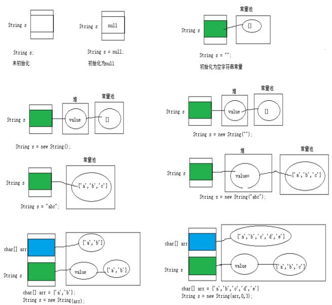

1. 常量+常量：结果是常量池。且常量池中不会存在相同内容的常量。
1. 常量与变量 或 变量与变量：结果在堆中
1. 拼接后调用intern方法：返回值在常量池中
1. concat方法拼接，哪怕是两个常量对象拼接，结果也是在堆。

##### 3.3.1.3 String常用API

1. 构造器

    - `public String()`：初始化新创建的 String对象，以使其表示空字符序列。
    - `String(String original)`： 初始化一个新创建的 String 对象，使其表示一个与参数相同的字符序列；换句话说，新创建的字符串是该参数字符串的副本。
    - `public String(char[] value)`：通过当前参数中的字符数组来构造新的String。
    - `public String(char[] value,int offset, int count)`：通过字符数组的一部分来构造新的String。
    - `public String(byte[] bytes,int offset, int length, String charsetName)`：通过使用平台的默认字符集解码当前参数中的字节数组、使用指定的字符集解码当前参数中的字节数组来构造新的String。

1. String的常用API-1

    String 类包括的方法可用于检查序列的单个字符、比较字符串、搜索字符串、提取子字符串、创建字符串副本并将所有字符全部转换为大写或小写。
    1. 常用方法
        - `boolean isEmpty()`：字符串是否为空
        - `int length()`：返回字符串的长度
        - `String concat(xx)`：拼接
        - `boolean equals(Object obj)`：比较字符串是否相等，区分大小写
        - `boolean equalsIgnoreCase(Object obj)`：比较字符串是否相等，不区分大小写
        - `int compareTo(String other)`：比较字符串大小，区分大小写，按照Unicode编码值比较大小
        - `int compareToIgnoreCase(String other)`：比较字符串大小，不区分大小写
        - `String toLowerCase()`：将字符串中大写字母转为小写
        - `String toUpperCase()`：将字符串中小写字母转为大写
        - `String trim()`：去掉字符串前后空白符
        - `public String intern()`：结果在常量池中共享
    1. 查找方法
        - `boolean contains(xx)`：是否包含xx
        - `int indexOf(xx)`：从前往后找当前字符串中xx，即如果有返回第一次出现的下标，要是没有返回-1
        - `int indexOf(String str, int fromIndex)`：返回指定子字符串在此字符串中第一次出现处的索引，从指定的索引开始
        - `int lastIndexOf(xx)`：从后往前找当前字符串中xx，即如果有返回最后一次出现的下标，要是没有返回-1
        - `int lastIndexOf(String str, int fromIndex)`：返回指定子字符串在此字符串中最后一次出现处的索引，从指定的索引开始反向搜索。
    1. 截取方法
        - `String substring(int beginIndex)`：返回一个新的字符串，它是此字符串的从beginIndex开始截取到最后的一个子字符串。
        - `String substring(int beginIndex, int endIndex)`：返回一个新字符串，它是此字符串从beginIndex开始截取到endIndex(不包含)的一个子字符串。
    1. 字符/字符数组相关方法
        - `char charAt(index)`：返回[index]位置的字符
        - `char[] toCharArray()`： 将此字符串转换为一个新的字符数组返回
        - `static String valueOf(char[] data)`：返回指定数组中表示该字符序列的 String
        - `static String valueOf(char[] data, int offset, int count)`： 返回指定数组中表示该字符序列的 String
        - `static String copyValueOf(char[] data)`： 返回指定数组中表示该字符序列的 String
        - `static String copyValueOf(char[] data, int offset, int count)`：返回指定数组中表示该字符序列的 String
    1. 判断开头与结尾方法
    - `boolean startsWith(xx)`：测试此字符串是否以指定的前缀开始
    - `boolean startsWith(String prefix, int toffset)`：测试此字符串从指定索引开始的子字符串是否以指定前缀开始
    - `boolean endsWith(xx)`：测试此字符串是否以指定的后缀结束
    1. 替换
    - `String replace(char oldChar, char newChar)`：返回一个新的字符串，它是通过用 newChar 替换此字符串中出现的所有 oldChar 得到的。 不支持正则。
    - `String replace(CharSequence target, CharSequence replacement)`：使用指定的字面值替换序列替换此字符串所有匹配字面值目标序列的子字符串。
    - `String replaceAll(String regex, String replacement)`：使用给定的 replacement 替换此字符串所有匹配给定的正则表达式的子字符串。
    - `String replaceFirst(String regex, String replacement)`：使用给定的 replacement 替换此字符串匹配给定的正则表达式的第一个子字符串。

##### 3.3.1.4 String与其他结构间的转换

字符串 --> 基本数据类型、包装类：

- `Integer包装类的public static int parseInt(String s)`：可以将由“数字”字符组成的字符串转换为整型。
类似地，使用java.lang包中的Byte、Short、Long、Float、Double类调相应的类方法可以将由“数字”字符组成的字符串，转化为相应的基本数据类型。

基本数据类型、包装类 --> 字符串：

- 调用`String类的public String valueOf(int n)`可将int型转换为字符串
- 相应的valueOf(byte b)、valueOf(long l)、valueOf(float f)、valueOf(double d)、valueOf(boolean b)可由参数的相应类型到字符串的转换。

字符数组 --> 字符串：

- String 类的构造器：`String(char[])` 和 `String(char[]，int offset，int length)` 分别用字符数组中的全部字符和部分字符创建字符串对象。

字符串 --> 字符数组：

- `public char[] toCharArray()`：将字符串中的全部字符存放在一个字符数组中的方法。
- `public void getChars(int srcBegin, int srcEnd, char[] dst, int dstBegin)`：提供了将指定索引范围内的字符串存放到数组中的方法。

字符串 --> 字节数组：（编码）

- `public byte[] getBytes()`：使用平台的默认字符集将此 String 编码为 byte 序列，并将结果存储到一个新的 byte 数组中。
- `public byte[] getBytes(String charsetName)`：使用指定的字符集将此 String 编码到 byte 序列，并将结果存储到新的 byte 数组。

字节数组 --> 字符串：（解码）

- `String(byte[])`：通过使用平台的默认字符集解码指定的 byte 数组，构造一个新的 String。
- `String(byte[]，int offset，int length)`：用指定的字节数组的一部分，即从数组起始位置offset开始取length个字节构造一个字符串对象。
- `String(byte[], String charsetName )`或 new String(byte[], int, int,String charsetName )：解码，按照指定的编码方式进行解码

#### 3.3.2 字符串相关类之可变字符序列：StringBuffer、StringBuilder

##### 3.3.2.1 理解

StringBuilder 和 StringBuffer 非常类似，均代表可变的字符序列，而且提供相关功能的方法也一样。

区分String、StringBuffer、StringBuilder

- String:不可变的字符序列； 底层使用char[]数组存储(JDK8.0中)
- StringBuffer:可变的字符序列；线程安全（方法有synchronized修饰），效率低；底层使用char[]数组存储 (JDK8.0中)
- StringBuilder:可变的字符序列； jdk1.5引入，线程不安全的，效率高；底层使用char[]数组存储(JDK8.0中)

##### 3.3.2.2 StringBuilder、StringBuffer的API

StringBuilder、StringBuffer的API是完全一致的，并且很多方法与String相同。

1. 常用API

    - `StringBuffer append(xx)`：提供了很多的append()方法，用于进行字符串追加的方式拼接
    - `StringBuffer delete(int start, int end)`：删除[start,end)之间字符
    - `StringBuffer deleteCharAt(int index)`：删除[index]位置字符
    - `StringBuffer replace(int start, int end, String str)`：替换[start,end)范围的字符序列为str
    - `void setCharAt(int index, char c)`：替换[index]位置字符
    - `char charAt(int index)`：查找指定index位置上的字符
    - `StringBuffer insert(int index, xx)`：在[index]位置插入xx
    - `int length()`：返回存储的字符数据的长度
    - `StringBuffer reverse()`：反转

    当append和insert时，如果原来value数组长度不够，可扩容。
1. 其他API

    - `int indexOf(String str)`：在当前字符序列中查询str的第一次出现下标
    - `int indexOf(String str, int fromIndex)`：在当前字符序列[fromIndex,最后]中查询str的第一次出现下标
    - `int lastIndexOf(String str)`：在当前字符序列中查询str的最后一次出现下标
    - `int lastIndexOf(String str, int fromIndex)`：在当前字符序列[fromIndex,最后]中查询str的最后一次出现下标
    - `String substring(int start)`：截取当前字符序列[start,最后]
    - `String substring(int start, int end)`：截取当前字符序列[start,end)
    - `String toString()`：返回此序列中数据的字符串表示形式
    - `void setLength(int newLength)`：设置当前字符序列长度为newLength

#### 3.3.3 JDK8之前：日期时间API

##### 3.3.3.1 java.lang.System类

- System类提供的`public static long currentTimeMillis()`：用来返回当前时间与1970年1月1日0时0分0秒之间以毫秒为单位的时间差。
此方法适于计算时间差。

##### 3.3.3.2 java.util.Date类

表示特定的瞬间，精确到毫秒。

1. 构造器：

    - `Date()`：使用无参构造器创建的对象可以获取本地当前时间。
    - `Date(long 毫秒数)`：把该毫秒值换算成日期时间对象

1. 常用方法

    - `getTime()`: 返回自 1970 年 1 月 1 日 00:00:00 GMT 以来此 Date 对象表示的毫秒数。
    - `toString()`: 把此 Date 对象转换为以下形式的 String： dow mon dd hh:mm:ss zzz yyyy 其中： dow 是一周中的某一天 (Sun, Mon, Tue, Wed, Thu, Fri, Sat)，zzz是时间标准。
    - 其它很多方法都过时了。

##### 3.3.3.3 java.text.SimpleDateFormat类

java.text.SimpleDateFormat类是一个不与语言环境有关的方式来格式化和解析日期的具体类。

可以进行格式化：日期 --> 文本

可以进行解析：文本 --> 日期

构造器：

- `SimpleDateFormat()`：默认的模式和语言环境创建对象
- `public SimpleDateFormat(String pattern)`：该构造方法可以用参数pattern指定的格式创建一个对象

格式化：

- `public String format(Date date)`：方法格式化时间对象date

解析：

- `public Date parse(String source)`：从给定字符串的开始解析文本，以生成一个日期。

##### 3.3.3.4 java.util.Calendar(日历)类

Date类的API大部分被废弃了，替换为Calendar。

Calendar 类是一个抽象类，主用用于完成日期字段之间相互操作的功能。

获取Calendar实例的方法

1. 使用Calendar.getInstance()方法

    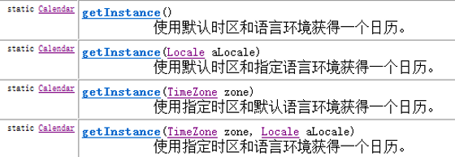

1. 调用它的子类GregorianCalendar（公历）的构造器。

一个Calendar的实例是系统时间的抽象表示，可以修改或获取 YEAR、MONTH、DAYOFWEEK、HOUROFDAY 、MINUTE、SECOND等 日历字段对应的时间值。

- `public int get(int field)`：返回给定日历字段的值
- `public void set(int field,int value)`：将给定的日历字段设置为指定的值
- `public void add(int field,int amount)`：根据日历的规则，为给定的日历字段添加或者减去指定的时间量
- `public final Date getTime()`：将Calendar转成Date对象
- `public final void setTime(Date date)`：使用指定的Date对象重置Calendar的时间

常用字段
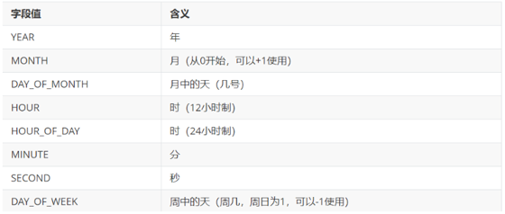

注意：

- 获取月份时：一月是0，二月是1，以此类推，12月是11
- 获取星期时：周日是1，周二是2 ， 。。。。周六是7

#### 3.3.4 JDK8：新的日期时间API

我们希望时间与昼夜和四季有关，于是事情就变复杂了。JDK 1.0中包含了一个java.util.Date类，但是它的大多数方法已经在JDK 1.1引入Calendar类之后被弃用了。而Calendar并不比Date好多少。它们面临的问题是：

- 可变性：像日期和时间这样的类应该是不可变的。
- 偏移性：Date中的年份是从1900开始的，而月份都从0开始。
- 格式化：格式化只对Date有用，Calendar则不行。
- 此外，它们也不是线程安全的；不能处理闰秒等。

  闰秒，是指为保持协调世界时接近于世界时时刻，由国际计量局统一规定在年底或年中（也可能在季末）对协调世界时增加或减少1秒的调整。由于地球自转的不均匀性和长期变慢性（主要由潮汐摩擦引起的），会使世界时（民用时）和原子时之间相差超过到±0.9秒时，就把协调世界时向前拨1秒（负闰秒，最后一分钟为59秒）或向后拨1秒（正闰秒，最后一分钟为61秒）； 闰秒一般加在公历年末或公历六月末。

  目前，全球已经进行了27次闰秒，均为正闰秒。

总结：对日期和时间的操作一直是Java程序员最痛苦的地方之一。

第三次引入的API是成功的，并且Java 8中引入的java.time API 已经纠正了过去的缺陷，将来很长一段时间内它都会为我们服务。

Java 8 以一个新的开始为 Java 创建优秀的 API。新的日期时间API包含：

- java.time – 包含值对象的基础包
- java.time.chrono – 提供对不同的日历系统的访问。
- java.time.format – 格式化和解析时间和日期
- java.time.temporal – 包括底层框架和扩展特性
- java.time.zone – 包含时区支持的类

说明：新的 java.time 中包含了所有关于时钟（Clock），本地日期（LocalDate）、本地时间（LocalTime）、本地日期时间（LocalDateTime）、时区（ZonedDateTime）和持续时间（Duration）的类。

##### 3.3.4.1 本地日期时间：LocalDate、LocalTime、LocalDateTime

import java.time.LocalDate;

import java.time.LocalDateTime;

import java.time.LocalTime;

- `now()/ now(ZoneId zone)`：静态方法，根据当前时间创建对象/指定时区的对象
- `of(xx,xx,xx,xx,xx,xxx)`：静态方法，根据指定日期/时间创建对象
- `getDayOfMonth()/getDayOfYear()`：获得月份天数(1-31) /获得年份天数(1-366)
- `getDayOfWeek()`：获得星期几(返回一个 DayOfWeek 枚举值)
- `getMonth()`：获得月份, 返回一个 Month 枚举值
- `getMonthValue() / getYear()`：获得月份(1-12) /获得年份
- `getHours()/getMinute()/getSecond()`：获得当前对象对应的小时、分钟、秒
- `withDayOfMonth()/withDayOfYear()/withMonth()/withYear()`：将月份天数、年份天数、月份、年份修改为指定的值并返回新的对象
- `with(TemporalAdjuster t)`：将当前日期时间设置为校对器指定的日期时间
- `plusDays(), plusWeeks(), plusMonths(), plusYears(),plusHours()`：向当前对象添加几天、几周、几个月、几年、几小时
- `minusMonths() / minusWeeks()/minusDays()/minusYears()/minusHours()`：从当前对象减去几月、几周、几天、几年、几小时
- `plus(TemporalAmount t)/minus(TemporalAmount t)`：添加或减少一个 Duration 或 Period
- `isBefore()/isAfter()`：比较两个 LocalDate
- `isLeapYear()`：判断是否是闰年（在LocalDate类中声明）
- `format(DateTimeFormatter t)`：格式化本地日期、时间，返回一个字符串
- `parse(Charsequence text)`：将指定格式的字符串解析为日期、时间

##### 3.3.4.2 瞬时：Instant

java.time.Instant;

Instant：时间线上的一个瞬时点。 这可能被用来记录应用程序中的事件时间戳。

时间戳是指格林威治时间1970年01月01日00时00分00秒(北京时间1970年01月01日08时00分00秒)起至现在的总秒数。

java.time.Instant表示时间线上的一点，而不需要任何上下文信息，例如，时区。概念上讲，它只是简单的表示自1970年1月1日0时0分0秒（UTC）开始的秒数。

- `now()`：静态方法，返回默认UTC时区的Instant类的对象
- `ofEpochMilli(long epochMilli)`：静态方法，返回在1970-01-01 00:00:00基础上加上指定毫秒数之后的Instant类的对象
- `atOffset(ZoneOffset offset)`：结合即时的偏移来创建一个 OffsetDateTime
- `toEpochMilli()`：返回1970-01-01 00:00:00到当前时间的毫秒数，即为时间戳

##### 3.3.4.3 日期时间格式化：DateTimeFormatter

该类提供了三种格式化方法：

- (了解)预定义的标准格式。如：ISOLOCALDATETIME、ISOLOCALDATE、ISOLOCAL_TIME
- (了解)本地化相关的格式。如：ofLocalizedDate(FormatStyle.LONG)

```java
// 本地化相关的格式。如：ofLocalizedDateTime()
// FormatStyle.MEDIUM / FormatStyle.SHORT :适用于LocalDateTime

// 本地化相关的格式。如：ofLocalizedDate()
// FormatStyle.FULL / FormatStyle.LONG / FormatStyle.MEDIUM / FormatStyle.SHORT : 适用于LocalDate
```

- 自定义的格式。如：ofPattern(“yyyy-MM-dd hh:mm:ss”)

- `ofPattern(String pattern)`：静态方法，返回一个指定字符串格式的DateTimeFormatter
- `format(TemporalAccessor t)`：格式化一个日期、时间，返回字符串
- `parse(CharSequence text)`：将指定格式的字符序列解析为一个日期、时间

```java
import org.junit.Test;

import java.time.LocalDateTime;
import java.time.ZoneId;
import java.time.format.DateTimeFormatter;
import java.time.format.FormatStyle;

public class TestDatetimeFormatter {
    @Test
    public void test1(){
        // 方式一：预定义的标准格式。如：ISO_LOCAL_DATE_TIME;ISO_LOCAL_DATE;ISO_LOCAL_TIME
        DateTimeFormatter formatter = DateTimeFormatter.ISO_LOCAL_DATE_TIME;
        // 格式化:日期-->字符串
        LocalDateTime localDateTime = LocalDateTime.now();
        String str1 = formatter.format(localDateTime);
        System.out.println(localDateTime);
        System.out.println(str1);//2022-12-04T21:02:14.808

        // 解析：字符串 -->日期
        TemporalAccessor parse = formatter.parse("2022-12-04T21:02:14.808");
        LocalDateTime dateTime = LocalDateTime.from(parse);
        System.out.println(dateTime);
    }

    @Test
    public void test2(){
        LocalDateTime localDateTime = LocalDateTime.now();
        // 方式二：
        // 本地化相关的格式。如：ofLocalizedDateTime()
        // FormatStyle.LONG / FormatStyle.MEDIUM / FormatStyle.SHORT :适用于LocalDateTime
        DateTimeFormatter formatter1 = DateTimeFormatter.ofLocalizedDateTime(FormatStyle.LONG);
        
        // 格式化
        String str2 = formatter1.format(localDateTime);
        System.out.println(str2);// 2022年12月4日 下午09时03分55秒

        // 本地化相关的格式。如：ofLocalizedDate()
        // FormatStyle.FULL / FormatStyle.LONG / FormatStyle.MEDIUM / FormatStyle.SHORT : 适用于LocalDate
        DateTimeFormatter formatter2 = DateTimeFormatter.ofLocalizedDate(FormatStyle.FULL);
        // 格式化
        String str3 = formatter2.format(LocalDate.now());
        System.out.println(str3);// 2022年12月4日 星期日
    }

    @Test
    public void test3(){
        //方式三：自定义的方式（关注、重点）
        DateTimeFormatter dateTimeFormatter = DateTimeFormatter.ofPattern("yyyy/MM/dd HH:mm:ss");
        //格式化
        String strDateTime = dateTimeFormatter.format(LocalDateTime.now());
        System.out.println(strDateTime); //2022/12/04 21:05:42
        //解析
        TemporalAccessor accessor = dateTimeFormatter.parse("2022/12/04 21:05:42");
        LocalDateTime localDateTime = LocalDateTime.from(accessor);
        System.out.println(localDateTime); //2022-12-04T21:05:42
    }
}

```

#### 3.3.5 其它API

##### 3.3.5.1 定时区日期时间：ZondId和ZonedDateTime

- ZoneId：该类中包含了所有的时区信息，一个时区的ID，如 Europe/Paris
- ZonedDateTime：一个在ISO-8601日历系统时区的日期时间，如 2007-12-03T10:15:30+01:00 Europe/Paris。

其中每个时区都对应着ID，地区ID都为“{区域}/{城市}”的格式，例如：Asia/Shanghai等

常见时区ID：

- Asia/Shanghai
- UTC
- America/New_York

可以通过ZondId获取所有可用的时区ID：

##### 3.3.5.2 持续日期/时间：Period和Duration

- 持续时间：Duration，用于计算两个“时间”间隔
- 日期间隔：Period，用于计算两个“日期”间隔

##### 3.3.5.3 Clock：使用时区提供对当前即时、日期和时间的访问的时钟

##### 3.3.5.4 TemporalAdjuster : 时间校正器

有时我们可能需要获取例如：将日期调整到“下一个工作日”等操作。 TemporalAdjusters : 该类通过静态方法(firstDayOfXxx()/lastDayOfXxx()/nextXxx())提供了大量的常用 TemporalAdjuster 的实现。

#### 3.3.6 与传统日期处理的转换

|类|To 遗留类|From 遗留类|
|:---:|:---:|:---:|
|java.time.Instant与java.util.Date|Date.from(instant)|date.toInstant()|
|java.time.Instant与java.sql.Timestamp|Timestamp.from(instant)|timestamp.toInstant()|
|java.time.ZonedDateTime与java.util.GregorianCalendar|GregorianCalendar.from(zonedDateTime)|cal.toZonedDateTime()|
|java.time.LocalDate与java.sql.Time|Date.valueOf(localDate)|date.toLocalDate()|
|java.time.LocalTime与java.sql.Time|Date.valueOf(localDate)|date.toLocalTime()|
|java.time.LocalDateTime与java.sql.Timestamp|Timestamp.valueOf(localDateTime)|timestamp.toLocalDateTime()|
|java.time.ZoneId与java.util.TimeZone|Timezone.getTimeZone(id)|timeZone.toZoneId()|
|java.time.format.DateTimeFormatter与java.text.DateFormat|formatter.toFormat()|无|

#### 3.3.7 比较器

Java实现对象排序的方式有两种：

- 自然排序：java.lang.Comparable
- 定制排序：java.util.Comparator

##### 3.3.7.1 自然排序：java.lang.Comparable

Comparable接口强行对实现它的每个类的对象进行整体排序。这种排序被称为类的自然排序。

实现 Comparable 的类必须实现 compareTo(Object obj)方法，两个对象即通过 compareTo(Object obj) 方法的返回值来比较大小。如果当前对象this大于形参对象obj，则返回正整数，如果当前对象this小于形参对象obj，则返回负整数，如果当前对象this等于形参对象obj，则返回零。

实现Comparable接口的对象列表（和数组）可以通过 Collections.sort 或 Arrays.sort进行自动排序。实现此接口的对象可以用作有序映射中的键或有序集合中的元素，无需指定比较器。

对于类 C 的每一个 e1 和 e2 来说，当且仅当 e1.compareTo(e2) == 0 与 e1.equals(e2) 具有相同的 boolean 值时，类 C 的自然排序才叫做与 equals 一致。建议（虽然不是必需的）最好使自然排序与 equals 一致。

Comparable 的典型实现：(默认都是从小到大排列的)

- String：按照字符串中字符的Unicode值进行比较
- Character：按照字符的Unicode值来进行比较
- 数值类型对应的包装类以及BigInteger、BigDecimal：按照它们对应的数值大小进行比较
- Boolean：true 对应的包装类实例大于 false 对应的包装类实例
- Date、Time等：后面的日期时间比前面的日期时间大

##### 3.3.7.2 定制排序：java.util.Comparator

当元素的类型没有实现java.lang.Comparable接口而又不方便修改代码（例如：一些第三方的类，你只有.class文件，没有源文件）

如果一个类，实现了Comparable接口，也指定了两个对象的比较大小的规则，但是此时此刻我不想按照它预定义的方法比较大小，但是我又不能随意修改，因为会影响其他地方的使用，怎么办？

JDK在设计类库之初，也考虑到这种情况，所以又增加了一个java.util.Comparator接口。强行对多个对象进行整体排序的比较。

重写compare(Object o1,Object o2)方法，比较o1和o2的大小：如果方法返回正整数，则表示o1大于o2；如果返回0，表示相等；返回负整数，表示o1小于o2。

可以将 Comparator 传递给 sort 方法（如 Collections.sort 或 Arrays.sort），从而允许在排序顺序上实现精确控制。

#### 3.3.8 系统相关类

##### 3.3.8.1 System类

System类代表系统，系统级的很多属性和控制方法都放置在该类的内部。该类位于java.lang包

由于该类的构造器是private的，所以无法创建该类的对象。其内部的成员变量和成员方法都是static的，所以也可以很方便的进行调用。

成员变量 Scanner scan = new Scanner(System.in);
System类内部包含in、out和err三个成员变量，分别代表标准输入流(键盘输入)，标准输出流(显示器)和标准错误输出流(显示器)。

成员方法

- `native long currentTimeMillis()`： 该方法的作用是返回当前的计算机时间，时间的表达格式为当前计算机时间和GMT时间(格林威治时间)1970年1月1号0时0分0秒所差的毫秒数。
- `void exit(int status)`： 该方法的作用是退出程序。其中status的值为0代表正常退出，非零代表异常退出。使用该方法可以在图形界面编程中实现程序的退出功能等。
- `void gc()`： 该方法的作用是请求系统进行垃圾回收。至于系统是否立刻回收，则取决于系统中垃圾回收算法的实现以及系统执行时的情况。
- `String getProperty(String key)`： 该方法的作用是获得系统中属性名为key的属性对应的值。系统中常见的属性名以及属性的作用如下表所示：
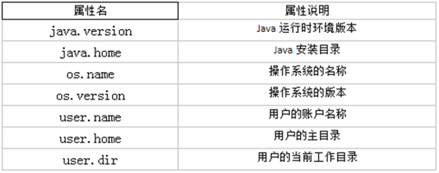

##### 3.3.8.2 java.lang.Runtime类

每个 Java 应用程序都有一个 Runtime 类实例，使应用程序能够与其运行的环境相连接。

- `public static Runtime getRuntime()`： 返回与当前 Java 应用程序相关的运行时对象。应用程序不能创建自己的 Runtime 类实例。
- `public long totalMemory()`：返回 Java 虚拟机中初始化时的内存总量。此方法返回的值可能随时间的推移而变化，这取决于主机环境。默认为物理电脑内存的1/64。
- `public long maxMemory()`：返回 Java 虚拟机中最大程度能使用的内存总量。默认为物理电脑内存的1/4。
- `public long freeMemory()`：回 Java 虚拟机中的空闲内存量。调用 gc 方法可能导致 freeMemory 返回值的增加。

#### 3.3.9 和数学相关的类

##### 3.3.9.1 java.lang.Math

java.lang.Math 类包含用于执行基本数学运算的方法，如初等指数、对数、平方根和三角函数。类似这样的工具类，其所有方法均为静态方法，并且不会创建对象，调用起来非常简单。

- `public static double abs(double a)`：返回 double 值的绝对值。
- `public static double ceil(double a)`：返回大于等于参数的最小的整数。
- `public static double floor(double a)`：返回小于等于参数最大的整数。
- `public static long round(double a)`：返回最接近参数的 long。(相当于四舍五入方法)
- `public static double pow(double a,double b)`：返回a的b幂次方法
- `public static double sqrt(double a)`：返回a的平方根
- `public static double random()`：返回[0,1)的随机值
- `public static final double PI`：返回圆周率
- `public static double max(double x, double y)`：返回x,y中的最大值
- `public static double min(double x, double y)`：返回x,y中的最小值
- 其它：acos,asin,atan,cos,sin,tan 三角函数

##### 3.3.9.2 java.math包

###### 3.3.9.2.1 BigInteger

Integer类作为int的包装类，能存储的最大整型值为2^31-1，Long类也是有限的，最大为2^63-1。如果要表示再大的整数，不管是基本数据类型还是他们的包装类都无能为力，更不用说进行运算了。

java.math包的BigInteger可以表示不可变的任意精度的整数。BigInteger 提供所有 Java 的基本整数操作符的对应物，并提供 java.lang.Math 的所有相关方法。

另外，BigInteger 还提供以下运算：模算术、GCD 计算、质数测试、素数生成、位操作以及一些其他操作。

构造器

- BigInteger(String val)：根据字符串构建BigInteger对象

方法

- `public BigInteger abs()`：返回此 BigInteger 的绝对值的 BigInteger。
- `BigInteger add(BigInteger val)`：返回其值为 (this + val) 的 BigInteger
- `BigInteger subtract(BigInteger val)`：返回其值为 (this - val) 的 BigInteger
- `BigInteger multiply(BigInteger val)`：返回其值为 (this * val) 的 BigInteger
- `BigInteger divide(BigInteger val)`：返回其值为 (this / val) 的 BigInteger。整数相除只保留整数部分。
- `BigInteger remainder(BigInteger val)`：返回其值为 (this % val) 的 BigInteger。
- `BigInteger[] divideAndRemainder(BigInteger val)`：返回包含 (this / val) 后跟 (this % val) 的两个 BigInteger 的数组。
- `BigInteger pow(int exponent)`：返回其值为 (this^exponent) 的 BigInteger。

###### 3.3.9.2.2 BigDecimal

一般的Float类和Double类可以用来做科学计算或工程计算，但在商业计算中，要求数字精度比较高，故用到java.math.BigDecimal类。

BigDecimal类支持不可变的、任意精度的有符号十进制定点数。

构造器

- `public BigDecimal(double val)`
- `public BigDecimal(String val)` --> 推荐

常用方法

- `public BigDecimal add(BigDecimal augend)`
- `public BigDecimal subtract(BigDecimal subtrahend)`
- `public BigDecimal multiply(BigDecimal multiplicand)`
- `public BigDecimal divide(BigDecimal divisor, int scale, int roundingMode)`：divisor是除数，scale指明保留几位小数，roundingMode指明舍入模式（ROUNDUP :向上加1、ROUNDDOWN :直接舍去、ROUNDHALFUP:四舍五入）

###### 3.3.9.2.3 java.util.Random用于产生随机数

- `boolean nextBoolean()`：返回下一个伪随机数，它是取自此随机数生成器序列的均匀分布的 boolean 值。
- `void nextBytes(byte[] bytes)`：生成随机字节并将其置于用户提供的 byte 数组中。
- `double nextDouble()`：返回下一个伪随机数，它是取自此随机数生成器序列的、在 0.0 和 1.0 之间均匀分布的 double 值。
- `float nextFloat()`：返回下一个伪随机数，它是取自此随机数生成器序列的、在 0.0 和 1.0 之间均匀分布的 float 值。
- `double nextGaussian()`：返回下一个伪随机数，它是取自此随机数生成器序列的、呈高斯（“正态”）分布的 double 值，其平均值是 0.0，标准差是 1.0。
- `int nextInt()`：返回下一个伪随机数，它是此随机数生成器的序列中均匀分布的 int 值。
- `int nextInt(int n)`：返回一个伪随机数，它是取自此随机数生成器序列的、在 0（包括）和指定值（不包括）之间均匀分布的 int 值。
- `long nextLong()`：返回下一个伪随机数，它是取自此随机数生成器序列的均匀分布的 long 值。

### 3.4 集合框架

#### 3.4.1 Java集合框架体系

Java 集合可分为 Collection 和 Map 两大体系：

- Collection接口：用于存储一个一个的数据，也称单列数据集合。
  - List子接口：用来存储有序的、可以重复的数据（主要用来替换数组，"动态"数组）

    实现类：ArrayList(主要实现类)、LinkedList、Vector

  - Set子接口：用来存储无序的、不可重复的数据（类似于高中讲的"集合"）

    实现类：HashSet(主要实现类)、LinkedHashSet、TreeSet

- Map接口：用于存储具有映射关系“key-value对”的集合，即一对一对的数据，也称双列数据集合。(类似于高中的函数、映射。(x1,y1),(x2,y2) ---> y = f(x) )

  - HashMap(主要实现类)、LinkedHashMap、TreeMap、Hashtable、Properties

JDK提供的集合API位于java.util包内

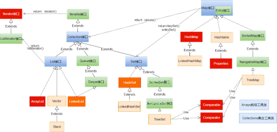
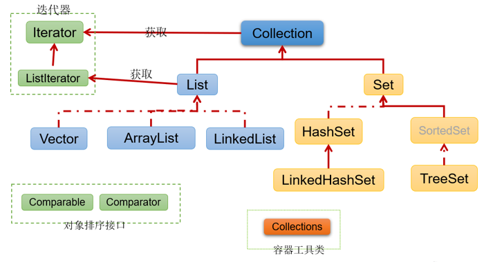
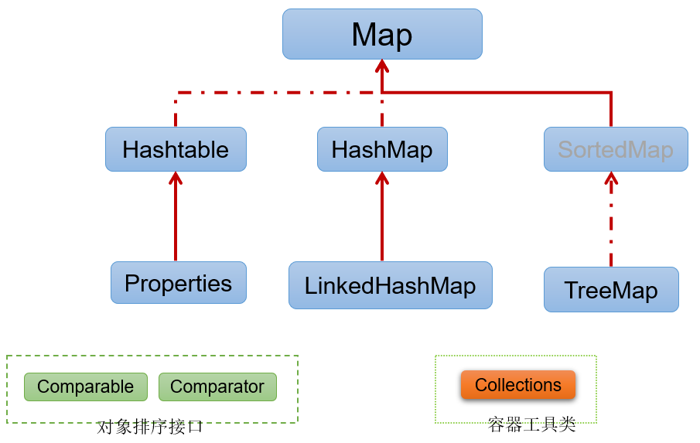

#### 3.4.2 Collection接口及其方法

JDK不提供此接口的任何直接实现，而是提供更具体的子接口（如：Set和List）去实现。

Collection 接口是 List和Set接口的父接口，该接口里定义的方法既可用于操作 Set 集合，也可用于操作 List 集合。方法如下：

##### 3.4.2.1 添加

- `add(E obj)`：添加元素对象到当前集合中
- `addAll(Collection other)`：添加other集合中的所有元素对象到当前集合中，即this = this ∪ other

add是作为一个添加，addAll是逐个添加。

##### 3.4.2.2 判断

- `int size()`：获取当前集合中实际存储的元素个数
- `boolean isEmpty()`：判断当前集合是否为空集合
- `boolean contains(Object obj)`：判断当前集合中是否存在一个与obj对象equals返回true的元素
- `boolean containsAll(Collection coll)`：判断coll集合中的元素是否在当前集合中都存在。即coll集合是否是当前集合的“子集”
- `boolean equals(Object obj)`：判断当前集合与obj是否相等

##### 3.4.2.3 删除

- `void clear()`：清空集合元素
- `boolean remove(Object obj)`：从当前集合中删除第一个找到的与obj对象equals返回true的元素。
- `boolean removeAll(Collection coll)`：从当前集合中删除所有与coll集合中相同的元素。即this = this - this ∩ coll
- `boolean retainAll(Collection coll)`：从当前集合中删除两个集合中不同的元素，使得当前集合仅保留与coll集合中的元素相同的元素，即当前集合中仅保留两个集合的交集，即this = this ∩ coll；

##### 3.4.2.4 其它

- `Object[] toArray()`：返回包含当前集合中所有元素的数组
- `hashCode()`：获取集合对象的哈希值
- `iterator()`：返回迭代器对象，用于集合遍历

#### 3.4.3 Iterator(迭代器)接口

##### 3.4.3.1 Iterator接口

在程序开发中，经常需要遍历集合中的所有元素。针对这种需求，JDK专门提供了一个接口java.util.Iterator。Iterator接口也是Java集合中的一员，但它与Collection、Map接口有所不同。

Collection接口与Map接口主要用于存储元素。

Iterator，被称为迭代器接口，本身并不提供存储对象的能力，主要用于遍历Collection中的元素

Collection接口继承了java.lang.Iterable接口，该接口有一个iterator()方法，那么所有实现了Collection接口的集合类都有一个iterator()方法，用以返回一个实现了Iterator接口的对象。

- `public Iterator iterator()`: 获取集合对应的迭代器，用来遍历集合中的元素的。

集合对象每次调用iterator()方法都得到一个全新的迭代器对象，默认游标都在集合的第一个元素之前。

Iterator接口的常用方法如下：

- `public E next()`:返回迭代的下一个元素。
- `public boolean hasNext()`:如果仍有元素可以迭代，则返回 true。

注意：在调用it.next()方法之前必须要调用it.hasNext()进行检测。若不调用，且下一条记录无效，直接调用it.next()会抛出NoSuchElementException异常。

##### 3.4.3.2 迭代器的执行原理

Iterator迭代器对象在遍历集合时，内部采用指针的方式来跟踪集合中的元素，可使用Iterator迭代器删除元素：java.util.Iterator迭代器中有一个方法：`void remove()`;

Iterator可以删除集合的元素，但是遍历过程中通过迭代器对象的remove方法，不是集合对象的remove方法。

如果还未调用next()或在上一次调用 next() 方法之后已经调用了 remove() 方法，再调用remove()都会报IllegalStateException。

Collection已经有remove(xx)方法了，为什么Iterator迭代器还要提供删除方法呢？因为迭代器的remove()可以按指定的条件进行删除。

##### 3.4.3.3 foreach循环

foreach循环（也称增强for循环）是 JDK5.0 中定义的一个高级for循环，专门用来遍历数组和集合的。

foreach循环的语法格式：

```java
for(元素的数据类型 局部变量 : Collection集合或数组){ 
    //操作局部变量的输出操作
}
```

#### 3.4.4 Collection子接口1：List

##### 3.4.4.1 List接口特点

- 鉴于Java中数组用来存储数据的局限性，我们通常使用java.util.List替代数组
- List集合类中元素有序、且可重复，集合中的每个元素都有其对应的顺序索引。

JDK API中List接口的实现类常用的有：ArrayList、LinkedList和Vector。

##### 3.4.4.2 List接口方法

List除了从Collection集合继承的方法外，List 集合里添加了一些根据索引来操作集合元素的方法。

插入元素

- `void add(int index, Object ele)`:在index位置插入ele元素
- `boolean addAll(int index, Collection eles)`:从index位置开始将eles中的所有元素添加进来

获取元素

- `Object get(int index)`:获取指定index位置的元素
- `List subList(int fromIndex, int toIndex)`:返回从fromIndex到toIndex位置的子集合

获取元素索引

- `int indexOf(Object obj)`:返回obj在集合中首次出现的位置
- `int lastIndexOf(Object obj)`:返回obj在当前集合中末次出现的位置

删除和替换元素

- `Object remove(int index)`:移除指定index位置的元素，并返回此元素
- `Object set(int index, Object ele)`:设置指定index位置的元素为ele

##### 3.4.4.3 List接口主要实现类：ArrayList

ArrayList 是 List 接口的主要实现类

本质上，ArrayList是对象引用的一个”变长”数组

Arrays.asList(…) 方法返回的 List 集合，既不是 ArrayList 实例，也不是 Vector 实例。

Arrays.asList(…) 返回值是一个固定长度的 List 集合

##### 3.4.4.4 List的实现类之二：LinkedList

对于频繁的插入或删除元素的操作，建议使用LinkedList类，效率较高。这是由底层采用链表（双向链表）结构存储数据决定的。

特有方法：

- `void addFirst(Object obj)`
- `void addLast(Object obj)`
- `Object getFirst()`
- `Object getLast()`
- `Object removeFirst()`
- `Object removeLast()`

##### 3.4.4.5 List的实现类之三：Vector

Vector 是一个古老的集合，JDK1.0就有了。大多数操作与ArrayList相同，区别之处在于Vector是线程安全的。

在各种List中，最好把ArrayList作为默认选择。当插入、删除频繁时，使用LinkedList；Vector总是比ArrayList慢，所以尽量避免使用。

特有方法：

- `void addElement(Object obj)`
- `void insertElementAt(Object obj,int index)`
- `void setElementAt(Object obj,int index)`
- `void removeElement(Object obj)`
- `void removeAllElements()`

#### 3.4.5 Collection子接口2：Set

##### 3.4.5.1 Set接口概述

Set接口是Collection的子接口，Set接口相较于Collection接口没有提供额外的方法

Set 集合不允许包含相同的元素，如果试把两个相同的元素加入同一个 Set 集合中，则添加操作失败。

Set集合支持的遍历方式和Collection集合一样：foreach和Iterator。

Set的常用实现类有：HashSet、TreeSet、LinkedHashSet。

##### 3.4.5.2 et主要实现类：HashSet

###### 3.4.5.2.1 HashSet概述

HashSet 是 Set 接口的主要实现类，大多数时候使用 Set 集合时都使用这个实现类。

HashSet 按 Hash 算法来存储集合中的元素，因此具有很好的存储、查找、删除性能。

HashSet 具有以下特点：

- 不能保证元素的排列顺序
- HashSet 不是线程安全的
- 集合元素可以是 null

HashSet 集合判断两个元素相等的标准：两个对象通过 hashCode() 方法得到的哈希值相等，并且两个对象的 equals()方法返回值为true。

对于存放在Set容器中的对象，对应的类一定要重写hashCode()和equals(Object obj)方法，以实现对象相等规则。即：“相等的对象必须具有相等的散列码”。

HashSet集合中元素的无序性，不等同于随机性。这里的无序性与元素的添加位置有关。具体来说：我们在添加每一个元素到数组中时，具体的存储位置是由元素的hashCode()调用后返回的hash值决定的。导致在数组中每个元素不是依次紧密存放的，表现出一定的无序性。

###### 3.4.5.2.2 HashSet中添加元素的过程

1. 当向 HashSet 集合中存入一个元素时，HashSet 会调用该对象的 hashCode() 方法得到该对象的 hashCode值，然后根据 hashCode值，通过某个散列函数决定该对象在 HashSet 底层数组中的存储位置。
1. 如果要在数组中存储的位置上没有元素，则直接添加成功。
1. 如果要在数组中存储的位置上有元素，则继续比较：
    - 如果两个元素的hashCode值不相等，则添加成功；
    - 如果两个元素的hashCode()值相等，则会继续调用equals()方法：
      - 如果equals()方法结果为false，则添加成功。
      - 如果equals()方法结果为true，则添加失败。

    第2步添加成功，元素会保存在底层数组中。

    第3步两种添加成功的操作，由于该底层数组的位置已经有元素了，则会通过链表的方式继续链接，存储。

###### 3.4.5.2.3 重写 hashCode() 方法的基本原则

在程序运行时，同一个对象多次调用 hashCode() 方法应该返回相同的值。

当两个对象的 equals() 方法比较返回 true 时，这两个对象的 hashCode() 方法的返回值也应相等。

对象中用作 equals() 方法比较的 Field，都应该用来计算 hashCode 值。

注意：如果两个元素的 equals() 方法返回 true，但它们的 hashCode() 返回值不相等，hashSet 将会把它们存储在不同的位置，但依然可以添加成功。

###### 3.4.5.2.4 重写equals()方法的基本原则

重写equals方法的时候一般都需要同时复写hashCode方法。通常参与计算hashCode的对象的属性也应该参与到equals()中进行计算。

推荐：开发中直接调用Eclipse/IDEA里的快捷键自动重写equals()和hashCode()方法即可。

为什么用Eclipse/IDEA复写hashCode方法，有31这个数字？

1. 首先，选择系数的时候要选择尽量大的系数。因为如果计算出来的hash地址越大，所谓的“冲突”就越少，查找起来效率也会提高。（减少冲突）

1. 其次，31只占用5bits,相乘造成数据溢出的概率较小。

1. 再次，31可以 由i*31== (i<<5)-1来表示,现在很多虚拟机里面都有做相关优化。（提高算法效率）

1. 最后，31是一个素数，素数作用就是如果我用一个数字来乘以这个素数，那么最终出来的结果只能被素数本身和被乘数还有1来整除！(减少冲突)

##### 3.4.5.3 Set实现类之二：LinkedHashSet

LinkedHashSet 是 HashSet 的子类，不允许集合元素重复。

LinkedHashSet 根据元素的 hashCode 值来决定元素的存储位置，但它同时使用双向链表维护元素的次序，这使得元素看起来是以添加顺序保存的。

LinkedHashSet插入性能略低于 HashSet，但在迭代访问 Set 里的全部元素时有很好的性能。

##### 3.4.5.4 Set实现类之三：TreeSet

###### 3.4.5.4.1 TreeSet概述

TreeSet 是 SortedSet 接口的实现类，TreeSet 可以按照添加的元素的指定的属性的大小顺序进行遍历。

TreeSet底层使用红黑树结构存储数据

新增的方法如下： (了解)

- `Comparator comparator()`
- `Object first()`
- `Object last()`
- `Object lower(Object e)`
- `Object higher(Object e)`
- `SortedSet subSet(fromElement, toElement)`
- `SortedSet headSet(toElement)`
- `SortedSet tailSet(fromElement)`

TreeSet特点：不允许重复、实现排序（自然排序或定制排序）

TreeSet 两种排序方法：自然排序和定制排序。默认情况下，TreeSet 采用自然排序。

- 自然排序：TreeSet 会调用集合元素的 compareTo(Object obj) 方法来比较元素之间的大小关系，然后将集合元素按升序(默认情况)排列。

  如果试图把一个对象添加到 TreeSet 时，则该对象的类必须实现 Comparable 接口。

  实现 Comparable 的类必须实现 compareTo(Object obj) 方法，两个对象即通过 compareTo(Object obj) 方法的返回值来比较大小。

- 定制排序：如果元素所属的类没有实现Comparable接口，或不希望按照升序(默认情况)的方式排列元素或希望按照其它属性大小进行排序，则考虑使用定制排序。定制排序，通过Comparator接口来实现。需要重写compare(T o1,T o2)方法。

    利用int compare(T o1,T o2)方法，比较o1和o2的大小：如果方法返回正整数，则表示o1大于o2；如果返回0，表示相等；返回负整数，表示o1小于o2。

    要实现定制排序，需要将实现Comparator接口的实例作为形参传递给TreeSet的构造器。

    因为只有相同类的两个实例才会比较大小，所以向 TreeSet 中添加的应该是同一个类的对象。

    对于 TreeSet 集合而言，它判断两个对象是否相等的唯一标准是：两个对象通过 compareTo(Object obj) 或compare(Object o1,Object o2)方法比较返回值。返回值为0，则认为两个对象相等。

#### 3.4.6 Map接口

现实生活与开发中，我们常会看到这样的一类集合：用户ID与账户信息、学生姓名与考试成绩、IP地址与主机名等，这种一一对应的关系，就称作映射。Java提供了专门的集合框架用来存储这种映射关系的对象，即java.util.Map接口。

##### 3.4.6.1 Map接口概述

Map与Collection并列存在。用于保存具有映射关系的数据：key-value

Collection集合称为单列集合，元素是孤立存在的（理解为单身）。
Map集合称为双列集合，元素是成对存在的(理解为夫妻)。

Map 中的 key 和 value 都可以是任何引用类型的数据。但常用String类作为Map的“键”。

Map接口的常用实现类：HashMap、LinkedHashMap、TreeMap和`Properties。其中，HashMap是 Map 接口使用频率最高的实现类。

##### 3.4.6.2 Map中key-value特点

这里主要以HashMap为例说明。HashMap中存储的key、value的特点如下：

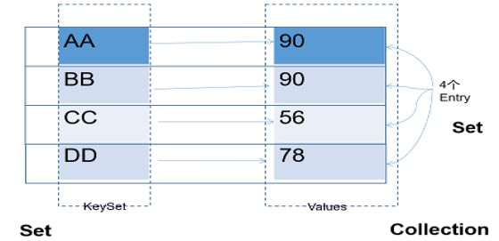

Map 中的 key用Set来存放，不允许重复，即同一个 Map 对象所对应的类，须重写hashCode()和equals()方法

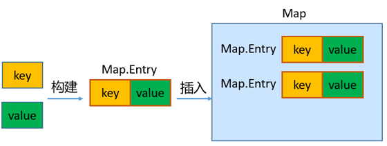

key 和 value 之间存在单向一对一关系，即通过指定的 key 总能找到唯一的、确定的 value，不同key对应的value可以重复。value所在的类要重写equals()方法。

key和value构成一个entry。所有的entry彼此之间是无序的、不可重复的。

##### 3.4.6.3 Map接口的常用方法

添加、修改操作：

- `Object put(Object key,Object value)`：将指定key-value添加到(或修改)当前map对象中
- `void putAll(Map m)`:将m中的所有key-value对存放到当前map中

###### 3.4.6.3.1 删除操作

- `Object remove(Object key)`：移除指定key的key-value对，并返回value
- `void clear()`：清空当前map中的所有数据

###### 3.4.6.3.2 元素查询的操作

- `Object get(Object key)`：获取指定key对应的value
- `boolean containsKey(Object key)`：是否包含指定的key
- `boolean containsValue(Object value)`：是否包含指定的value
- `int size()`：返回map中key-value对的个数
- `boolean isEmpty()`：判断当前map是否为空
- `boolean equals(Object obj)`：判断当前map和参数对象obj是否相等

###### 3.4.6.3.3 元视图操作的方法

- `Set keySet()`：返回所有key构成的Set集合
- `Collection values()`：返回所有value构成的Collection集合
- `Set entrySet()`：返回所有key-value对构成的Set集合

##### 3.4.6.4 Map的主要实现类：HashMap

HashMap是 Map 接口使用频率最高的实现类。

HashMap是线程不安全的。允许添加 null 键和 null 值。

存储数据采用的哈希表结构，底层使用一维数组+单向链表+红黑树进行key-value数据的存储。与HashSet一样，元素的存取顺序不能保证一致。

HashMap 判断两个key相等的标准是：两个 key 的hashCode值相等，通过 equals() 方法返回 true。

HashMap 判断两个value相等的标准是：两个 value 通过 equals() 方法返回 true。

#### 3.4.6.5 Map实现类之二：LinkedHashMap

LinkedHashMap 是 HashMap 的子类

存储数据采用的哈希表结构+链表结构，在HashMap存储结构的基础上，使用了一对双向链表来记录添加元素的先后顺序，可以保证遍历元素时，与添加的顺序一致。

通过哈希表结构可以保证键的唯一、不重复，需要键所在类重写hashCode()方法、equals()方法。

#### 3.4.6.6 Map实现类之三：TreeMap

TreeMap存储 key-value 对时，需要根据 key-value 对进行排序。TreeMap 可以保证所有的 key-value 对处于有序状态。

TreeSet底层使用红黑树结构存储数据

TreeMap 的 Key 的排序：

- 自然排序：TreeMap 的所有的 Key 必须实现 Comparable 接口，而且所有的 Key 应该是同一个类的对象，否则将会抛出 ClasssCastException
- 定制排序：创建 TreeMap 时，构造器传入一个 Comparator 对象，该对象负责对 TreeMap 中的所有 key 进行排序。此时不需要 Map 的 Key 实现 Comparable 接口

TreeMap判断两个key相等的标准：两个key通过compareTo()方法或者compare()方法返回0。

#### 3.4.6.7 Map实现类之四：Hashtable

Hashtable是Map接口的古老实现类，JDK1.0就提供了。不同于HashMap，Hashtable是线程安全的。

Hashtable实现原理和HashMap相同，功能相同。底层都使用哈希表结构（数组+单向链表），查询速度快。

与HashMap一样，Hashtable 也不能保证其中 Key-Value 对的顺序

Hashtable判断两个key相等、两个value相等的标准，与HashMap一致。

与HashMap不同，Hashtable 不允许使用 null 作为 key 或 value。

#### 3.4.6.8 Map实现类之五：Properties

Properties 类是 Hashtable 的子类，该对象用于处理属性文件

由于属性文件里的 key、value 都是字符串类型，所以 Properties 中要求 key 和 value 都是字符串类型

存取数据时，建议使用setProperty(String key,String value)方法和getProperty(String key)方法

#### 3.4.7 Collections工具类

参考操作数组的工具类：Arrays，Collections 是一个操作 Set、List 和 Map 等集合的工具类。

Collections 中提供了一系列静态的方法对集合元素进行排序、查询和修改等操作，还提供了对集合对象设置不可变、对集合对象实现同步控制等方法（均为static方法）

##### 3.4.7.1 排序

- `reverse(List)`：反转 List 中元素的顺序
- `shuffle(List)`：对 List 集合元素进行随机排序
- `sort(List)`：根据元素的自然顺序对指定 List 集合元素按升序排序
- `sort(List，Comparator)`：根据指定的 Comparator 产生的顺序对 List 集合元素进行排序
- `swap(List，int， int)`：将指定 list 集合中的 i 处元素和 j 处元素进行交换

##### 3.4.7.2 查找

- `Object max(Collection)`：根据元素的自然顺序，返回给定集合中的最大元素
- `Object max(Collection，Comparator)`：根据 Comparator 指定的顺序，返回给定集合中的最大元素
- `Object min(Collection)`：根据元素的自然顺序，返回给定集合中的最小元素
- `Object min(Collection，Comparator)`：根据 Comparator 指定的顺序，返回给定集合中的最小元素
- `int binarySearch(List list,T key)`：在List集合中查找某个元素的下标，但是List的元素必须是T或T的子类对象，而且必须是可比较大小的，即支持自然排序的。而且集合也事先必须是有序的，否则结果不确定。
- `int binarySearch(List list,T key,Comparator c)`在List集合中查找某个元素的下标，但是List的元素必须是T或T的子类对象，而且集合也事先必须是按照c比较器规则进行排序过的，否则结果不确定。
- `int frequency(Collection c，Object o)`：返回指定集合中指定元素的出现次数

##### 3.4.7.3 复制、替换

- `void copy(List dest,List src)`：将src中的内容复制到dest中
- `boolean replaceAll(List list，Object oldVal，Object newVal)`：使用新值替换 List 对象的所有旧值
- 提供了多个unmodifiableXxx()方法，该方法返回指定 Xxx的不可修改的视图。

##### 3.4.7.4 添加

- `boolean addAll(Collection c,T... elements)`将所有指定元素添加到指定 collection 中。

##### 3.4.7.5 同步

Collections 类中提供了多个 synchronizedXxx() 方法，该方法可使将指定集合包装成线程同步的集合，从而可以解决多线程并发访问集合时的线程安全问题：

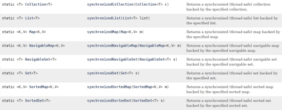

### 3.5 泛型

#### 3.5.1 概念

JDK1.5设计了泛型的概念。泛型即为“类型参数”，这个类型参数在声明它的类、接口或方法中，代表未知的某种通用类型。

所谓泛型，就是允许在定义类、接口时通过一个标识表示类中某个属性的类型或者是某个方法的返回值或参数的类型。这个类型参数将在使用时（例如，继承或实现这个接口、创建对象或调用方法时）确定（即传入实际的类型参数，也称为类型实参）。

把一个集合中的内容限制为一个特定的数据类型，这就是generic背后的核心思想。

相关使用说明：在创建集合对象的时候，可以指明泛型的类型。

具体格式为：List\<String> list = new ArrayList\<String>();

JDK7.0时，有新特性，可以简写为：
List\<String> list = new ArrayList<>(); //类型推断

泛型，也称为泛型参数，即参数的类型，只能使用引用数据类型进行赋值。（不能使用基本数据类型，可以使用包装类替换）

集合声明时，声明泛型参数。在使用集合时，可以具体指明泛型的类型。一旦指明，类或接口内部，凡是使用泛型参数的位置，都指定为具体的参数类型。如果没有指明的话，看做是Object类型。

#### 3.5.2 自定义泛型

##### 3.5.2.1 位置与格式

位置：声明类或接口时，在类名或接口名后面声明泛型类型，我们把这样的类或接口称为泛型类或泛型接口。
声明方法时，在【修饰符】与返回值类型之间声明类型变量，我们把声明了类型变量的方法，称为泛型方法。

泛型类型的变量不能被static修饰。

```java
【修饰符】 class 类名<类型变量列表> 【extends 父类】 【implements 接口们】{
    
}
【修饰符】 interface 接口名<类型变量列表> 【implements 接口们】{
    
}
【修饰符】 <类型变量列表> 返回值类型 方法名(【形参列表】)【throws 异常列表】{
    //...
}

```

##### 3.5.2.2 自定义泛型类或泛型接口

当我们在类或接口中定义某个成员时，该成员的相关类型是不确定的，而这个类型需要在使用这个类或接口时才可以确定，那么我们可以使用泛型类、泛型接口。

###### 3.5.2.2.1 说明

- 我们在声明完自定义泛型类以后，可以在类的内部（比如：属性、方法、构造器中）使用类的泛型。
- 我们在创建自定义泛型类的对象时，可以指明泛型参数类型。一旦指明，内部凡是使用类的泛型参数的位置，都具体化为指定的类的泛型类型。
- 如果在创建自定义泛型类的对象时，没有指明泛型参数类型，那么泛型将被擦除，泛型对应的类型均按照Object处理，但不等价于Object。也就是，如果创建泛型类对象时不写泛型参数（比如不写<>, 或者写List list = new ArrayList();），那么编译时会把泛型擦除掉，所有泛型位置都按Object处理，但它又和List\<Object>不是一回事。

经验：泛型要使用一路都用。要不用，一路都不要用。

- 泛型的指定中必须使用引用数据类型。不能使用基本数据类型，此时只能使用包装类替换。
- 除创建泛型类对象外，子类继承泛型类时、实现类实现泛型接口时，也可以确定泛型结构中的泛型参数。
如果我们在给泛型类提供子类时，子类也不确定泛型的类型，则可以继续使用泛型参数。

我们还可以在现有的父类的泛型参数的基础上，新增泛型参数。

###### 3.5.2.2.2 注意

- 泛型类可能有多个参数，此时应将多个参数一起放在尖括号内。比如：<E1,E2,E3>
- JDK7.0 开始，泛型的简化操作：ArrayList flist = new ArrayList<>();
- 如果泛型结构是一个接口或抽象类，则不可创建泛型类的对象。
- 不能使用new E[]。但是可以：E[] elements = (E[])new Object[capacity];
  参考：ArrayList源码中声明：Object[] elementData，而非泛型参数类型数组。
- 在类/接口上声明的泛型，在本类或本接口中即代表某种类型，但不可以在静态方法中使用类的泛型。
- 异常类不能是带泛型的。

##### 3.5.2.3 自定义泛型方法

如果我们定义类、接口时没有使用<泛型参数>，但是某个方法形参类型不确定时，这个方法可以单独定义<泛型参数>。

3.3.1 说明

方法，也可以被泛型化，与其所在的类是否是泛型类没有关系。

泛型方法中的泛型参数在方法被调用时确定。

泛型方法可以根据需要，声明为static的。

#### 3.5.4 泛型在继承上的体现

如果B是A的一个子类型（子类或者子接口），而G是具有泛型声明的类或接口，G并不是G的子类型！

比如：String是Object的子类，但是List\<String>并不是List\<Object>的子类。

#### 3.5.5  通配符的使用

当我们声明一个变量/形参时，这个变量/形参的类型是一个泛型类或泛型接口，例如：Comparator类型，但是我们仍然无法确定这个泛型类或泛型接口的类型变量的具体类型，此时我们考虑使用类型通配符 `?`

##### 3.5.5.1 通配符的理解

使用类型通配符：？

比如：List\<?>，Map\<?,?>
 List<?>是List\<String>、List\<Object>等各种泛型List的父类。

作用：

1. 免去重复重载

    不用为 Integer、Double、Number 各写一个求和方法，一个通配符方法全收下

    ```java
    // 接收所有数字子类集合
    public static double sum(List<? extends Number> list){
        double total = 0;
        for(Number n : list) total += n.doubleValue();
        return total;
    }
    // 调用都合法
    sum(new ArrayList<Integer>());
    sum(new ArrayList<Double>());
    ```

1. 通用工具方法

    任意类型集合都能遍历打印，一套代码通用

    ```java
    public static void print(List<?> list){
        for(Object o : list) System.out.println(o);
    }
    ```

1. 批量存入子类对象

    父类容器统一收纳各类子类数据

    ```java
    public static void fill(List<? super Integer> list){
        list.add(1);
        list.add(99);
    }
    ```

1. 适配框架多类型返回

    不确定具体泛型，用通配符承接返回值，保证代码兼容

##### 3.5.5.2 写操作

将任意元素加入到其中不是类型安全的：

Collection<?> c = new ArrayList\<String\>();

c.add(new Object()); // 编译时错误

因为我们不知道c的元素类型，我们不能向其中添加对象。add方法有类型参数E作为集合的元素类型。我们传给add的任何参数都必须是一个未知类型的子类。因为我们不知道那是什么类型，所以我们无法传任何东西进去。

唯一可以插入的元素是null，因为它是所有引用类型的默认值。

##### 3.5.5.3 读操作

另一方面，读取List<?>的对象list中的元素时，永远是安全的，因为不管 list 的真实类型是什么，它包含的都是Object。

##### 3.5.5.4 使用注意点

1. 注意点1：编译错误：不能用在泛型方法声明上，返回值类型前面<>不能使用?

    public static \<?> void test(ArrayList<?> list){}
1. 注意点2：编译错误：不能用在泛型类的声明上

    class GenericTypeClass\<?>{}
1. 注意点3：编译错误：不能用在创建对象上，右边属于创建集合对象

    ArrayList\<?> list2 = new ArrayList<?>();

##### 3.5.5.6 有限制的通配符

\<?>：允许所有泛型的引用调用(读安全，只能写null)

通配符指定上限：\<? extends 类/接口 >：使用时指定的类型必须是继承某个类，或者实现某个接口，即<=。(读安全，只能写null)

通配符指定下限：\<? super 类/接口 >：使用时指定的类型必须是操作的类或接口，或者是操作的类的父类或接口的父接口，即>=。(写安全，读只能用Object接收)

### 3.6 数据结构与集合源码

### 3.7 File类与IO流

#### 3.7.1 File类

##### 3.7.1.1 概述

File类及本章下的各种流，都定义在java.io包下。

一个File对象代表硬盘或网络中可能存在的一个文件或者文件目录（俗称文件夹），与平台无关。（体会万事万物皆对象）

File 能新建、删除、重命名文件和目录，但 File 不能访问文件内容本身。如果需要访问文件内容本身，则需要使用输入/输出流。

File对象可以作为参数传递给流的构造器。

想要在Java程序中表示一个真实存在的文件或目录，那么必须有一个File对象，但是Java程序中的一个File对象，可能没有一个真实存在的文件或目录。

##### 3.7.1.2 构造器

- `public File(String pathname)`：以pathname为路径创建File对象，可以是绝对路径或者相对路径，如果pathname是相对路径，则默认的当前路径在系统属性user.dir中存储
- `public File(String parent, String child)`：以parent为父路径，child为子路径创建File对象。
- `public File(File parent, String child)`：根据一个父File对象和子文件路径创建File对象

1. 无论该路径下是否存在文件或者目录，都不影响File对象的创建。
1. window的路径分隔符使用“\”，而Java程序中的“\”表示转义字符，所以在Windows中表示路径，需要用“\”。或者直接使用“/”也可以，Java程序支持将“/”当成平台无关的路径分隔符。或者直接使用File.separator常量值表示。比如：

    File file2 = new File("d:" + File.separator + "atguigu" + File.separator + "info.txt");
1. 当构造路径是绝对路径时，那么getPath和getAbsolutePath结果一样
1. 当构造路径是相对路径时，那么getAbsolutePath的路径 = user.dir的路径 + 构造路径

##### 3.7.1.3 常用方法

###### 3.7.1.3.1 获取文件和目录基本信息

- `public String getName()`：获取名称
- `public String getPath()`：获取路径
- `public String getAbsolutePath()`：获取绝对路径
- `public File getAbsoluteFile()`：获取绝对路径表示的文件
- `public String getParent()`：获取上层文件目录路径。若无，返回null
- `public long length()`：获取文件长度（即：字节数）。不能获取目录的长度。
- `public long lastModified()`：获取最后一次的修改时间，毫秒值

如果File对象代表的文件或目录存在，则File对象实例初始化时，就会用硬盘中对应文件或目录的属性信息（例如，时间、类型等）为File对象的属性赋值，否则除了路径和名称，File对象的其他属性将会保留默认值。

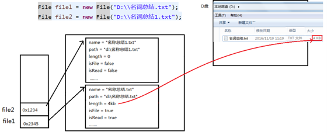

###### 3.7.1.3.2 列出目录的下一级

- `public String[] list()`：返回一个String数组，表示该File目录中的所有子文件或目录。
- `public File[] listFiles()`：返回一个File数组，表示该File目录中的所有的子文件或目录。

###### 3.7.1.3.3 File类的重命名功能

- `public boolean renameTo(File dest)`:把文件重命名为指定的文件路径。

###### 3.7.1.3.4 判断功能的方法

- `public boolean exists()`：此File表示的文件或目录是否实际存在。
- `public boolean isDirectory()`：此File表示的是否为目录。
- `public boolean isFile()`：此File表示的是否为文件。
- `public boolean canRead()`：判断是否可读
- `public boolean canWrite()`：判断是否可写
- `public boolean isHidden()`：判断是否隐藏

如果文件或目录不存在，那么exists()、isFile()和isDirectory()都是返回false

###### 3.7.1.3.5 创建、删除功能

- `public boolean createNewFile()`：创建文件。若文件存在，则不创建，返回false。
- `public boolean mkdir()`：创建文件目录。如果此文件目录存在，就不创建了。如果此文件目录的上层目录不存在，也不创建。
- `public boolean mkdirs()`：创建文件目录。如果上层文件目录不存在，一并创建。
- `public boolean delete()`：删除文件或者文件夹

删除注意事项：① Java中的删除不走回收站。② 要删除一个文件目录，请注意该文件目录内不能包含文件或者文件目录。

#### 3.7.2 IO流原理及其分类

##### 3.7.2.1 IO流原理

Java程序中，对于数据的输入/输出操作以“流(stream)” 的方式进行，可以看做是一种数据的流动。

I/O流中的I/O是Input/Output的缩写， I/O技术是非常实用的技术，用于处理设备之间的数据传输。如读/写文件，网络通讯等。

- 输入input：读取外部数据（磁盘、光盘等存储设备的数据）到程序（内存）中。
- 输出output：将程序（内存）数据输出到磁盘、光盘等存储设备中。

##### 3.7.2.2 流的分类

java.io包下提供了各种“流”类和接口，用以获取不同种类的数据，并通过标准的方法输入或输出数据。

1. 按数据的流向不同分为：输入流和输出流。

    - 输入流 ：把数据从其他设备上读取到内存中的流。

        以InputStream、Reader结尾
    - 输出流 ：把数据从内存 中写出到其他设备上的流。

        以OutputStream、Writer结尾
1. 按操作数据单位的不同分为：字节流（8bit）和字符流（16bit）。

    - 字节流 ：以字节为单位，读写数据的流。

        以InputStream、OutputStream结尾
    - 字符流 ：以字符为单位，读写数据的流。
        以Reader、Writer结尾

1. 根据IO流的角色不同分为：节点流和处理流。

    - 节点流：直接从数据源或目的地读写数据

    - 处理流：不直接连接到数据源或目的地，而是“连接”在已存在的流（节点流或处理流）之上，通过对数据的处理为程序提供更为强大的读写功能。

##### 3.7.2.3 流的API

Java的IO流共涉及40多个类，实际上非常规则，都是从如下4个抽象基类派生的。

|抽象基类|输入流|输出流|
|:---:|:---:|:---:|
|字节流|InputStream|OutputStream|
|字符流|Reader|Writer|

由这四个类派生出来的子类名称都是以其父类名作为子类名后缀。


1. 常用的节点流：

    - 文件流： FileInputStream、FileOutputStrean、FileReader、FileWriter
    - 字节/字符数组流： ByteArrayInputStream、ByteArrayOutputStream、CharArrayReader、CharArrayWriter
    - 对数组进行处理的节点流（对应的不再是文件，而是内存中的一个数组）。

1. 常用处理流：

    - 缓冲流：BufferedInputStream、BufferedOutputStream、BufferedReader、BufferedWriter

        作用：增加缓冲功能，避免频繁读写硬盘，进而提升读写效率。
    - 转换流：InputStreamReader、OutputStreamReader

        作用：实现字节流和字符流之间的转换。
    - 对象流：ObjectInputStream、ObjectOutputStream
        作用：提供直接读写Java对象功能

#### 3.7.3 节点流之一——FileReader\FileWriter

##### 3.7.3.1 Reader与Writer

Java提供一些字符流类，以字符为单位读写数据，专门用于处理文本文件。不能操作图片，视频等非文本文件。

常见的文本文件有如下的格式：.txt、.java、.c、.cpp、.py等

注意：.doc、.xls、.ppt这些都不是文本文件。

###### 3.7.3.1.1 字符输入流：Reader

java.io.Reader抽象类是表示用于读取字符流的所有类的父类，可以读取字符信息到内存中。它定义了字符输入流的基本共性功能方法。

- `public int read()`： 从输入流读取一个字符。 虽然读取了一个字符，但是会自动提升为int类型。返回该字符的Unicode编码值。如果已经到达流末尾了，则返回-1。
- `public int read(char[] cbuf)`： 从输入流中读取一些字符，并将它们存储到字符数组 cbuf中 。每次最多读取cbuf.length个字符。返回实际读取的字符个数。如果已经到达流末尾，没有数据可读，则返回-1。
- `public int read(char[] cbuf,int off,int len)`：从输入流中读取一些字符，并将它们存储到字符数组 cbuf中，从cbuf[off]开始的位置存储。每次最多读取len个字符。返回实际读取的字符个数。如果已经到达流末尾，没有数据可读，则返回-1。
- `public void close()`：关闭此流并释放与此流相关联的任何系统资源。

注意：当完成流的操作时，必须调用close()方法，释放系统资源，否则会造成内存泄漏。

##### 3.7.3.1.2 字符输出流：Writer

java.io.Writer抽象类是表示用于写出字符流的所有类的超类，将指定的字符信息写出到目的地。它定义了字节输出流的基本共性功能方法。

- `public void write(int c)` ：写出单个字符。
- `public void write(char[] cbuf)`：写出字符数组。
- `public void write(char[] cbuf, int off, int len)`：写出字符数组的某一部分。off：数组的开始索引；len：写出的字符个数。
- `public void write(String str)`：写出字符串。
- `public void write(String str, int off, int len)`：写出字符串的某一部分。off：字符串的开始索引；len：写出的字符个数。
- `public void flush()`：刷新该流的缓冲。
- `public void close()`：关闭此流。

注意：当完成流的操作时，必须调用close()方法，释放系统资源，否则会造成内存泄漏。

##### 3.7.3.2 FileReader 与 FileWriter

###### 3.7.3.2.1 FileReader

java.io.FileReader类用于读取字符文件，构造时使用系统默认的字符编码和默认字节缓冲区。

- `FileReader(File file)`： 创建一个新的 FileReader ，给定要读取的File对象。
- `FileReader(String fileName)`： 创建一个新的 FileReader ，给定要读取的文件的名称。

###### 3.7.3.2.2 FileWriter

java.io.FileWriter类用于写出字符到文件，构造时使用系统默认的字符编码和默认字节缓冲区。

- `FileWriter(File file)`： 创建一个新的 FileWriter，给定要读取的File对象。
- `FileWriter(String fileName)`： 创建一个新的 FileWriter，给定要读取的文件的名称。
- `FileWriter(File file,boolean append)`： 创建一个新的 FileWriter，指明是否在现有文件末尾追加内容。

###### 3.7.3.2.3 小结

因为出现流资源的调用，为了避免内存泄漏，需要使用try-catch-finally处理异常

对于输入流来说，File类的对象必须在物理磁盘上存在，否则执行就会报FileNotFoundException。如果传入的是一个目录，则会报IOException异常。

对于输出流来说，File类的对象是可以不存在的。

  1. 如果File类的对象不存在，则可以在输出的过程中，自动创建File类的对象

  1. 如果File类的对象存在，

        1. 如果调用FileWriter(File file)或FileWriter(File file,false)，输出时会新建File文件覆盖已有的文件

        1. 如果调用FileWriter(File file,true)构造器，则在现有的文件末尾追加写出内容。

#### 3.7.4 关于flush（刷新）

因为内置缓冲区的原因，如果FileWriter不关闭输出流，无法写出字符到文件中。但是关闭的流对象，是无法继续写出数据的。如果我们既想写出数据，又想继续使用流，就需要flush() 方法了。

flush() ：刷新缓冲区，流对象可以继续使用。

close()：先刷新缓冲区，然后通知系统释放资源。流对象不可以再被使用了。

注意：即便是flush()方法写出了数据，操作的最后还是要调用close方法，释放系统资源。

#### 3.7.5 节点流之二——FileInputStream\FileOutputStream

如果我们读取或写出的数据是非文本文件，则Reader、Writer就无能为力了，必须使用字节流。

##### 3.7.5.1 InputStream和OutputStream

###### 3.7.5.1.1 字节输入流：InputStream

java.io.InputStream抽象类是表示字节输入流的所有类的超类，可以读取字节信息到内存中。它定义了字节输入流的基本共性功能方法。

- `public int read()`： 从输入流读取一个字节。返回读取的字节值。虽然读取了一个字节，但是会自动提升为int类型。如果已经到达流末尾，没有数据可读，则返回-1。
- `public int read(byte[] b)`： 从输入流中读取一些字节数，并将它们存储到字节数组 b中 。每次最多读取b.length个字节。返回实际读取的字节个数。如果已经到达流末尾，没有数据可读，则返回-1。
- `public int read(byte[] b,int off,int len)`：从输入流中读取一些字节数，并将它们存储到字节数组 b中，从b[off]开始存储，每次最多读取len个字节 。返回实际读取的字节个数。如果已经到达流末尾，没有数据可读，则返回-1。
- `public void close()`：关闭此输入流并释放与此流相关联的任何系统资源。

说明：close()方法，当完成流的操作时，必须调用此方法，释放系统资源。

###### 3.7.5.1.2 字节输出流：OutputStream

java.io.OutputStream抽象类是表示字节输出流的所有类的超类，将指定的字节信息写出到目的地。它定义了字节输出流的基本共性功能方法。

- `public void write(int b)`：将指定的字节输出流。虽然参数为int类型四个字节，但是只会保留一个字节的信息写出。
- `public void write(byte[] b)`：将 b.length字节从指定的字节数组写入此输出流。
- `public void write(byte[] b, int off, int len)`：从指定的字节数组写入 len字节，从偏移量 off开始输出到此输出流。
- `public void flush()`：刷新此输出流并强制任何缓冲的输出字节被写出。
- `public void close()`：关闭此输出流并释放与此流相关联的任何系统资源。

说明：close()方法，当完成流的操作时，必须调用此方法，释放系统资源。

##### 3.7.5.2 FileInputStream 与 FileOutputStream

###### 3.7.5.2.1 FileInputStream

java.io.FileInputStream类是文件输入流，从文件中读取字节。

- `FileInputStream(File file)`： 通过打开与实际文件的连接来创建一个 FileInputStream ，该文件由文件系统中的 File对象 file命名。
- `FileInputStream(String name)`： 通过打开与实际文件的连接来创建一个 FileInputStream ，该文件由文件系统中的路径名 name命名。

###### 3.7.5.2.2 FileOutputStream

java.io.FileOutputStream类是文件输出流，用于将数据写出到文件。

- `public FileOutputStream(File file)`：创建文件输出流，写出由指定的 File对象表示的文件。
- `public FileOutputStream(String name)`： 创建文件输出流，指定的名称为写出文件。
- `public FileOutputStream(File file, boolean append)`： 创建文件输出流，指明是否在现有文件末尾追加内容。

#### 3.7.6 处理流之一：缓冲流

为了提高数据读写的速度，Java API提供了带缓冲功能的流类：缓冲流。

缓冲流要“套接”在相应的节点流之上，根据数据操作单位可以把缓冲流分为：

- 字节缓冲流：BufferedInputStream，BufferedOutputStream
- 字符缓冲流：BufferedReader，BufferedWriter

缓冲流的基本原理：在创建流对象时，内部会创建一个缓冲区数组（缺省使用8192个字节(8Kb)的缓冲区），通过缓冲区读写，减少系统IO次数，从而提高读写的效率。

##### 3.7.6.1 构造器

- `public BufferedInputStream(InputStream in)`：创建一个 新的字节型的缓冲输入流。
- `public BufferedOutputStream(OutputStream out)`： 创建一个新的字节型的缓冲输出流。

##### 3.7.6.2 字符缓冲流特有方法

字符缓冲流的基本方法与普通字符流调用方式一致，不再阐述，我们来看它们具备的特有方法。

- `BufferedReader：public String readLine()`: 读一行文字。
- `BufferedWriter：public void newLine()`: 写一行行分隔符,由系统属性定义符号。

说明：

1. 涉及到嵌套的多个流时，如果都显式关闭的话，需要先关闭外层的流，再关闭内层的流
2. 其实在开发中，只需要关闭最外层的流即可，因为在关闭外层流时，内层的流也会被关闭。

#### 3.7.7 处理流之二：转换流

作用：转换流是字节与字符间的桥梁
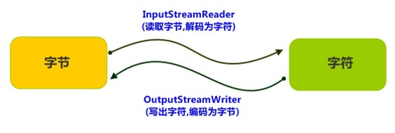

##### 3.7.7.1 InputStreamReader 与 OutputStreamWriter

###### 3.7.7.1.1 InputStreamReader

转换流java.io.InputStreamReader，是Reader的子类，是从字节流到字符流的桥梁。它读取字节，并使用指定的字符集将其解码为字符。它的字符集可以由名称指定，也可以接受平台的默认字符集。

构造器

- `InputStreamReader(InputStream in)`: 创建一个使用默认字符集的字符流。
- `InputStreamReader(InputStream in, String charsetName)`: 创建一个指定字符集的字符流。

###### 3.7.7.1.2 OutputStreamWriter

转换流java.io.OutputStreamWriter ，是Writer的子类，是从字符流到字节流的桥梁。使用指定的字符集将字符编码为字节。它的字符集可以由名称指定，也可以接受平台的默认字符集。

构造器

- `OutputStreamWriter(OutputStream in)`: 创建一个使用默认字符集的字符流。
- `OutputStreamWriter(OutputStream in,String charsetName)`: 创建一个指定字符集的字符流。

#### 3.7.8 处理流之三/四：数据流、对象流

对对象进行读写。

##### 3.7.8.1 数据流：DataOutputStream、DataInputStream

DataOutputStream：允许应用程序将基本数据类型、String类型的变量写入输出流中

DataInputStream：允许应用程序以与机器无关的方式从底层输入流中读取基本数据类型、String类型的变量。

对象流DataInputStream中的方法：

`byte readByte()`
`short readShort()`
`int readInt()`
`long readLong()`
`float readFloat()`
`double readDouble()`
`char readChar()`
`boolean readBoolean()`
`String readUTF()`
`void readFully(byte[] b)`

对象流DataOutputStream中的方法：将上述的方法的read改为相应的write即可。

数据流的弊端：只支持Java基本数据类型和字符串的读写，而不支持其它Java对象的类型。而ObjectOutputStream和ObjectInputStream既支持Java基本数据类型的数据读写，又支持Java对象的读写，所以重点介绍对象流ObjectOutputStream和ObjectInputStream。

##### 3.7.8.2 对象流：ObjectOutputStream、ObjectInputStream

ObjectOutputStream：将 Java 基本数据类型和对象写入字节输出流中。通过在流中使用文件可以实现Java各种基本数据类型的数据以及对象的持久存储。

ObjectInputStream：ObjectInputStream 对以前使用 ObjectOutputStream 写出的基本数据类型的数据和对象进行读入操作，保存在内存中。

说明：对象流的强大之处就是可以把Java中的对象写入到数据源中，也能把对象从数据源中还原回来。

##### 3.7.8.3 对象流API

###### 3.7.8.3.1 ObjectOutputStream中的构造器

`public ObjectOutputStream(OutputStream out)`： 创建一个指定的ObjectOutputStream。

###### 3.7.8.3.2 ObjectOutputStream中的方法

- `public void writeBoolean(boolean val)`：写出一个 boolean 值。
- `public void writeByte(int val)`：写出一个8位字节
- `public void writeShort(int val)`：写出一个16位的 short 值
- `public void writeChar(int val)`：写出一个16位的 char 值
- `public void writeInt(int val)`：写出一个32位的 int 值
- `public void writeLong(long val)`：写出一个64位的 long 值
- `public void writeFloat(float val)`：写出一个32位的 float 值。
- `public void writeDouble(double val)`：写出一个64位的 double 值
- `public void writeUTF(String str)`：将表示长度信息的两个字节写入输出流，后跟字符串 s 中每个字符的 UTF-8 修改版表示形式。根据字符的值，将字符串 s 中每个字符转换成一个字节、两个字节或三个字节的字节组。注意，将 String 作为基本数据写入流中与将它作为 Object 写入流中明显不同。 如果 s 为 null，则抛出 NullPointerException。
- `public void writeObject(Object obj)`：写出一个obj对象
- `public void close()`：关闭此输出流并释放与此流相关联的任何系统资源

###### 3.7.8.3.3 ObjectInputStream中的构造器

`public ObjectInputStream(InputStream in)`： 创建一个指定的ObjectInputStream。

###### 3.7.8.3.4 ObjectInputStream中的方法

- `public boolean readBoolean()`：读取一个 boolean 值
- `public byte readByte()`：读取一个 8 位的字节
- `public short readShort()`：读取一个 16 位的 short 值
- `public char readChar()`：读取一个 16 位的 char 值
- `public int readInt()`：读取一个 32 位的 int 值
- `public long readLong()`：读取一个 64 位的 long 值
- `public float readFloat()`：读取一个 32 位的 float 值
- `public double readDouble()`：读取一个 64 位的 double 值
- `public String readUTF()`：读取 UTF-8 修改版格式的 String
- `public void readObject(Object obj)`：读入一个obj对象
- `public void close()`：关闭此输入流并释放与此流相关联的任何系统资源

#### 3.7.9 对象序列化机制

- 序列化过程：用一个字节序列可以表示一个对象，该字节序列包含该对象的类型和对象中存储的属性等信息。字节序列写出到文件之后，相当于文件中持久保存了一个对象的信息。
- 反序列化过程：该字节序列还可以从文件中读取回来，重构对象，对它进行反序列化。对象的数据、对象的类型和对象中存储的数据信息，都可以用来在内存中创建对象。

序列化机制的重要性：序列化是 RMI（Remote Method Invoke、远程方法调用）过程的参数和返回值都必须实现的机制，而 RMI 是 JavaEE 的基础。因此序列化机制是 JavaEE 平台的基础。

##### 3.7.9.1 序列化的好处

在于可将任何实现了Serializable接口的对象转化为字节数据，使其在保存和传输时可被还原。

##### 3.7.9.2 实现原理

- 序列化：用ObjectOutputStream类保存基本类型数据或对象的机制。方法为：
`public final void writeObject (Object obj)`: 将指定的对象写出。
- 反序列化：用ObjectInputStream类读取基本类型数据或对象的机制。方法为：
`public final Object readObject ()`: 读取一个对象。

##### 3.7.9.3 如何实现序列化机制

如果需要让某个对象支持序列化机制，则必须让对象所属的类及其属性是可序列化的，为了让某个类是可序列化的，该类必须实现java.io.Serializable 接口。Serializable 是一个标记接口，不实现此接口的类将不会使任何状态序列化或反序列化，会抛出NotSerializableException 。

如果对象的某个属性也是引用数据类型，那么如果该属性也要序列化的话，也要实现Serializable 接口

该类的所有属性必须是可序列化的。如果有一个属性不需要可序列化的，则该属性必须注明是瞬态的，使用transient 关键字修饰。

静态（static）变量的值不会序列化。因为静态变量的值不属于某个对象。

##### 3.7.9.4 反序列化失败问题

问题1：
对于JVM可以反序列化对象，它必须是能够找到class文件的类。如果找不到该类的class文件，则抛出一个 ClassNotFoundException 异常。

问题2：
当JVM反序列化对象时，能找到class文件，但是class文件在序列化对象之后发生了修改，那么反序列化操作也会失败，抛出一个InvalidClassException异常。发生这个异常的原因如下：

- 该类的序列版本号与从流中读取的类描述符的版本号不匹配
- 该类包含未知数据类型

解决办法：

Serializable 接口给需要序列化的类，提供了一个序列版本号：serialVersionUID 。凡是实现 Serializable接口的类都应该有一个表示序列化版本标识符的静态变量：
static final long serialVersionUID = 234242343243L; //它的值由程序员随意指定即可。

serialVersionUID用来表明类的不同版本间的兼容性。简单来说，Java的序列化机制是通过在运行时判断类的serialVersionUID来验证版本一致性的。在进行反序列化时，JVM会把传来的字节流中的serialVersionUID与本地相应实体类的serialVersionUID进行比较，如果相同就认为是一致的，可以进行反序列化，否则就会出现序列化版本不一致的异常(InvalidCastException)。

如果类没有显示定义这个静态常量，它的值是Java运行时环境根据类的内部细节自动生成的。若类的实例变量做了修改，serialVersionUID 可能发生变化。因此，建议显式声明。

如果声明了serialVersionUID，即使在序列化完成之后修改了类导致类重新编译，则原来的数据也能正常反序列化，只是新增的字段值是默认值而已。

#### 3.7.10 其他流

##### 3.7.10.1 标准输入、输出流

System.in和System.out分别代表了系统标准的输入和输出设备

默认输入设备是：键盘，输出设备是：显示器

System.in的类型是InputStream

System.out的类型是PrintStream，其是OutputStream的子类FilterOutputStream 的子类

重定向：通过System类的setIn，setOut方法对默认设备进行改变。

- public static void setIn(InputStream in)
- public static void setOut(PrintStream out)

拓展：

System类中有三个常量对象：System.out、System.in、System.err

查看System类中这三个常量对象的声明：

```java
public final static InputStream in = null;
public final static PrintStream out = null;
public final static PrintStream err = null;
```

奇怪的是，

- 这三个常量对象有final声明，但是却初始化为null。final声明的常量一旦赋值就不能修改，那么null不会空指针异常吗？
- 这三个常量对象为什么要小写？final声明的常量按照命名规范不是应该大写吗？
- 这三个常量的对象有set方法？final声明的常量不是不能修改值吗？set方法是如何修改它们的值的？

final声明的常量，表示在Java的语法体系中它们的值是不能修改的，而这三个常量对象的值是由C/C++等系统函数进行初始化和修改值的，所以它们故意没有用大写，也有set方法。

##### 3.7.10.2 打印流

实现将基本数据类型的数据格式转化为字符串输出。

打印流：PrintStream和PrintWriter

提供了一系列重载的print()和println()方法，用于多种数据类型的输出。

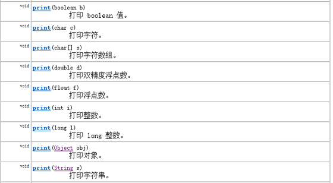
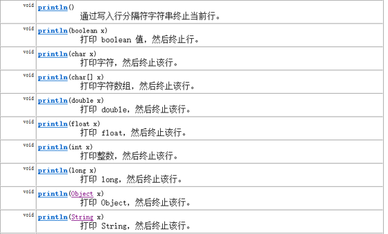

PrintStream和PrintWriter的输出不会抛出IOException异常

PrintStream和PrintWriter有自动flush功能

PrintStream 打印的所有字符都使用平台的默认字符编码转换为字节。在需要写入字符而不是写入字节的情况下，应该使用 PrintWriter 类。

System.out返回的是PrintStream的实例

###### 3.7.10.2 1 构造器

- `PrintStream(File file)` ：创建具有指定文件且不带自动行刷新的新打印流。
- `PrintStream(File file, String csn)`：创建具有指定文件名称和字符集且不带自动行刷新的新打印流。
- `PrintStream(OutputStream out)`：创建新的打印流。
- `PrintStream(OutputStream out, boolean autoFlush)`：创建新的打印流。 autoFlush如果为 true，则每当写入 byte 数组、调用其中一个 println 方法或写入换行符或字节 ('\n') 时都会刷新输出缓冲区。
- `PrintStream(OutputStream out, boolean autoFlush, String encoding)`：创建新的打印流。
- `PrintStream(String fileName)`：创建具有指定文件名称且不带自动行刷新的新打印流。
- `PrintStream(String fileName, String csn)` ：创建具有指定文件名称和字符集且不带自动行刷新的新打印流。

##### 3.7.10.3 Scanner类

###### 3.7.10.3.1 构造方法

- `Scanner(File source)`：构造一个新的 Scanner，它生成的值是从指定文件扫描的。
- `Scanner(File source, String charsetName)`：构造一个新的 Scanner，它生成的值是从指定文件扫描的。
- `Scanner(InputStream source)`：构造一个新的 Scanner，它生成的值是从指定的输入流扫描的。
- `Scanner(InputStream source, String charsetName)`：构造一个新的 Scanner，它生成的值是从指定的输入流扫描的。

###### 3.7.10.3.2 常用方法

- `boolean hasNextXxx()`： 如果通过使用nextXxx()方法，此扫描器输入信息中的下一个标记可以解释为默认基数中的一个 Xxx 值，则返回 true。
- `Xxx nextXxx()`： 将输入信息的下一个标记扫描为一个Xxx

#### 3.7.11 apache-common包的使用

##### 3.7.11.1 介绍

IO技术开发中，代码量很大，而且代码的重复率较高，为此Apache软件基金会，开发了IO技术的工具类commonsIO，大大简化了IO开发。

Apahce软件基金会属于第三方，（Oracle公司第一方，我们自己第二方，其他都是第三方）我们要使用第三方开发好的工具，需要添加jar包。

##### 3.7.11.2 IOUtils类的使用

- 静态方法：`IOUtils.copy(InputStream in,OutputStream out)`传递字节流，实现文件复制。
- 静态方法：`IOUtils.closeQuietly(任意流对象)`悄悄的释放资源，自动处理close()方法抛出的异常。

##### 3.7.11.3 FileUtils类的使用

- 静态方法：`void copyDirectoryToDirectory(File src,File dest)`：整个目录的复制，自动进行递归遍历

    参数:

    src:要复制的文件夹路径

    dest:要将文件夹粘贴到哪里去

- 静态方法：`void writeStringToFile(File file,String content)`：将内容content写入到file中
- 静态方法：`String readFileToString(File file)`：读取文件内容，并返回一个String
- 静态方法：`void copyFile(File srcFile,File destFile)`：文件复制

### 3.8 网络编程

#### 3.8.1 概述

##### 3.8.1.1 架构

C/S架构 ：全称为Client/Server结构，是指客户端和服务器结构。常见程序有QQ、美团app、360安全卫士等软件。

B/S架构 ：全称为Browser/Server结构，是指浏览器和服务器结构。常见浏览器有IE、谷歌、火狐等。

##### 3.8.1.2 网络基础

计算机网络： 把分布在不同地理区域的计算机与专门的外部设备用通信线路互连成一个规模大、功能强的网络系统，从而使众多的计算机可以方便地互相传递信息、共享硬件、软件、数据信息等资源。

网络编程的目的：直接或间接地通过网络协议与其它计算机实现数据交换，进行通讯。

网络编程中有三个主要的问题：

1. 问题1：如何准确地定位网络上一台或多台主机
1. 问题2：如何定位主机上的特定的应用
1. 问题3：找到主机后，如何可靠、高效地进行数据传输

#### 3.8.2 网络通信要素

通信双方地址

1. IP
1. 端口号

一定的规则：不同的硬件、操作系统之间的通信，所有的这一切都需要一种规则。而我们就把这种规则称为协议，即网络通信协议。

##### 3.8.2.1 通信要素之一：IP地址和域名

###### 3.8.2.1.1 IP地址

IP地址：指互联网协议地址（Internet Protocol Address），俗称IP。IP地址用来给网络中的一台计算机设备做唯一的编号。

IP地址 = 网络地址 +主机地址
网络地址：标识计算机或网络设备所在的网段
主机地址：标识特定主机或网络设备

分类一

1. IPv4：

    是一个32位的二进制数，通常被分为4个字节，表示成a.b.c.d 的形式，以**点分十进制**表示，例如192.168.65.100 。其中a、b、c、d都是0~255之间的十进制整数。

    这种方式最多可以表示42亿个。其中，30亿都在北美，亚洲4亿，中国2.9亿。2011年初已经用尽。

1. IPv6：

    为了扩大地址空间，拟通过IPv6重新定义地址空间，采用128位地址长度，共16个字节，写成8个无符号整数，每个整数用四个十六进制位表示，数之间用冒号（：）分开。**冒号分十六进制**

分类二：公网地址( 万维网使用）和 私有地址( 局域网使用）。192.168.开头的就是私有地址，范围即为192.168.0.0--192.168.255.255，专门为组织机构内部使用。

常用命令：

1. 查看本机IP地址，在控制台输入：
    ipconfig
1. 检查网络是否连通，在控制台输入：

    ping 空格 IP地址

    ping 220.181.57.216

特殊的IP地址：

1. 本地回环地址(hostAddress)：127.0.0.1

1. 主机名(hostName)：localhost

###### 3.8.2.2 域名

Internet上的主机有两种方式表示地址：

1. 域名(hostName)：www.atguigu.com
1. IP 地址(hostAddress)：202.108.35.210

域名解析：因为IP地址数字不便于记忆，因此出现了域名。域名容易记忆，当在连接网络时输入一个主机的域名后，**域名服务器**(DNS，Domain Name System，域名系统)负责将域名转化成IP地址，这样才能和主机建立连接。

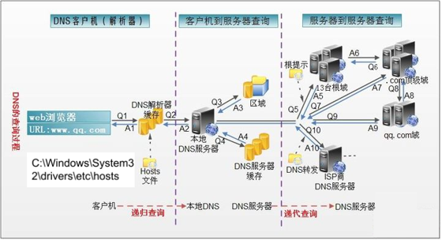

1. 在浏览器中输入www . qq .com 域名，操作系统会先检查自己本地的hosts文件是否有这个网址映射关系，如果有，就先调用这个IP地址映射，完成域名解析。
1. 如果hosts里没有这个域名的映射，则查找本地DNS解析器缓存，是否有这个网址映射关系，如果有，直接返回，完成域名解析。
1. 如果hosts与本地DNS解析器缓存都没有相应的网址映射关系，首先会找TCP/IP参数中设置的首选DNS服务器，在此我们叫它本地DNS服务器，此服务器收到查询时，如果要查询的域名，包含在本地配置区域资源中，则返回解析结果给客户机，完成域名解析，此解析具有权威性。
1. 如果要查询的域名，不由本地DNS服务器区域解析，但该服务器已缓存了此网址映射关系，则调用这个IP地址映射，完成域名解析，此解析不具有权威性。
1. 如果本地DNS服务器本地区域文件与缓存解析都失效，则根据本地DNS服务器的设置（是否设置转发器）进行查询，如果未用转发模式，本地DNS就把请求发至13台根DNS，根DNS服务器收到请求后会判断这个域名(.com)是谁来授权管理，并会返回一个负责该顶级域名服务器的一个IP。本地DNS服务器收到IP信息后，将会联系负责.com域的这台服务器。这台负责.com域的服务器收到请求后，如果自己无法解析，它就会找一个管理.com域的下一级DNS服务器地址<http://qq.com>给本地DNS服务器。当本地DNS服务器收到这个地址后，就会找<http://qq.com>域服务器，重复上面的动作，进行查询，直至找到<www.qq.com>主机。
1. 如果用的是转发模式，此DNS服务器就会把请求转发至上一级DNS服务器，由上一级服务器进行解析，上一级服务器如果不能解析，或找根DNS或把转请求转至上上级，以此循环。不管是本地DNS服务器用是是转发，还是根提示，最后都是把结果返回给本地DNS服务器，由此DNS服务器再返回给客户机。

##### 3.8.2.2 通信要素二：端口号

网络的通信，本质上是两个进程（应用程序）的通信。每台计算机都有很多的进程，那么在网络通信时，如何区分这些进程呢？

如果说IP地址可以唯一标识网络中的设备，那么端口号就可以唯一标识设备中的进程（应用程序）。

不同的进程，设置不同的端口号。

端口号：用两个字节表示的整数，它的取值范围是0~65535。

1. 公认端口：0~1023。被预先定义的服务通信占用，如：HTTP（80），FTP（21），Telnet（23）

1. 注册端口：1024~49151。分配给用户进程或应用程序。如：Tomcat（8080），MySQL（3306），Oracle（1521）。

1. 动态/ 私有端口：49152~65535。

如果端口号被另外一个服务或应用所占用，会导致当前程序启动失败。

##### 3.8.2.3 通信要素三：网络通信协议

###### 3.8.2.3.1 概述

网络通信协议：在计算机网络中，这些连接和通信的规则被称为网络通信协议，它对数据的传输格式、传输速率、传输步骤、出错控制等做了统一规定，通信双方必须同时遵守才能完成数据交换。

TCP/IP协议： 传输控制协议/因特网互联协议( Transmission Control Protocol/Internet Protocol)，TCP/IP 以其两个主要协议：传输控制协议(TCP)和网络互联协议(IP)而得名，实际上是一组协议，包括多个具有不同功能且互为关联的协议。是Internet最基本、最广泛的协议。

TCP/IP协议中的四层介绍：

1. 应用层：应用层决定了向用户提供应用服务时通信的活动。主要协议有：HTTP协议、FTP协议、SNMP（简单网络管理协议）、SMTP（简单邮件传输协议）和POP3（Post Office Protocol 3的简称,即邮局协议的第3个版）等。
1. 传输层：主要使网络程序进行通信，在进行网络通信时，可以采用TCP协议，也可以采用UDP协议。TCP（Transmission Control Protocol）协议，即传输控制协议，是一种面向连接的、可靠的、基于字节流的传输层通信协议。UDP(User Datagram Protocol，用户数据报协议)：是一个无连接的传输层协议、提供面向事务的简单不可靠的信息传送服务。
1. 网络层：网络层是整个TCP/IP协议的核心，支持网间互连的数据通信。它主要用于将传输的数据进行分组，将分组数据发送到目标计算机或者网络。而IP协议是一种非常重要的协议。IP（internet protocal）又称为互联网协议。IP的责任就是把数据从源传送到目的地。它在源地址和目的地址之间传送一种称之为数据包的东西，它还提供对数据大小的重新组装功能，以适应不同网络对包大小的要求。
1. 物理+数据链路层：链路层是用于定义物理传输通道，通常是对某些网络连接设备的驱动协议，例如针对光纤、网线提供的驱动。

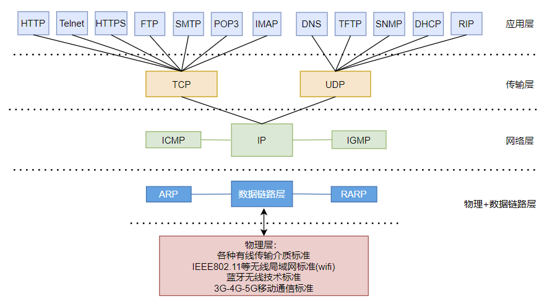

###### 3.8.2.3.2 谈传输层协议：TCP与UDP协议

通信的协议还是比较复杂的，java.net 包中包含的类和接口，它们提供低层次的通信细节。我们可以直接使用这些类和接口，来专注于网络程序开发，而不用考虑通信的细节。
java.net 包中提供了两种常见的网络协议的支持：

- UDP：用户数据报协议(User Datagram Protocol)。
- TCP：传输控制协议 (Transmission Control Protocol)。

**TCP协议**：

TCP协议进行通信的两个应用进程：客户端、服务端。
使用TCP协议前，须先建立TCP连接，形成基于字节流的传输数据通道

传输前，采用“三次握手”方式，点对点通信，是可靠的

TCP协议使用重发机制，当一个通信实体发送一个消息给另一个通信实体后，需要收到另一个通信实体确认信息，如果没有收到另一个通信实体确认信息，则会再次重复刚才发送的消息。

- 在连接中可进行大数据量的传输
- 传输完毕，需释放已建立的连接，效率低

**UDP协议**：

UDP协议进行通信的两个应用进程：发送端、接收端。
将数据、源、目的封装成数据包（传输的基本单位），不需要建立连接。发送不管对方是否准备好，接收方收到也不确认，不能保证数据的完整性，故是不可靠的。

- 每个数据报的大小限制在64K内
- 发送数据结束时无需释放资源，开销小，通信效率高

**三次握手**：

TCP协议中，在发送数据的准备阶段，客户端与服务器之间的三次交互，以保证连接的可靠。

- 第一次握手，客户端向服务器端发起TCP连接的请求
- 第二次握手，服务器端发送针对客户端TCP连接请求的确认
- 第三次握手，客户端发送确认的确认

**四次挥手**：

TCP协议中，在发送数据结束后，释放连接时需要经过四次挥手。

- 第一次挥手：客户端向服务器端提出结束连接，让服务器做最后的准备工作。此时，客户端处于半关闭状态，即表示不再向服务器发送数据了，但是还可以接受数据。
- 第二次挥手：服务器接收到客户端释放连接的请求后，会将最后的数据发给客户端。并告知上层的应用进程不再接收数据。
- 第三次挥手：服务器发送完数据后，会给客户端发送一个释放连接的报文。那么客户端接收后就知道可以正式释放连接了。
- 第四次挥手：客户端接收到服务器最后的释放连接报文后，要回复一个彻底断开的报文。这样服务器收到后才会彻底释放连接。这里客户端，发送完最后的报文后，会等待2MSL，因为有可能服务器没有收到最后的报文，那么服务器迟迟没收到，就会再次给客户端发送释放连接的报文，此时客户端在等待时间范围内接收到，会重新发送最后的报文，并重新计时。如果等待2MSL后，没有收到，那么彻底断开。

#### 3.8.3 网络编程API

##### 3.8.3.1 InetAddress类

InetAddress类主要表示IP地址，两个子类：Inet4Address、Inet6Address。

InetAddress 类没有提供公共的构造器，而是提供了如下几个静态方法来**获取InetAddress实例**

- `public static InetAddress getLocalHost()`
- `public static InetAddress getByName(String host)`
- `public static InetAddress getByAddress(byte[] addr)`

InetAddress 提供了如下几个**常用方法**

- `public String getHostAddress()`：返回 IP 地址字符串（以文本表现形式）
- `public String getHostName()`：获取此 IP 地址的主机名
- `public boolean isReachable(int timeout)`：测试是否可以达到该地址

##### 3.8.3.2 Socket类

网络上具有唯一标识的IP地址和端口号组合在一起构成唯一能识别的标识符**套接字（Socket）**。

利用套接字(Socket)开发网络应用程序早已被广泛的采用，以至于成为事实上的标准。网络通信其实就是Socket间的通信。

通信的两端都要有Socket，是两台机器间通信的端点。
Socket允许程序把网络连接当成一个流，数据在两个Socket间通过IO传输。

一般主动发起通信的应用程序属客户端，等待通信请求的为服务端。

Socket分类：

- 流套接字（stream socket）：使用TCP提供可依赖的字节流服务
- ServerSocket：此类实现TCP服务器套接字。服务器套接字等待请求通过网络传入。
- Socket：此类实现客户端套接字（也可以就叫“套接字”）。套接字是两台机器间通信的端点。
- 数据报套接字（datagram socket）：使用UDP提供“尽力而为”的数据报服务
- DatagramSocket：此类表示用来发送和接收UDP数据报包的套接字。

##### 3.8.3.3 Socket相关类API

###### 3.8.3.3.1 ServerSocket类

ServerSocket类的构造方法：

- `ServerSocket(int port)`：创建绑定到特定端口的服务器套接字。

ServerSocket类的常用方法：

- Socket accept()`：侦听并接受到此套接字的连接。

###### 3.8.3.3.2 Socket类

Socket类的常用构造方法：

- `public Socket(InetAddress address,int port)`：创建一个流套接字并将其连接到指定 IP 地址的指定端口号。
- `public Socket(String host,int port)`：创建一个流套接字并将其连接到指定主机上的指定端口号。
Socket类的常用方法：
- `public InputStream getInputStream()`：返回此套接字的输入流，可以用于接收消息
- `public OutputStream getOutputStream()`：返回此套接字的输出流，可以用于发送消息
- `public InetAddress getInetAddress()`：此套接字连接到的远程 IP 地址；如果套接字是未连接的，则返回 null。
- `public InetAddress getLocalAddress()`：获取套接字绑定的本地地址。
- `public int getPort()`：此套接字连接到的远程端口号；如果尚未连接套接字，则返回 0。
- `public int getLocalPort()`：返回此套接字绑定到的本地端口。如果尚未绑定套接字，则返回 -1。
- `public void close()`：关闭此套接字。套接字被关闭后，便不可在以后的网络连接中使用（即无法重新连接或重新绑定）。需要创建新的套接字对象。 关闭此套接字也将会关闭该套接字的 InputStream 和 OutputStream。
- `public void shutdownInput()`：如果在套接字上调用 shutdownInput() 后从套接字输入流读取内容，则流将返回 EOF（文件结束符）。 即不能在从此套接字的输入流中接收任何数据。
- `public void shutdownOutput()`：禁用此套接字的输出流。对于 TCP 套接字，任何以前写入的数据都将被发送，并且后跟 TCP 的正常连接终止序列。 如果在套接字上调用 shutdownOutput() 后写入套接字输出流，则该流将抛出 IOException。 即不能通过此套接字的输出流发送任何数据。

注意：先后调用Socket的shutdownInput()和shutdownOutput()方法，仅仅关闭了输入流和输出流，并不等于调用Socket的close()方法。在通信结束后，仍然要调用Scoket的close()方法，因为只有该方法才会释放Socket占用的资源，比如占用的本地端口号等。

###### 3.8.3.3.3 DatagramSocket类

DatagramSocket 类的常用方法：

- `public DatagramSocket(int port)`创建数据报套接字并将其绑定到本地主机上的指定端口。套接字将被绑定到通配符地址，IP 地址由内核来选择。
- `public DatagramSocket(int port,InetAddress laddr)`创建数据报套接字，将其绑定到指定的本地地址。本地端口必须在 0 到 65535 之间（包括两者）。如果 IP 地址为 0.0.0.0，套接字将被绑定到通配符地址，IP 地址由内核选择。
- `public void close()`关闭此数据报套接字。
- `public void send(DatagramPacket p)`从此套接字发送数据报包。DatagramPacket 包含的信息指示：将要发送的数据、其长度、远程主机的 IP 地址和远程主机的端口号。
- `public void receive(DatagramPacket p)`从此套接字接收数据报包。当此方法返回时，DatagramPacket 的缓冲区填充了接收的数据。数据报包也包含发送方的 IP 地址和发送方机器上的端口号。 此方法在接收到数据报前一直阻塞。数据报包对象的 length 字段包含所接收信息的长度。如果信息比包的长度长，该信息将被截短。
- `public InetAddress getLocalAddress()`获取套接字绑定的本地地址。
- `public int getLocalPort()`返回此套接字绑定的本地主机上的端口号。
- `public InetAddress getInetAddress()`返回此套接字连接的地址。如果套接字未连接，则返回 null。
- `public int getPort()`返回此套接字的端口。如果套接字未连接，则返回 -1。

###### 3.8.3.3.4 DatagramPacket类

DatagramPacket类的常用方法：

- `public DatagramPacket(byte[] buf,int length)`构造 DatagramPacket，用来接收长度为 length 的数据包。 length 参数必须小于等于 buf.length。
- `public DatagramPacket(byte[] buf,int length,InetAddress address,int port)`构造数据报包，用来将长度为 length 的包发送到指定主机上的指定端口号。length 参数必须小于等于 buf.length。
- `public InetAddress getAddress()`返回某台机器的 IP 地址，此数据报将要发往该机器或者是从该机器接收到的。
- `public int getPort()`返回某台远程主机的端口号，此数据报将要发往该主机或者是从该主机接收到的。
- `public byte[] getData()`返回数据缓冲区。接收到的或将要发送的数据从缓冲区中的偏移量 offset 处开始，持续 length 长度。
- `public int getLength()`返回将要发送或接收到的数据的长度。

#### 3.8.4 TCP网络编程

##### 3.8.4.1 通信模型

Java语言的基于套接字TCP编程分为服务端编程和客户端编程，其通信模型如图所示：
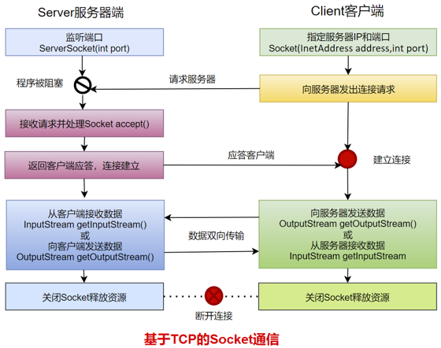

##### 3.8.4.2 开发步骤

客户端程序包含以下四个基本的步骤 ：

1. 创建 Socket ：根据指定服务端的 IP 地址或端口号构造 Socket 类对象。若服务器端响应，则建立客户端到服务器的通信线路。若连接失败，会出现异常。
1. 打开连接到 Socket 的输入/ 出流： 使用 getInputStream()方法获得输入流，使用getOutputStream()方法获得输出流，进行数据传输
1. 按照一定的协议对 Socket 进行读/ 写操作：通过输入流读取服务器放入线路的信息（但不能读取自己放入线路的信息），通过输出流将信息写入线路。
1. 关闭 Socket ：断开客户端到服务器的连接，释放线路

服务器端程序包含以下四个基本的 步骤：

1. 调用 ServerSocket(int port) ：创建一个服务器端套接字，并绑定到指定端口上。用于监听客户端的请求。
1. 调用 accept() ：监听连接请求，如果客户端请求连接，则接受连接，返回通信套接字对象。
1. 调用 该Socket 类对象的 getOutputStream() 和 getInputStream () ：获取输出流和输入流，开始网络数据的发送和接收。
1. 关闭Socket 对象：客户端访问结束，关闭通信套接字。

演示多个客户端与服务器之间的多次通信：

- 通常情况下，服务器不应该只接受一个客户端请求，而应该不断地接受来自客户端的所有请求，所以Java程序通常会通过循环，不断地调用ServerSocket的accept()方法。

- 如果服务器端要“同时”处理多个客户端的请求，因此服务器端需要为每一个客户端单独分配一个线程来处理，否则无法实现“同时”。

```java
1、服务器端示例代码
package com.atguigu.tcp.many;

import java.io.BufferedReader;
import java.io.IOException;
import java.io.InputStreamReader;
import java.io.PrintStream;
import java.net.ServerSocket;
import java.net.Socket;

public class Server {
    public static void main(String[] args) throws IOException {
        // 1、准备一个ServerSocket
        ServerSocket server = new ServerSocket(8888);
        System.out.println("等待连接...");

        int count = 0;
        while(true){
            // 2、监听一个客户端的连接
            Socket socket = server.accept();
            System.out.println("第" + ++count + "个客户端"+socket.getInetAddress().getHostAddress()+"连接成功！！");

            ClientHandlerThread ct = new ClientHandlerThread(socket);
            ct.start();
        }

        //这里没有关闭server，永远监听
    }
    static class ClientHandlerThread extends Thread{
        private Socket socket;
        private String ip;

        public ClientHandlerThread(Socket socket) {
            super();
            this.socket = socket;
            ip = socket.getInetAddress().getHostAddress();
        }

        public void run(){
            try{
                //（1）获取输入流，用来接收该客户端发送给服务器的数据
                BufferedReader br = new BufferedReader(new InputStreamReader(socket.getInputStream()));
                //（2）获取输出流，用来发送数据给该客户端
                PrintStream ps = new PrintStream(socket.getOutputStream());
                String str;
                // （3）接收数据
                while ((str = br.readLine()) != null) {
                    //（4）反转
                    StringBuilder word = new StringBuilder(str);
                    word.reverse();

                    //（5）返回给客户端
                    ps.println(word);
                }
                System.out.println("客户端" + ip+"正常退出");
            }catch(Exception  e){
                System.out.println("客户端" + ip+"意外退出");
            }finally{
                try {
                    //（6）断开连接
                    socket.close();
                } catch (IOException e) {
                    e.printStackTrace();
                }
            }
        }
    }
}
2、客户端示例代码
package com.atguigu.tcp.many;

import java.io.BufferedReader;
import java.io.InputStream;
import java.io.InputStreamReader;
import java.io.OutputStream;
import java.io.PrintStream;
import java.net.Socket;
import java.util.Scanner;

public class Client {
    public static void main(String[] args) throws Exception {
        // 1、准备Socket，连接服务器，需要指定服务器的IP地址和端口号
        Socket socket = new Socket("127.0.0.1", 8888);

        // 2、获取输出流，用来发送数据给服务器
        OutputStream out = socket.getOutputStream();
        PrintStream ps = new PrintStream(out);

        // 3、获取输入流，用来接收服务器发送给该客户端的数据
        InputStream input = socket.getInputStream();
        BufferedReader br;
        if(args!= null && args.length>0) {
            String encoding = args[0];
            br = new BufferedReader(new InputStreamReader(input,encoding));
        }else{
            br = new BufferedReader(new InputStreamReader(input));
        }

        Scanner scanner = new Scanner(System.in);
        while(true){
            System.out.println("输入发送给服务器的单词或成语：");
            String message = scanner.nextLine();
            if(message.equals("stop")){
                socket.shutdownOutput();
                break;
            }

            // 4、 发送数据
            ps.println(message);
            // 接收数据
            String feedback  = br.readLine();
            System.out.println("从服务器收到的反馈是：" + feedback);
        }

        //5、关闭socket，断开与服务器的连接
        scanner.close();
        socket.close();
    }
}

```

聊天室

```java
服务端：
package com.atguigu.tcp;

import java.io.BufferedReader;
import java.io.IOException;
import java.io.InputStream;
import java.io.InputStreamReader;
import java.io.OutputStream;
import java.io.PrintStream;
import java.net.ServerSocket;
import java.net.Socket;
import java.util.ArrayList;

public class TestChatServer {
    //这个集合用来存储所有在线的客户端
    static ArrayList<Socket> online = new  ArrayList<Socket>();

    public static void main(String[] args)throws Exception {
        //1、启动服务器，绑定端口号
        ServerSocket server = new ServerSocket(8989);

        //2、接收n多的客户端同时连接
        while(true){
            Socket accept = server.accept();

            online.add(accept);//把新连接的客户端添加到online列表中

            MessageHandler mh = new MessageHandler(accept);
            mh.start();//
        }
    }

    static class MessageHandler extends Thread{
        private Socket socket;
        private String ip;

        public MessageHandler(Socket socket) {
            super();
            this.socket = socket;
        }

        public void run(){
            try {
                ip = socket.getInetAddress().getHostAddress();

                //插入：给其他客户端转发“我上线了”
                sendToOther(ip+"上线了");

                //(1)接收该客户端的发送的消息
                InputStream input = socket.getInputStream();
                InputStreamReader reader = new InputStreamReader(input);
                BufferedReader br = new BufferedReader(reader);
                
                String str;
                while((str = br.readLine())!=null){
                    //(2)给其他在线客户端转发
                    sendToOther(ip+":"+str);
                }

                sendToOther(ip+"下线了");
            } catch (IOException e) {
                try {
                    sendToOther(ip+"掉线了");
                } catch (IOException e1) {
                    e1.printStackTrace();
                }
            }finally{
                //从在线人员中移除我
                online.remove(socket);
                        }
        }
        
        //封装一个方法：给其他客户端转发xxx消息
        public void sendToOther(String message) throws IOException{
            //遍历所有的在线客户端，一一转发
            for (Socket on : online) {
                OutputStream every = on.getOutputStream();
                //为什么用PrintStream？目的用它的println方法，按行打印
                PrintStream ps = new PrintStream(every);
                
                ps.println(message);
            }
        }
    }
}

客户端：
package com.atguigu.tcp;

import java.io.IOException;
import java.io.InputStream;
import java.io.OutputStream;
import java.io.PrintStream;
import java.net.Socket;
import java.util.Scanner;

public class TestChatClient {
    public static void main(String[] args)throws Exception {
        //1、连接服务器
        Socket socket = new Socket("127.0.0.1",8989);
        
        //2、开启两个线程
        //(1)一个线程负责看别人聊，即接收服务器转发的消息
        Receive receive = new Receive(socket);
        receive.start();
        
        //(2)一个线程负责发送自己的话
        Send send = new Send(socket);
        send.start();
        
        send.join();//等我发送线程结束了，才结束整个程序
        
        socket.close();
    }
}
class Send extends Thread{
    private Socket socket;
    
    public Send(Socket socket) {
        super();
        this.socket = socket;
    }

    public void run(){
        try {
            OutputStream outputStream = socket.getOutputStream();
            //按行打印
            PrintStream ps = new PrintStream(outputStream);
            
            Scanner input = new Scanner(System.in);
            
            //从键盘不断的输入自己的话，给服务器发送，由服务器给其他人转发
            while(true){
                System.out.print("自己的话：");
                String str = input.nextLine();
                if("bye".equals(str)){
                    break;
                }
                ps.println(str);
            }
            
            input.close();
        } catch (IOException e) {
            e.printStackTrace();
        }
    }
    
}
class Receive extends Thread{
    private Socket socket;
    
    public Receive(Socket socket) {
        super();
        this.socket = socket;
    }
    
    public void run(){
        try {
            InputStream inputStream = socket.getInputStream();
            Scanner input = new Scanner(inputStream);
            
            while(input.hasNextLine()){
                String line = input.nextLine();
                System.out.println(line);
            }
        } catch (IOException e) {
            e.printStackTrace();
        }
    }
}

```

#### 3.8.5 UDP网络编程

UDP(User Datagram Protocol，用户数据报协议)：是一个无连接的传输层协议、提供面向事务的简单不可靠的信息传送服务，类似于短信。

##### 3.8.5.1 通信模型

UDP协议是一种面向非连接的协议，面向非连接指的是在正式通信前不必与对方先建立连接，不管对方状态就直接发送，至于对方是否可以接收到这些数据内容，UDP协议无法控制，因此说，UDP协议是一种不可靠的协议。无连接的好处就是快，省内存空间和流量，因为维护连接需要创建大量的数据结构。UDP会尽最大努力交付数据，但不保证可靠交付，没有TCP的确认机制、重传机制，如果因为网络原因没有传送到对端，UDP也不会给应用层返回错误信息。

UDP协议是面向数据报文的信息传送服务。UDP在发送端没有缓冲区，对于应用层交付下来的报文在添加了首部之后就直接交付于ip层，不会进行合并，也不会进行拆分，而是一次交付一个完整的报文。比如我们要发送100个字节的报文，我们调用一次send()方法就会发送100字节，接收方也需要用receive()方法一次性接收100字节，不能使用循环每次获取10个字节，获取十次这样的做法。

UDP协议没有拥塞控制，所以当网络出现的拥塞不会导致主机发送数据的速率降低。虽然UDP的接收端有缓冲区，但是这个缓冲区只负责接收，并不会保证UDP报文的到达顺序是否和发送的顺序一致。因为网络传输的时候，由于网络拥塞的存在是很大的可能导致先发的报文比后发的报文晚到达。如果此时缓冲区满了，后面到达的报文将直接被丢弃。这个对实时应用来说很重要，比如：视频通话、直播等应用。

因此UDP适用于一次只传送少量数据、对可靠性要求不高的应用环境，数据报大小限制在64K以下。

**类 DatagramSocket 和 DatagramPacket 实现了基于 UDP 协议网络程序。**

UDP数据报通过数据报套接字 DatagramSocket 发送和接收，系统不保证 UDP数据报一定能够安全送到目的地，也不能确定什么时候可以抵达。

DatagramPacket 对象封装了UDP数据报，在数据报中包含了发送端的IP地址和端口号以及接收端的IP地址和端口号。
UDP协议中每个数据报都给出了完整的地址信息，因此无须建立发送方和接收方的连接。如同发快递包裹一样。

##### 3.8.5.2 开发步骤

发送端程序包含以下四个基本的步骤：

1. 创建DatagramSocket ：默认使用系统随机分配端口号。
1. 创建DatagramPacket：将要发送的数据用字节数组表示，并指定要发送的数据长度，接收方的IP地址和端口号。
1. 调用 该DatagramSocket 类对象的 send方法 ：发送数据报DatagramPacket对象。
1. 关闭DatagramSocket 对象：发送端程序结束，关闭通信套接字。

接收端程序包含以下四个基本的步骤 ：

1. 创建DatagramSocket ：指定监听的端口号。
1. 创建DatagramPacket：指定接收数据用的字节数组，起到临时数据缓冲区的效果，并指定最大可以接收的数据长度。
1. 调用 该DatagramSocket 类对象的receive方法 ：接收数据报DatagramPacket对象。。
1. 关闭DatagramSocket ：接收端程序结束，关闭通信套接字。

基于UDP协议的网络编程仍然需要在通信实例的两端各建立一个Socket，但这两个Socket之间并没有虚拟链路，这两个Socket只是发送、接收数据报的对象，Java提供了DatagramSocket对象作为基于UDP协议的Socket，使用DatagramPacket代表DatagramSocket发送、接收的数据报。

```java
发送端：
package com.atguigu.udp;

import java.net.DatagramPacket;
import java.net.DatagramSocket;
import java.net.InetAddress;
import java.util.ArrayList;

public class Send {

    public static void main(String[] args)throws Exception {
//1、建立发送端的DatagramSocket
        DatagramSocket ds = new DatagramSocket();

        //要发送的数据
        ArrayList<String> all = new ArrayList<String>();
        all.add("尚硅谷让天下没有难学的技术！");
        all.add("学高端前沿的IT技术来尚硅谷！");
        all.add("尚硅谷让你的梦想变得更具体！");
        all.add("尚硅谷让你的努力更有价值！");

        //接收方的IP地址
        InetAddress ip = InetAddress.getByName("127.0.0.1");
        //接收方的监听端口号
        int port = 9999;
        //发送多个数据报
        for (int i = 0; i < all.size(); i++) {
//2、建立数据包DatagramPacket
            byte[] data = all.get(i).getBytes();
            DatagramPacket dp = new DatagramPacket(data, 0, data.length, ip, port);
//3、调用Socket的发送方法
            ds.send(dp);
        }

//4、关闭Socket
        ds.close();
    }
}
发送端：
package com.atguigu.udp;

import java.net.DatagramPacket;
import java.net.DatagramSocket;
public class Receive {
    public static void main(String[] args) throws Exception {
//1、建立接收端的DatagramSocket，需要指定本端的监听端口号
        DatagramSocket ds = new DatagramSocket(9999);
        //一直监听数据
        while(true){
            //2、建立数据包DatagramPacket
            byte[] buffer = new byte[1024*64];
            DatagramPacket dp = new DatagramPacket(buffer,buffer.length);

            //3、调用Socket的接收方法
            ds.receive(dp);

            //4、拆封数据
            String str = new String(dp.getData(),0,dp.getLength());
            System.out.println(str);
        }
//        ds.close();
    }
}

```

#### 3.8.6 URL编程

##### 3.8.6.1 URL类

URL(Uniform Resource Locator)：统一资源定位符，它表示 Internet 上某一资源的地址。

通过 URL 我们可以访问 Internet 上的各种网络资源，比如最常见的 www，ftp 站点。浏览器通过解析给定的 URL 可以在网络上查找相应的文件或其他资源。

URL的基本结构由5部分组成：

`<传输协议>://<主机名>:<端口号>/<文件名>#片段名?参数列表`

例如:<http://192.168.1.100:8080/helloworld/index.jsp#a?username=shkstart&password=123>

- 片段名：即锚点，例如看小说，直接定位到章节
- 参数列表格式：参数名=参数值&参数名=参数值....

为了表示URL，java.net 中实现了**类 URL**。我们可以通过下面的**构造器**来初始化一个 URL 对象：

1. `public URL (String spec)`：通过一个表示URL地址的字符串可以构造一个URL对象。

    例如：
    URL url = new URL("<http://www.atguigu.com/>");
1. `public URL(URL context, String spec)`：通过基 URL 和相对 URL 构造一个 URL 对象。

    例如：
    URL downloadUrl = new URL(url, “download.html")
1. `public URL(String protocol, String host, String file)`;

    例如：
    URL url = new URL("http", "www.atguigu.com", “download. html");
1. `public URL(String protocol, String host, int port, String file)`;

    例如:
    URL gamelan = new URL("http", "www.atguigu.com", 80, “download.html");

URL类的构造器都声明抛出非运行时异常，必须要对这一异常进行处理，通常是用 try-catch 语句进行捕获。

##### 3.8.6.2 URL类常用方法

一个URL对象生成后，其属性是不能被改变的，但可以通过它给定的方法来获取这些属性：

- `public String getProtocol( )`获取该URL的协议名
- `public String getHost( )`获取该URL的主机名
- `public String getPort( )`获取该URL的端口号
- `public String getPath( )`获取该URL的文件路径
- `public String getFile( )`获取该URL的文件名
- `public String getQuery( )`获取该URL的查询名

##### 3.8.6.3 针对HTTP协议的URLConnection类

URL的方法 openStream()：能从网络上读取数据

若希望输出数据，例如向服务器端的 CGI （公共网关接口-Common Gateway Interface-的简称，是用户浏览器和服务器端的应用程序进行连接的接口）程序发送一些数据，则必须先与URL建立连接，然后才能对其进行读写，此时需要使用 URLConnection 。

URLConnection：表示到URL所引用的远程对象的连接。当与一个URL建立连接时，首先要在一个 URL 对象上通过方法 openConnection() 生成对应的 URLConnection 对象。如果连接过程失败，将产生IOException.

URL netchinaren = new URL ("<http://www.atguigu.com/index.shtml>");

URLConnectonn u = netchinaren.openConnection( );

通过URLConnection对象获取的输入流和输出流，即可以与现有的CGI程序进行交互。

- `public Object getContent( ) throws IOException`：获取内容本身
- `public int getContentLength( )`：内容有多大
- `public String getContentType( )`：内容是什么类型
- `public long getDate( )`：服务器响应的时间
- `public long getLastModified( )`：文件最后修改时间
- `public InputStream getInputStream ( ) throws IOException`：获取输入流 → 用来读数据
- `public OutputSteram getOutputStream( )throws IOException`：获取输出流 → 用来写数据

#### 3.8.7 小结

位于网络中的计算机具有唯一的IP地址，这样不同的主机可以互相区分。

客户端－服务器是一种最常见的网络应用程序模型。服务器是一个为其客户端提供某种特定服务的硬件或软件。客户机是一个用户应用程序，用于访问某台服务器提供的服务。端口号是对一个服务的访问场所，它用于区分同一物理计算机上的多个服务。套接字用于连接客户端和服务器，客户端和服务器之间的每个通信会话使用一个不同的套接字。

TCP协议用于实现面向连接的会话。

Java 中有关网络方面的功能都定义在 java.net 程序包中。Java 用 InetAddress 对象表示 IP 地址，该对象里有两个字段：主机名(String) 和 IP 地址(int)。

类 Socket 和 ServerSocket 实现了基于TCP协议的客户端－服务器程序。Socket是客户端和服务器之间的一个连接，连接创建的细节被隐藏了。这个连接提供了一个安全的数据传输通道，这是因为 TCP 协议可以解决数据在传送过程中的丢失、损坏、重复、乱序以及网络拥挤等问题，它保证数据可靠的传送。

类 URL 和 URLConnection 提供了最高级网络应用。URL 的网络资源的位置来同一表示 Internet 上各种网络资源。通过URL对象可以创建当前应用程序和 URL 表示的网络资源之间的连接，这样当前程序就可以读取网络资源数据，或者把自己的数据传送到网络上去。

### 3.9 反射机制

#### 3.9.1 概述

##### 3.9.1.1 起源

Reflection（反射）是被视为动态语言的关键，反射机制允许程序在运行期间借助于Reflection API取得任何类的内部信息，并能直接操作任意对象的内部属性及方法。

加载完类之后，在堆内存的方法区中就产生了一个Class类型的对象（一个类只有一个Class对象），这个对象就包含了完整的类的结构信息。我们可以通过这个对象看到类的结构。这个对象就像一面镜子，透过这个镜子看到类的结构，所以，我们形象的称之为：反射。

##### 3.9.1.2 作用

Java反射机制提供的功能：

- 在运行时判断任意一个对象所属的类
- 在运行时构造任意一个类的对象
- 在运行时判断任意一个类所具有的成员变量和方法
- 在运行时获取泛型信息
- 在运行时调用任意一个对象的成员变量和方法
- 在运行时处理注解
- 生成动态代理

##### 3.9.1.3 反射相关的主要API

- java.lang.Class：代表一个类
- java.lang.reflect.Method：代表类的方法
- java.lang.reflect.Field：代表类的成员变量
- java.lang.reflect.Constructor：代表类的构造器

##### 3.9.1.4 反射的优缺点

优点：

- 提高了Java程序的灵活性和扩展性，降低了耦合性，提高自适应能力
- 允许程序创建和控制任何类的对象，无需提前硬编码目标类

缺点：

- 反射的性能较低。
- 反射机制主要应用在对灵活性和扩展性要求很高的系统框架上
- 反射会模糊程序内部逻辑，可读性较差。

#### 3.9.2 理解Class类并获取Class实例

要想解剖一个类，必须先要获取到该类的Class对象。而剖析一个类或用反射解决具体的问题就是使用相关API:

- java.lang.Class
- java.lang.reflect.*

所以，Class对象是反射的根源。

##### 3.9.2.1 理论上

在Object类中定义了以下的方法，此方法将被所有子类继承：
`public final Class getClass()`
以上的方法返回值的类型是一个Class类，此类是Java反射的源头，实际上所谓反射从程序的运行结果来看也很好理解，即：可以通过对象反射求出类的名称。

- Class本身也是一个类
- Class 对象只能由系统建立对象
- 一个加载的类在 JVM 中只会有一个Class实例
- 一个Class对象对应的是一个加载到JVM中的一个.class文件
- 每个类的实例都会记得自己是由哪个 Class 实例所生成
- 通过Class可以完整地得到一个类中的所有被加载的结构
- Class类是Reflection的根源，针对任何你想动态加载、运行的类，唯有先获得相应的Class对象

##### 3.9.2.2 内存上

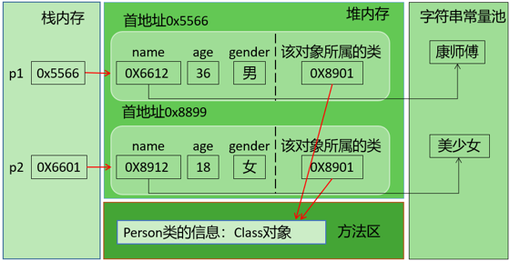
上图中字符串常量池在JDK6中存储在方法区；JDK7及以后，存储在堆空间。

##### 3.9.2.3 获取Class类的实例(四种方法)

- 方式1：要求编译期间已知类型

    前提：若已知具体的类，通过类的class属性获取，该方法最为安全可靠，程序性能最高

    实例：
    Class clazz = String.class;

- 方式2：获取对象的运行时类型

    前提：已知某个类的实例，调用该实例的getClass()方法获取Class对象

    实例：
    Class clazz = "www.atguigu.com".getClass();

- 方式3：可以获取编译期间未知的类型

    前提：已知一个类的全类名，且该类在类路径下，可通过Class类的静态方法forName()获取，可能抛出ClassNotFoundException

    实例：
    Class clazz = Class.forName("java.lang.String");

##### 3.9.2.4 哪些类型可以有Class对象

简言之，所有Java类型！

1. class：外部类，成员(成员内部类，静态内部类)，局部内部类，匿名内部类
1. interface：接口
1. []：数组
1. enum：枚举
1. annotation：注解@interface
1. primitive type：基本数据类型
1. void

##### 3.9.2.5 Class类的常用方法

- `static Class forName(String name)`返回指定类名 name 的 Class 对象
- `Object newInstance()`调用缺省构造函数，返回该Class对象的一个实例
- `getName()`返回此Class对象所表示的实体（类、接口、数组类、基本类型或void）名称
- `Class getSuperClass()`返回当前Class对象的父类的Class对象
- `Class [] getInterfaces()`获取当前Class对象的接口
- `ClassLoader getClassLoader()`返回该类的类加载器
- `Class getSuperclass()`返回表示此Class所表示的实体的超类的Class
- `Constructor[] getConstructors()`返回一个包含某些Constructor对象的数组
- `Field[] getDeclaredFields()`返回Field对象的一个数组
- `Method getMethod(String name,Class … paramTypes)`返回一个Method对象，此对象的形参类型为paramType

#### 3.9.3 类的加载与ClassLoader的理解

##### 3.9.3.1 类的生命周期

类在内存中完整的生命周期：加载-->使用-->卸载。其中加载过程又分为：装载、链接、初始化三个阶段。

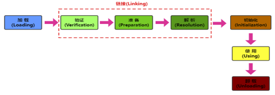

##### 3.9.3.2 类的加载过程

当程序主动使用某个类时，如果该类还未被加载到内存中，系统会通过装载、链接、初始化三个步骤来对该类进行初始化。如果没有意外，JVM将会连续完成这三个步骤，所以有时也把这三个步骤统称为类加载。

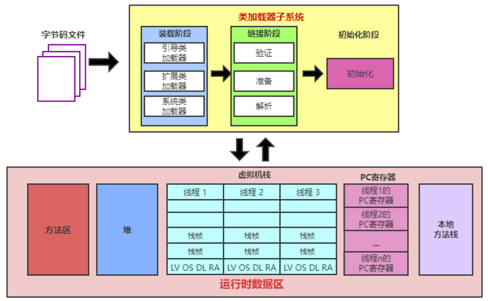

1. 装载（Loading）

    将类的class文件读入内存，并为之创建一个java.lang.Class对象。此过程由类加载器完成
1. 链接（Linking）

    1. 验证Verify：确保加载的类信息符合JVM规范，例如：以cafebabe开头，没有安全方面的问题。
    1. 准备Prepare：正式为类变量（static）分配内存并设置类变量默认初始值的阶段，这些内存都将在方法区中进行分配。
    1. 解析Resolve：虚拟机常量池内的符号引用（常量名）替换为直接引用（地址）的过程。
1. 初始化（Initialization）

    执行类构造器\<clinit>()方法的过程。类构造器\<clinit>()方法是由编译期自动收集类中所有类变量的赋值动作和静态代码块中的语句合并产生的。（类构造器是构造类信息的，不是构造该类对象的构造器）。

    当初始化一个类的时候，如果发现其父类还没有进行初始化，则需要先触发其父类的初始化。

    虚拟机会保证一个类的\<clinit>()方法在多线程环境中被正确加锁和同步。

##### 3.9.3.3 类加载器（classloader)

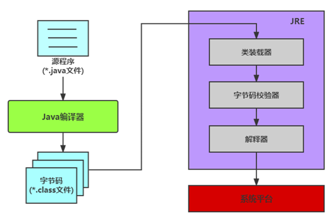

###### 3.9.3.3.1 类加载器的作用

将class文件字节码内容加载到内存中，并将这些静态数据转换成方法区的运行时数据结构，然后在堆中生成一个代表这个类的java.lang.Class对象，作为方法区中类数据的访问入口。

类缓存：标准的JavaSE类加载器可以按要求查找类，但一旦某个类被加载到类加载器中，它将维持加载（缓存）一段时间。不过JVM垃圾回收机制可以回收这些Class对象。

###### 3.9.3.3.2 类加载器的分类(JDK8为例)

JVM支持两种类型的类加载器，分别为引导类加载器（Bootstrap ClassLoader）和自定义类加载器（User-Defined ClassLoader）。

从概念上来讲，自定义类加载器一般指的是程序中由开发人员自定义的一类类加载器，但是Java虚拟机规范却没有这么定义，而是将所有派生于抽象类ClassLoader的类加载器都划分为自定义类加载器。无论类加载器的类型如何划分，在程序中我们最常见的类加载器结构主要是如下情况：

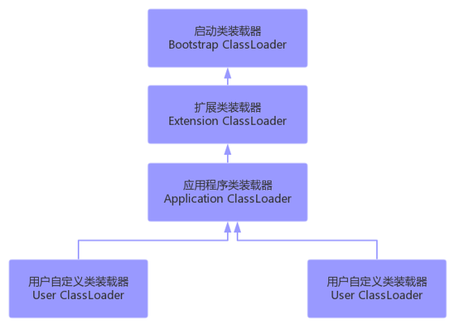

1. 启动类加载器（引导类加载器，Bootstrap ClassLoader）

    - 这个类加载使用C/C++语言实现的，嵌套在JVM内部。获取它的对象时往往返回null
    - 它用来加载Java的核心库（JAVA_HOME/jre/lib/rt.jar或sun.boot.class.path路径下的内容）。用于提供JVM自身需要的类。
    - 并不继承自java.lang.ClassLoader，没有父加载器。
    - 出于安全考虑，Bootstrap启动类加载器只加载包名为java、javax、sun等开头的类
    - 加载扩展类和应用程序类加载器，并指定为他们的父类加载器。
1. 扩展类加载器（Extension ClassLoader）

    - Java语言编写，由sun.misc.Launcher$ExtClassLoader实现。
    - 继承于ClassLoader类
    - 父类加载器为启动类加载器
    - 从java.ext.dirs系统属性所指定的目录中加载类库，或从JDK的安装目录的jre/lib/ext子目录下加载类库。如果用户创建的JAR放在此目录下，也会自动由扩展类加载器加载。
1. 应用程序类加载器（系统类加载器，AppClassLoader）

    - java语言编写，由sun.misc.Launcher$AppClassLoader实现
    - 继承于ClassLoader类
    - 父类加载器为扩展类加载器
    - 它负责加载环境变量classpath或系统属性 java.class.path 指定路径下的类库
    - 应用程序中的类加载器默认是系统类加载器。
    - 它是用户自定义类加载器的默认父加载器
    - 通过ClassLoader的getSystemClassLoader()方法可以获取到该类加载器
1. 用户自定义类加载器（了解）

    - 在Java的日常应用程序开发中，类的加载几乎是由上述3种类加载器相互配合执行的。在必要时，我们还可以自定义类加载器，来定制类的加载方式。
    - 体现Java语言强大生命力和巨大魅力的关键因素之一便是，Java开发者可以自定义类加载器来实现类库的动态加载，加载源可以是本地的JAR包，也可以是网络上的远程资源。
    - 同时，自定义加载器能够实现应用隔离，例如 Tomcat，Spring等中间件和组件框架都在内部实现了自定义的加载器，并通过自定义加载器隔离不同的组件模块。这种机制比C/C++程序要好太多，想不修改C/C++程序就能为其新增功能，几乎是不可能的，仅仅一个兼容性便能阻挡住所有美好的设想。
    - 自定义类加载器通常需要继承于ClassLoader。

###### 3.9.3.3.3 查看某个类的类加载器对象

1. 获取默认的系统类加载器

    ClassLoader classloader = ClassLoader.getSystemClassLoader();
1. 查看某个类是哪个类加载器加载的

    ClassLoader classloader = Class.forName("exer2.ClassloaderDemo").getClassLoader();

    //如果是根加载器加载的类，则会得到null
    ClassLoader classloader1 = Class.forName("java.lang.Object").getClassLoader();
1. 获取某个类加载器的父加载器

    ClassLoader parentClassloader = classloader.getParent();

###### 3.9.3.3.4  使用ClassLoader获取流

关于类加载器的一个主要方法：

getResourceAsStream(String str):获取类路径下的指定文件的输入流

#### 3.9.4 反射的基本应用

##### 3.9.4.1 关于setAccessible方法的使用

Method和Field、Constructor对象都有setAccessible()方法。

setAccessible启动和禁用访问安全检查的开关。

参数值为true则指示反射的对象在使用时应该取消Java语言访问检查。

提高反射的效率。如果代码中必须用反射，而该句代码需要频繁的被调用，那么请设置为true。

使得原本无法访问的私有成员也可以访问

参数值为false则指示反射的对象应该实施Java语言访问检查。

##### 3.9.4.2 创建运行时类的对象

这是反射机制应用最多的地方。创建运行时类的对象有两种方式：

1. 直接调用Class对象的newInstance()方法

    要求：
    1. 类必须有一个无参数的构造器。
    1. 类的构造器的访问权限需要足够。

    步骤：
    1. 获取该类型的Class对象
    1. 调用Class对象的newInstance()方法创建对象

1. 通过获取构造器对象来进行实例化

    步骤：
    1. 通过Class类的getDeclaredConstructor(Class … parameterTypes)取得本类的指定形参类型的构造器
    1. 向构造器的形参中传递一个对象数组进去，里面包含了构造器中所需的各个参数。
    1. 通过Constructor实例化对象。

如果构造器的权限修饰符修饰的范围不可见，也可以调用setAccessible(true)

##### 3.9.4.3 获取运行时类的完整结构

###### 3.9.4.3.1 相关API

1. 实现的全部接口

    `public Class<?>[] getInterfaces()`
    确定此对象所表示的类或接口实现的接口。

1. 所继承的父类

    `public Class<? Super T> getSuperclass()`
    返回表示此 Class 所表示的实体（类、接口、基本类型）的父类的 Class。

1. 全部的构造器

    `public Constructor<T>[] getConstructors()`
    返回此 Class 对象所表示的类的所有public构造方法。

    `public Constructor<T>[] getDeclaredConstructors()`
    返回此 Class 对象表示的类声明的所有构造方法。

    Constructor类中：

    `public int getModifiers();`
    取得修饰符:

    `public String getName();`
    取得方法名称:

    `public Class<?>[] getParameterTypes();`
    取得参数的类型：

1. 全部的方法

    `public Method[] getDeclaredMethods()`
    返回此Class对象所表示的类或接口的全部方法

    `public Method[] getMethods()`
    返回此Class对象所表示的类或接口的public的方法

    Method类中：

    `public Class<?> getReturnType()`
    取得全部的返回值

    `public Class<?>[] getParameterTypes()`
    取得全部的参数

    `public int getModifiers()`
    取得修饰符

    `public Class<?>[] getExceptionTypes()`
    取得异常信息

1. 全部的Field

    `public Field[] getFields()`
    返回此Class对象所表示的类或接口的public的Field。

    `public Field[] getDeclaredFields()`
    返回此Class对象所表示的类或接口的全部Field。

    Field方法中：

    `public int getModifiers()`
    以整数形式返回此Field的修饰符

    `public Class<?> getType()`
    得到Field的属性类型

    `public String getName()`
    返回Field的名称。

1. Annotation相关

    `get Annotation(Class<T> annotationClass)`
    `getDeclaredAnnotations()`

1. 泛型相关

    获取父类泛型类型：
    `Type getGenericSuperclass()`

    泛型类型：
    `ParameterizedType`

    获取实际的泛型类型参数数组：
    `getActualTypeArguments()`

1. 类所在的包
    `Package getPackage()`

1. 内部类外部类

    `public Class<?>[] getClasses()`：返回所有公共内部类和内部接口。包括从超类继承的公共类和接口成员以及该类声明的公共类和接口成员。

    `public Class<?>[] getDeclaredClasses()`：返回 Class 对象的一个数组，这些对象反映声明为此 Class 对象所表示的类的成员的所有类和接口。包括该类所声明的公共、保护、默认（包）访问及私有类和接口，但不包括继承的类和接口。

    `public Class<?> getDeclaringClass()`：如果此 Class 对象所表示的类或接口是一个内部类或内部接口，则返回它的外部类或外部接口，否则返回null。

    `Class<?> getEnclosingClass()`：返回某个内部类的外部类

##### 3.9.4.4 调用运行时类的指定结构

###### 3.9.4.4.1 调用指定的属性

在反射机制中，可以直接通过Field类操作类中的属性，通过Field类提供的set()和get()方法就可以完成设置和取得属性内容的操作。

1. 获取该类型的Class对象

    `Class clazz = Class.forName("包.类名");`
1. 获取属性对象

    `Field field = clazz.getDeclaredField("属性名");`
1. 如果属性的权限修饰符不是public，那么需要设置属性可访问

    `field.setAccessible(true);`
1. 创建实例对象：如果操作的是非静态属性，需要创建实例对象

    `Object obj = clazz.newInstance(); //有公共的无参构造`

    `Object obj = 构造器对象.newInstance(实参...);//通过特定构造器对象创建实例对象`
1. 设置指定对象obj上此Field的属性内容

    `field.set(obj,"属性值");`

    如果操作静态变量，那么实例对象可以省略，用null表示
1. 取得指定对象obj上此Field的属性内容

    `Object value = field.get(obj);`

    如果操作静态变量，那么实例对象可以省略，用null表示

###### 3.9.4.4.2 调用指定的方法

1. 获取该类型的Class对象

    `Class clazz = Class.forName("包.类名");`
1. 获取方法对象

    `Method method = clazz.getDeclaredMethod("方法名",方法的形参类型列表);`
1. 创建实例对象

    `Object obj = clazz.newInstance();`
1. 调用方法

    `Object result = method.invoke(obj, 方法的实参值列表);`

如果方法的权限修饰符修饰的范围不可见，也可以调用setAccessible(true)

如果方法是静态方法，实例对象也可以省略，用null代替

##### 3.9.4.5 读取注解信息

一个完整的注解应该包含三个部分： （1）声明 （2）使用 （3）读取

###### 3.9.4.5.1 声明

```java
import java.lang.annotation.*;

@Inherited
@Target(ElementType.TYPE)
@Retention(RetentionPolicy.RUNTIME)
public @interface Table {
    String value();
}
-------------------------
import java.lang.annotation.*;

@Inherited
@Target(ElementType.FIELD)
@Retention(RetentionPolicy.RUNTIME)
public @interface Column {
    String columnName();
    String columnType();
}

```

- 自定义注解可以通过四个元注解@Retention,@Target，@Inherited,@Documented，分别说明它的声明周期，使用位置，是否被继承，是否被生成到API文档中。

- Annotation 的成员在 Annotation 定义中以无参数有返回值的抽象方法的形式来声明，我们又称为配置参数。返回值类型只能是八种基本数据类型、String类型、Class类型、enum类型、Annotation类型、以上所有类型的数组

- 可以使用 default 关键字为抽象方法指定默认返回值

- 如果定义的注解含有抽象方法，那么使用时必须指定返回值，除非它有默认值。格式是“方法名 = 返回值”，如果只有一个抽象方法需要赋值，且方法名为value，可以省略“value=”，所以如果注解只有一个抽象方法成员，建议使用方法名value。

###### 3.9.4.5.2 使用

```java
@Table("t_stu")
public class Student {
    @Column(columnName = "sid",columnType = "int")
    private int id;
    @Column(columnName = "sname",columnType = "varchar(20)")
    private String name;

    public int getId() {
        return id;
    }

    public void setId(int id) {
        this.id = id;
    }

    public String getName() {
        return name;
    }

    public void setName(String name) {
        this.name = name;
    }

    @Override
    public String toString() {
        return "Student{" +
                "id=" + id +
                ", name='" + name + '\'' +
                '}';
    }
}

```

###### 3.9.4.5.3 读取

自定义注解必须配上注解的信息处理流程才有意义。

我们自己定义的注解，只能使用反射的代码读取。所以自定义注解的声明周期必须是RetentionPolicy.RUNTIME。

```java
import java.lang.reflect.Field;

public class TestAnnotation {
    public static void main(String[] args) {
        Class studentClass = Student.class;
        Table tableAnnotation = (Table) studentClass.getAnnotation(Table.class);
        String tableName = "";
        if(tableAnnotation != null){
            tableName = tableAnnotation.value();
        }

        Field[] declaredFields = studentClass.getDeclaredFields();
        String[] columns = new String[declaredFields.length];
        int index = 0;
        for (Field declaredField : declaredFields) {
            Column column = declaredField.getAnnotation(Column.class);
            if(column!= null) {
                columns[index++] = column.columnName();
            }
        }
        
        String sql = "select ";
        for (int i=0; i<index; i++) {
            sql += columns[i];
            if(i<index-1){
                sql += ",";
            }
        }
        sql += " from " + tableName;
        System.out.println("sql = " + sql);
    }
}
```

### 3.10 JDK8-17新特性

## 常用类

### 1 java.util.Scanner 读取输入

1. 导包（找）
   `import java.util.Scanner;`在类定义前
1. 创建对象（准备）
    `Scanner sc = new Scannner(System.in);`sc可以改。System.in默认代表键盘输入。
1. 调用方法，接收数据（开始）
    `int i = sc.nextInt();`i可以改。nextXXX()接收某一基本数据类型，next()接收字符串。输入与对应类型不同时，会报异常，导致程序终止。
1. 释放资源
    sc.close();

用nextLine()，才能接收空格。

### 2 java.util.Random 获取随机数

1. 导包
    `import java.util.Random;`
1. 创建对象
    `Random r = new Random ();`r可以改。种子默认时间，可以更改。
1. 生成随机数
    `int number = r.nextInt(随机数范围);// 0到这个数-1。包头不包尾，包左不包右。`number可以改

获取随机数有另外一个方法。

用自带的Math.random(),Math.random()返回[0~1)double类型。种子默认时间，不能更改。

### 3 java.util.Array 数组工具类

java.util.Arrays类，即操作数组的工具类。包括了用来操作数组的各种方法。

数组元素拼接：

- `static String toString(int[] a)`：字符串表示形式由数组的元素列表组成，括在方括号（"[]"）中。相邻元素用字符 ", "（逗号加空格）分隔。形式为：[元素1，元素2，元素3。。。]。
- `static String toString(Object[] a)`：字符串表示形式由数组的元素列表组成，括在方括号（"[]"）中。相邻元素用字符 ", "（逗号加空格）分隔。元素将自动调用自己从Object继承的toString方法将对象转为字符串进行拼接，如果没有重写，则返回类型@hash值，如果重写则按重写返回的字符串进行拼接。

数组排序：

- `static void sort(int[] a)`：将a数组按照从小到大进行排序
- `static void sort(int[] a, int fromIndex, int toIndex)`：将a数组的[fromIndex, toIndex)部分按照升序排列
- `static void sort(Object[] a)`：根据元素的自然顺序对指定对象数组按升序进行排序。
- `static  void sort(T[] a, Comparator<? super T> c)`：根据指定比较器产生的顺序对指定对象数组进行排序。

数组元素的二分查找：

- `static int binarySearch(int[] a, int key)`、`static int binarySearch(Object[] a, Object key)`：要求数组有序，在数组中查找key是否存在，如果存在返回第一次找到的下标，不存在返回负数。

数组的复制：

- `static int[] copyOf(int[] original, int newLength)`：根据original原数组复制一个长度为newLength的新数组，并返回新数组
- `static  T[] copyOf(T[] original,int newLength)`：根据original原数组复制一个长度为newLength的新数组，并返回新数组
- `static int[] copyOfRange(int[] original, int from, int to)`：复制original原数组的[from,to)构成新数组，并返回新数组
- `static  T[] copyOfRange(T[] original,int from,int to)`：复制original原数组的[from,to)构成新数组，并返回新数组

比较两个数组是否相等：

- `static boolean equals(int[] a, int[] a2)`：比较两个数组的长度、元素是否完全相同
- `static boolean equals(Object[] a,Object[] a2)`：比较两个数组的长度、元素是否完全相同

填充数组：

- `static void fill(int[] a, int val)`：用val值填充整个a数组
- `static void fill(Object[] a,Object val)`：用val对象填充整个a数组
- `static void fill(int[] a, int fromIndex, int toIndex, int val)`：将a数组[fromIndex,toIndex)部分填充为val值
- `static void fill(Object[] a, int fromIndex, int toIndex, Object val)`：将a数组[fromIndex,toIndex)部分填充为val对象

### 4 Object类的getClass()与拓展

所有对象都能调用，返回对象真正new出来的本体。

||||
|:---:|:---:|:---:|
|对象.getClass()|拿到类的本体对象|Class<Student\>|
|getClass().getName()|全类名 (包名 + 类名)|com.test.Student|
|getClass().getSimpleName()|只拿简单类名，不要包名|Student|

### 5 java.lang.Character

- `public static boolean isUpperCase(char ch)`：是否大写
- `public static boolean isLowerCase(char ch)`：
是否小写
- `public static char toUpperCase(char ch)`：转大写
- `public static char toLowerCase(char ch)`：转小写

## 琐碎

### 1 多样的System.out.输出

- System.out.println()。先输出后换行。
- System.out.print()。输出不换行。
- System.out.printf()。用格式化的形式输出。

### 2 求余与取模

q = [a/b]

r = a-b*q

求余是q向0靠拢。
取模是q向负无穷靠拢。

### 3 交换两个变量值的方法

#### 3.1 引入中间变量

- 优点：使用与所有数据类型的变量。
- 缺点：需要额外的空间。

#### 3.2 加减交换

```java
m = m + n;
n = m - n;
m = m - n;
```

- 优点：不需要额外空间
- 缺点：只适用数值

#### 3.3 异或交换

```java
m = m ^ n;
n = m ^ n;
m = m ^ n;
```

- 优点：不需要额外空间
- 缺点：只适用数值

### 4 MVC设计模式

MVC是一种软件构件模式，目的是为了降低程序开发中代码业务的耦合度。

MVC设计模式将整个程序分为三个层次：视图模型(Viewer)层，控制器(Controller)层，与数据模型(Model)层。这种将程序输入输出、数据处理，以及数据的展示分离开来的设计模式使程序结构变的灵活而且清晰，同时也描述了程序各个对象间的通信方式，降低了程序的耦合性。

视图层viewer：显示数据,为用户提供使用界面，与用户直接进行交互。

- 相关工具类   view.utils
- 自定义view  view.ui

控制层controller：解析用户请求，处理业务逻辑，给予用户响应

- 应用界面相关    controller.activity
- 存放fragment   controller.fragment
- 显示列表的适配器 controller.adapter
- 服务相关的        controller.service
- 抽取的基类        controller.base

模型层model：主要承载数据、处理数据

- 数据对象封装 model.bean/domain
- 数据库操作类 model.dao
- 数据库      model.db

### 5 jdk主要包介绍

- java.lang----包含一些Java语言的核心类，如String、Math、Integer、 System和Thread，提供常用功能
- java.net----包含执行与网络相关的操作的类和接口。
- java.io ----包含能提供多种输入/输出功能的类。
- java.util----包含一些实用工具类，如定义系统特性、接口的集合框架类、使用与日期日历相关的函数。
- java.text----包含了一些java格式化相关的类
- java.sql----包含了java进行JDBC数据库编程的相关类/接口
- java.awt----包含了构成抽象窗口工具集（abstract window toolkits）的多个类，这些类被用来构建和管理应用程序的图形用户界面(GUI)。

### 5 权限修饰符

权限修饰符：public、protected、缺省、private。

|权限修饰符|本类内部|本包内|其他包的子类|其他包的非子类|
|:---:|:---:|:---:|:---:|:---:|
|private|可|不|不|不|
|缺省|可|可|不|不|
|protected|可|可|可|不|
|public|可|可|可|可|

具体修饰结构：

- 类：public、缺省
- 成员变量、成员方法、构造器、成员内部类：public、protected、缺省、private

跨包使用时，如果类的权限修饰符缺省，成员权限修饰符>类的权限修饰符也没有意义。

### 6 Java内存分配

- 栈：方法运行时使用的内存
- 堆：存储对象或数组，new建立的
- 方法区：存储可以运行的class文件和静态方法静态变量
- 本地方法栈：JVM在使用操作系统功能时使用
- 寄存器：给CPU使用

（堆与方法区连一起）

**JDK8开始，取消方法区，新增元空间，把全赖的方法区的多种功能进行拆分，有的功能在堆区，有的功能在元空间。**

### 7 开闭原则OCP

对扩展开放，对修改关闭
通俗解释：软件系统中的各种组件，如模块（Modules）、类（Classes）以及功能（Functions）等，应该在不修改现有代码的基础上，引入新功能

### 8 一个.java文件要求

一个java文件只能有一个public引用数据类型

### 9 时间标准

计算世界时间的主要标准有：

- UTC(Coordinated Universal Time)
- GMT(Greenwich Mean Time)
- CST(Central Standard Time)

在国际无线电通信场合，为了统一起见，使用一个统一的时间，称为通用协调时(UTC, Universal Time Coordinated)。UTC与格林尼治平均时(GMT, Greenwich Mean Time)一样，都与英国伦敦的本地时相同。这里，UTC与GMT含义完全相同。

### 10 Hashtable和HashMap的区别

HashMap:底层是一个哈希表（jdk7:数组+链表;jdk8:数组+链表+红黑树）,是一个线程不安全的集合,执行效率高
Hashtable:底层也是一个哈希表（数组+链表）,是一个线程安全的集合,执行效率低

HashMap集合:可以存储null的键、null的值
Hashtable集合,不能存储null的键、null的值

Hashtable和Vector集合一样,在jdk1.2版本之后被更先进的集合(HashMap,ArrayList)取代了。所以HashMap是Map的主要实现类，Hashtable是Map的古老实现类。

Hashtable的子类Properties（配置文件）依然活跃在历史舞台
Properties集合是一个唯一和IO流相结合的集合

### 11 相对路径与绝对路径

- 绝对路径：从盘符开始的路径，这是一个完整的路径。
- 相对路径：相对于项目目录的路径，这是一个便捷的路径，开发中经常使用。

IDEA中，main中的文件的相对路径，是相对于"当前工程"

IDEA中，单元测试方法中的文件的相对路径，是相对于"当前module"

### 12 三层架构

- 数据访问层（Dao / Mapper）：和数据库交互
- 业务逻辑层（Service）：核心业务、规则、判断
- 表现层（Controller / 控制层）：接收请求、返回结果，和前端交互
